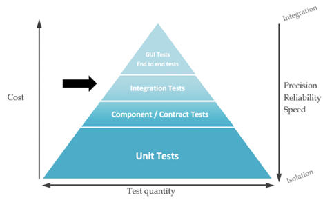
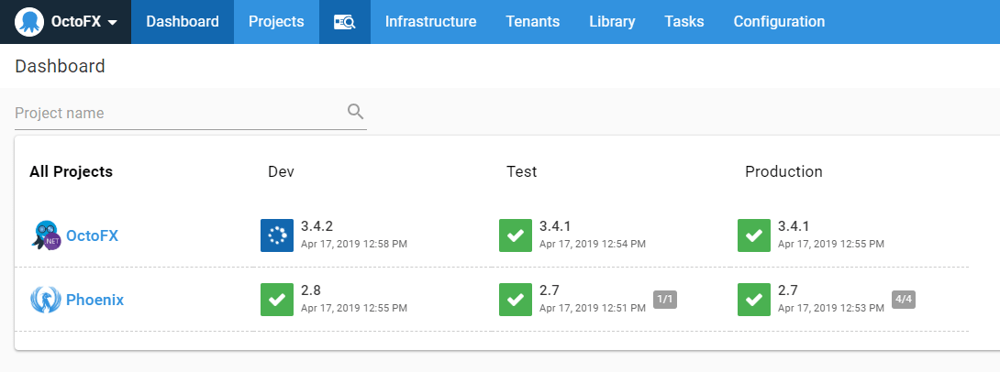

One of the biggest challenges software development organizations face in 2020 is the need to deliver code to production faster. In order to do this seamlessly we must have a completely automated deployment process and it must be repeatable through multiple environments. In order to confidently deploy to production without service interruption, we must have successful tests pass in each layer of the testing pyramid.

Defining this process can be challenging, and even more difficult is visualizing it. Octopus Deploy makes both easy for us! In this blog post, let’s define a “pre-approved” production-ready deployment pipeline as well as discuss the details of each step involved.

## The Automated Testing Pyramid

Before digging into our scenario, let’s start by defining our test pyramid. A complete test pyramid has 4 blocks, the lower the block the higher quantity of tests, the higher the block the higher quality of tests. A complete test pyramid provides a high-degree of confidence in our deployment success rate. 



As you can see from the diagram, the four layers of tests are:

- Unit Tests: These need to be successful during continuous integration stages of our pipeline
- Component Tests: These need to be successful during continuous integration stages of our pipeline
- Integration Tests: These need to be successful during continuous delivery stages of our pipeline
- End-To-End Tests: These need to be successful during continuous delivery stages of our pipeline

## Scenario

We have a `/hello/world` microservice running in production that currently returns a JSON field “message” with the value “hello world!” We want to add another response field called “status” with the value “200” when it returns successfully.

```JSON
{
    "message":"Hello World!",
    "status":200
}
```

## Environments



Organizational policy dictates that any code promoted to production must be deployed in the following environments:

- Development
- Test
- QA
- Pre-production
- Production

Each of these environments are “static integration” environments, meaning that all components of our application live in each of these environments. We want to ensure we do not have configuration drift. In a later blog post I’ll discuss how to make “static integration” environments and “ephemeral dynamic environments” co-exist within our CI/CD pipeline. For now, we’ll keep it simple.

## Continuous Integration Stages

Our goal with any code promotion is to build once, deploy anywhere. Building the deployable object is obviously the first step before we can even begin to think about deploying it anywhere. At build time, we have several stages that must occur:

1. Pre-Build: Code Linting/Formatting
2. Pre-Build: Unit Tests
3. Pre-Build: Component Tests
4. Pre-Build: Static Code Analysis
5. Pre-Build: 3rd Party Library Security Analysis
6. Build: Binary Builds and Packaged
7. Post-Build: Push Binary to Artifact Repository

These are the smallest definable units or stages that must happen during our pre-approved deployment pipeline. Each stage must pass successfully based upon pre-defined rules configured by our tooling administrators, information security and software architects. Once Continuous Integration stages pass successfully we are ready for the continuous delivery stages.

## Continuous Delivery


First, let’s define the difference between continuous delivery and continuous deployment.

Delivery: “The practice of making every change to source code ready for a production release as soon as automated testing validates it. This includes automatically building, testing and deploying.[2]”

Deployment: “Continuous Deployment is the practice that strives to automate production deployment end to end.[3]”

So for C-Delivery we want to get our deployable binary to our lowest integration environment to ensure the binary:

1. Executes as desired (the binary actually runs)
2. Run our minimal required phase 3 and 4 automated tests (and they pass successfully)
3. Stage for code promotion (or auto-promote)

Often the continuous delivery aspect of our pipeline executes as a secondary phase of the continuous integration pipeline. This is the aspect most often confused and difficult to troubleshoot for developers because this is where traditionally “operations” folks step into the picture. Unlike the continuous integration piece of the pipeline, we introduce many new points of failure here including:

- Network Connectivity
- Namespace collision
- Event driven/event triggered steps not completing
- Mixing deployment issues with automated testing issues
- Integrating multiple tools and troubleshooting those integrations

One of the great things about Octopus Deploy is that it has a built-in artifact repository so that we don’t have to introduce another potential point of failure by storing the thing we want to deploy in a third-party location or tool. This means we can be extremely confident that new artifact events do in fact trigger our continuous delivery steps in our pipeline. We should clearly define the difference between our continuous delivery automation and our integration/end-to-end testing stages as to make it clear where in our pipeline something might have failed. Those steps can be defined as such:

- CD Binary Deploy
- CD Binary Validate
- CD AT Integration Testing
- CD AT End-To-End Testing

It’s important to have the CD Binary Validate stage as to ensure we not only got the binary where it needed to go, but that it actually executed/startup as intended. In the case we had a bad binary (due to corruption or bad code logic, etc) we can save a lot of time in our pipeline by failing early and getting that feedback back to the developer quickly.

## Which Tests When?

One of the conflicting aspects of code promotion is trying to ensure code is deployed in every environment the same way while only running the necessary tests to ensure a new deployment works as intended. An example of this would be running a “load test” in our QA environment but not other environments. Running a load test in every environment would be time consuming, thus actually extending the time to deploy (which is the opposite of the goal we are trying to achieve). In addition, we probably wouldn’t run load tests in production as we do not want to take unnecessary risks with our service reliability for live services. 

This begs the question, which tests need to run, when do they need to run, how to differentiate what is ran and in which environments should they run?

Those are excellent questions and can be broken down simply by framing them into 1 of 2 categories:

- Pre-Approved CI/CD Pipeline
- Extensive CI/CD Pipeline

## What changes can be run through the pre-approved pipeline and how can I designate them?

Not every code change needs to be run through hours of regression testing and load testing. In fact, most code changes shouldn’t need to if you follow lean/agile development methodologies. In the given scenario, this is a very simple change that isn’t pulling new data from a database or doing any advanced calculations. This can probably be deployed to production without the full suite of testing as the risk is low and confidence is high.

All pipeline events should be triggered from source control. As such, in order to designate this change should run through the pre-approved CI/CD Pipeline, I will simply create a new GIT Branch with a naming convention similar to this:

`feature-pa-eado-4287-add_status_response`

- `feature`-This designates this new branch is adding new functionality to the code base
- `pa`-This designates this is pre-approved change and thus run through the fast-tracked pipeline
- `eado`-This designates my JIRA project 
- `<number>`-This designates my JIRA ticket
- `add_status_response`-This is a quick description of the change for this branch

It’s important to note that unless otherwise specified, all changes will run through complete CI/CD pipeline by default. This ensures developers have put enough thought into their change to determine if it can be “fast-tracked” for deployment into production.

In a later blog post, we will discuss how non-pre-approved changes will run through our complete CI/CD pipeline.

## The Complete Pre-Approved CI/CD Pipeline


1. Pre-Deployment Steps (GitHub/Jira)
    1. Developer gets assigned JIRA ticket EADO-4287. Based upon the requirements, determines it is a small change and creates a feature branch `“feature-pa-eado-4287-add_status_response”`
    2. Writes Unit Test that satisfies the acceptance criteria
    3. Writes code that satisfies the unit test
    4. Validates tests pass successfully locally, “git push” to source control
2. Continuous Integration (Jenkins)
    1. Pre-Build: Code Linting/Formatting
    2. Pre-Build: Unit Tests
    3. Pre-Build: Component Tests
    4. Pre-Build: Static Code Analysis
    5. Pre-Build: 3rd Party Library Security Analysis
    6. Pre-Build: Pull Request Opened – Pause for approval
    7. Pre-Build: Pull Request approved, Merge, TAG MASTER BRANCH (`rc-<version>`,`pa`)
    8. Build: Binary Builds and Packaged
    9. Post-Build: Push Binary to Artifact Repository (Octopus Deploy)
3. Development Environment (Octopus Deploy)
    1. CD Binary Deploy – Copies and unzips package to web server
    2. CD Binary Validate – Validates web server returns 200 response
    3. CD AT Integration Testing – Validates 200 response from load balanced URI
    4. CD AT End-To-End Testing – Validates Frontend making API call returns successful response
    5. CD POST GIT TAG `dev_success`
4. Test Environment
    1. GIT Tag `dev_success` Triggers CD Binary Deploy – Copies and unzips package to web server
    2. CD Binary Validate – Validates web server returns 200 response
    3. CD AT Integration Testing – Validates 200 response from load balanced URI
    4. CD AT End-To-End Testing – Validates Frontend making API call returns successful response
    5. CD POST GIT TAG `test_success`
5. QA Environment
    1. GIT Tag `test_success` Triggers CD Binary Deploy Copies and unzips package to web server
    2. CD Binary Validate – Validates web server returns 200 response
    3. CD AT Integration Testing – Validates 200 response from load balanced URI
    4. CD AT End-To-End Testing – Validates Frontend making API call returns successful response
    5. CD POST GIT TAG `qa_success`
6. Pre-Production Environment
    1. GIT Tag `qa_success` Triggers CD Binary Deploy – Copies and unzips package to web server
    2. CD Binary Validate – Validates web server returns 200 response
    3. CD AT Integration Testing – Validates 200 response from load balanced URI
    4. CD AT End-To-End Testing – Validates Frontend making API call returns successful response
    5. CD POST GIT TAG `preprod_success`
7. Production Environment
    1. GIT Tag `preprod_success` Triggers CD Binary Deploy – Copies and unzips package to web server
    2. CD Binary Validate – Validates web server returns 200 response
    3. CD AT Integration Testing – Validates 200 response from load balanced URI
    4. CD AT End-To-End Testing – Validates Frontend making API call returns successful response
    5. CD POST GIT TAG `v<version>`
    6. CD POST GIT remove tags:
        1. `rc-<version>`
        2. dev_success
        3. test_success
        4. qa_success
        5. preprod_success

## Conclusion

Deploying code to production quickly is the greatest challenge facing modern software development. Code promotion and deployment is all about confidence in success. In order to have consistent confidence in deployment success our CI/CD pipeline must contain the four layers of the testing pyramid. Determining when each layer of the testing pyramid is executed in which deployment environment becomes the next challenge. Defining a pre-approved deployment pipeline for small, low-risk changes is mandatory to balance speed with quality. Use GIT branches and tags to trigger your pre-approved pipeline in order to truly “shift-left” deployment reasonability to those who know the code best, the developers. 

### References

1. https://blog.octo.com/wp-content/uploads/2018/10/integration-tests-1024x634.png
2. Digestible DevOps: The 7 DevOps Practices, https://levelup.gitconnected.com/digestible-devops-the-7-devops-practices-8bd8b34e1418
3. Digestible DevOps: The 7 DevOps Practices, https://levelup.gitconnected.com/digestible-devops-the-7-devops-practices-8bd8b34e1418
