In this post, I share some templates that will help you build a PowerBI report from your Octopus Deploy database that shows how much time and money automation has saved you and your company. I'll also show you how to highlight development issues, such as how many times releases have been skipped due to bugs not being found in lower environments.

This should help highlight how much automation can save in time and money, and even justify the need to increase testing resources.

This is a preview of what I put together. In this post, we'll go over how you can create a connection and pull data from your instance of Octopus Deploy. I've also included PowerBI Desktop templates for your cloud and local instances to help you get started as quickly as possible.

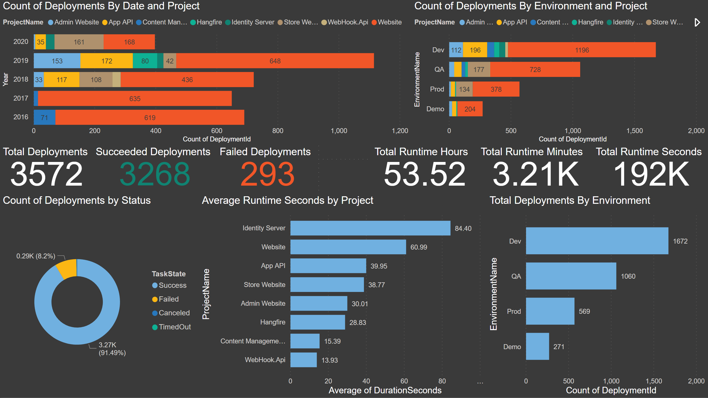

This post is broken up into the following sections:

1. [Prerequisites](#prerequisites)
2. [Deployment history charts](#deployment-history-charts)
3. [Runbooks history charts](#runbooks-history-charts)
4. [Reports](#reports)
5. [ROI](#roi)
6. [Conclusion](#conclusion)

## Prerequisites

There are a couple of prerequisites you need to have in place:

- [Install PowerBI Desktop](https://blog.reviewmydb.com/2020/06/how-to-install-powerbi-desktop.html).
- [Connect to a local instance of Octopus Deploy](https://blog.reviewmydb.com/2020/06/how-to-connect-to-octopus-deploy-local.html).
- [Find your Octopus Cloud API key and connect to your cloud instance of Octopus Deploy](https://blog.reviewmydb.com/2020/06/how-to-connect-to-your-octopus-deploy.html).

## Deployment history charts {#deployment-history-charts}

**Count of Deployments By Date and Project**: This is the first chart I put together, and I was kind of shocked to see how many deployments we had done each year over the last five years. This report breaks down each year and stacks each project. In this chart, you can drill down to see the count of deployments by quarters, month, and day. You can drill down by clicking the _double down arrow_ and then click on the _up arrow_ to go back:

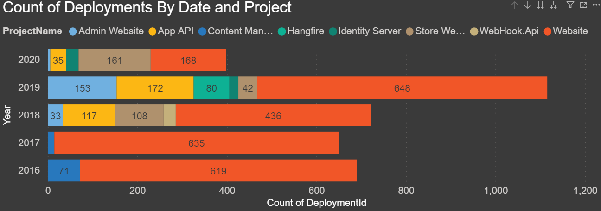

**Count of Deployments By Environment and Project**: The chart below shows how many deployments we have done in each environment split by project:

**Total Deployments**: This is a count of all records in the Deployment History table, which is all of the deployments.

**Succeeded Deployments**: This is the count of all, filtered by TaskState = Succeeded.

**Failed Deployments**: This is the count of all, filtered by TaskState = Failed.

**Total Runtime Hours**: This is a measure that tells us the total time of all the deployments in hours. Duration is stored in seconds so we divide it to arrive at the total number of hours.

**Total Runtime Minutes**: This is a measure that tells us the total time of all the deployments in minutes. Duration is stored in seconds so we divide it to arrive at the total number of minutes.

**Total Runtime Seconds**: This is a sum of the total duration for all deployments.

**Count of Deployments by Status**: The chart below displays a summary and count of all deployment's task statuses:

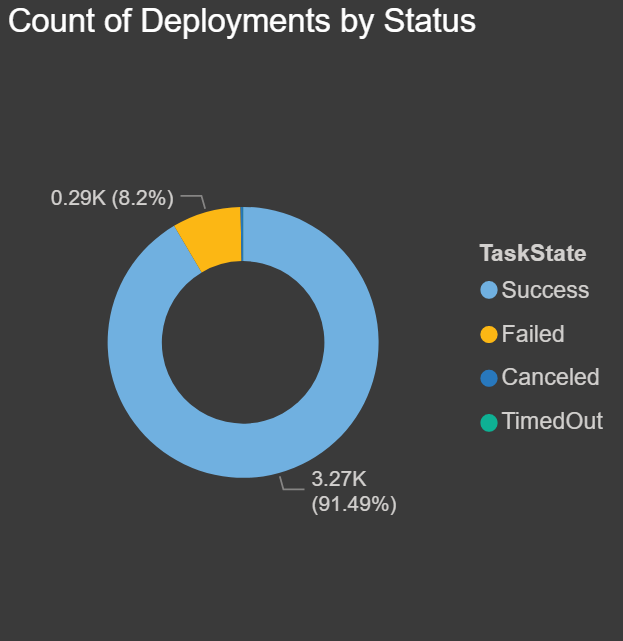

**Average Runtime Seconds by Project**: The chart below shows how long each deployment takes for each project on average. This is for all environments:

**Total Deployments by Environment**: The chart below shows how many total deployments have occurred in each environment:

**Percentage of Issues by Project and Environment Based on Number of Deployments**: With the chart below, I wanted to show what the ratio of deployments, or redeployments, we have done to each environment by project. This may not be an exact representation, but it suggests that the percentage of deployments in the lower environments (Dev and QA) means that if issues were found, they were re-deployed and fixed. If we had an even percentage of deployments in each environment, it could mean that no bugs/issues were found and the deployment went through to Production. 

If you notice in this chart that the _Store Website_ in both QA and Prod almost have the same percentage of deployments. To me, this means that instead of testing and finding issues in QA, the bugs are found in Production. This, to me, means that there is a code quality issue that needs to be addressed.

Compare the _Store Website_ to the _Website_, and you can see that the percentage difference is might higher in Dev and then QA compared to Production. To me, this means the developers are finding bugs in Dev, and then the ones they miss are caught in QA. Over the past 5 years, we have released 16 major stable versions of the website.

While this may not be 100% accurate, you could pull in some data and create a relationship between your ticket system to make this more precise with supporting data.

**Percentage of Planned vs. Actual**: The chart below compares the releases from Development vs. Production. The goal was to see how many project releases were meant to go to Production, but due to either, code issues or bugs they had to be re-released before making it to Production.

**Applications with most Canceled/Timed Out Deployments**: The chart below shows which project has had the most canceled or timed out deployments. This could be an indication of a script or process taking too long if it timed out. This might be a large database change script or perhaps large file transfers.

**Applications with most Failed Deployments**: The chart below shows which project/application has had the most failed deployments. This could be any number of things, such as misconfigured variables, changed servers, third party component changes or upgrades, servers down, failed scripts, etc. If there is a high number, this may be something you should look into to see why they keep failing.

**Applications with the Most Deployments**: The chart below shows which project/application has had the most successful deployments.

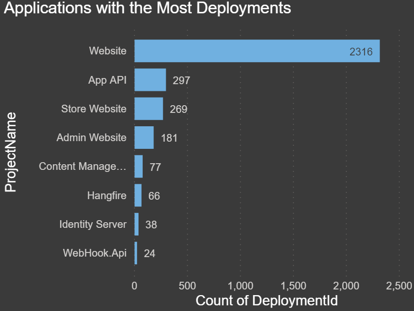

**Max Duration of Seconds by Project and Environment**: The chart below shows the max duration in seconds for each environment for each project. This allows you to compare how long it takes to deploy your code for each project.

**Average Days from Dev to Prod by Project**: The chart below shows the average duration in days from the time a release has been deployed to Dev and then the same release deployed to Production.

**Minimum Days To Release To Prod**: The chart below shows the minimum time in days for a release to make it from Dev to Production. In our case, we have deployed releases from Dev to Production on the same day. 

**Maximum Days To Release To Prod**: The chart below shows the maximum time in days for a release to make it from Dev to Production.

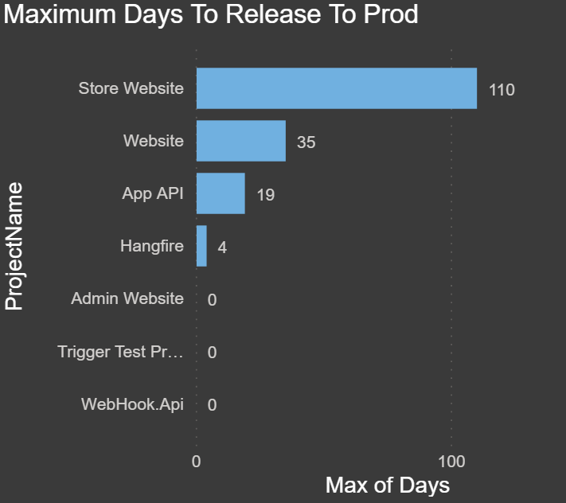

## Runbooks history charts {#runbooks-history-charts}
*Currently unavailable in the cloud API*

**Frequency of Runbooks by Date**: The chart below shows the frequency of executions by date. Since we have only recently started using runbooks, I have drilled down to the day to see how many we have run this month.

**Runbook Executions**: This is a count of all records in the runbooks history table, which is all of the executions of all runbooks.

**Succeeded Runs**: This is the count of all runs, filtered by TaskState = Succeeded.

**Failed Runs**: This is the count of all runs, filtered by TaskState = Failed.

**Total Runtime Hours**: This is a measure that tells us the total time of all the runbook execution in hours. Duration is stored in seconds so we divide it to arrive at the total number of hours.

**Total Runtime Minutes**: This is a measure that tells us the total time of all the runbook execution in hours. Duration is stored in seconds so we divide it to arrive at the total number of minutes.

**Total Runtime Seconds**: This is a sum of the entire duration for all runbook executions.

**Runbook Success Rates**: The chart below shows the count of Runbook Executions based on their task status, filtered by the `IsPublished` flag equaling true. We had some failures when were testing, obviously, but we only want to know if these failed after they have been published and used by our end users.

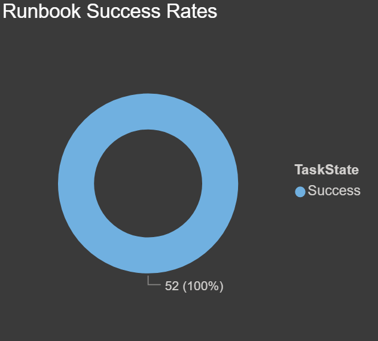

**Users Executing Runbooks**: The chart below shows which users are executing the runbooks and how many times each user has initiated an execution.

**Average Duration in Second by Runbook**: The chart below shows  the number of times each runbook has been executed. This chart is also filtered on the `IsPublished` flag = `true`.

This might seem like a lot amount of work to create these reports, and you are correct, it is. But I have a treat for you! I have taken a copy of my PowerBI reports and created a template for both the SQL Server and the Cloud instances of Octopus Deploy. Below are links to each template and links to my blog which covers setting up the connection string, API URL, and API key so that you can access your data.

- [SQL Server template: OctopusDeploySQLServer.pbt](https://tinyurl.com/ycz4awvl) ([Instructions](https://blog.reviewmydb.com/2020/06/how-to-configure-sql-server-powerbi.html)).
- [The Cloud template: OctopusDeployCloud.pbt](https://tinyurl.com/ydz9vjy5) ([Instructions](https://blog.reviewmydb.com/2020/06/how-to-configure-powerbi-template-for.html).

## Reports

Now that we have our data, we can view all of the charts we created. I have organized the charts into several report _pages_.

The first page is called **Deployments**. Here is a screenshot with a sample of the data from my local instance of Octopus Deploy for the last 5 years:

*Local Instance: Deployments Page*

This screenshot is a sample of data from my cloud app test:

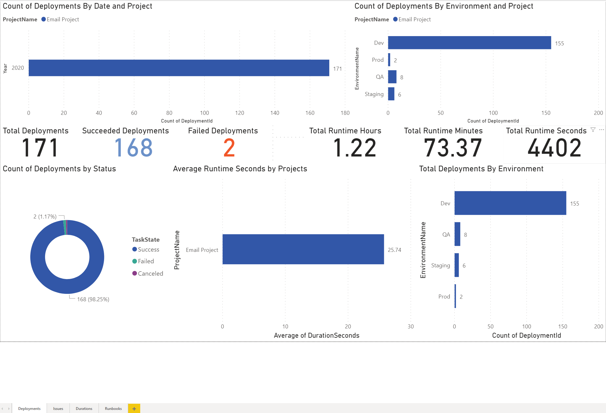
*Cloud Instance: Deployments Page*

The second page is **Issues**. This is a screenshot of my report with all of the charts relating to potential issues:

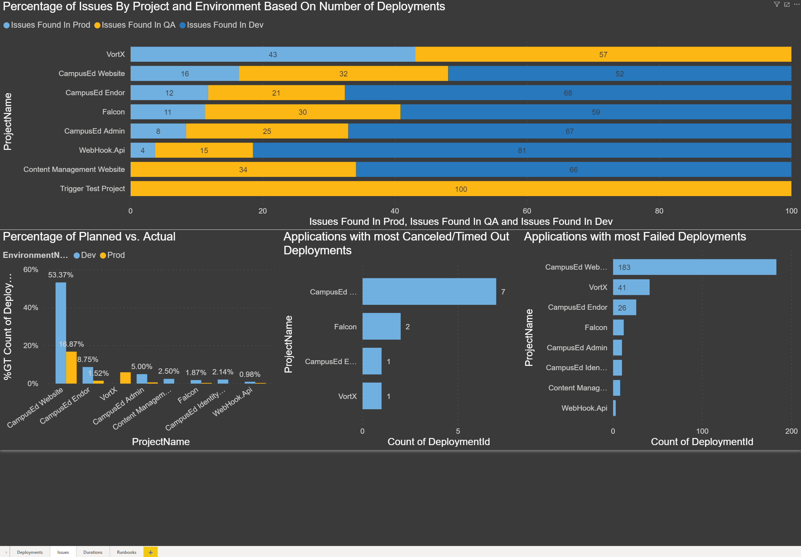
*Local Instance: Issues Page*

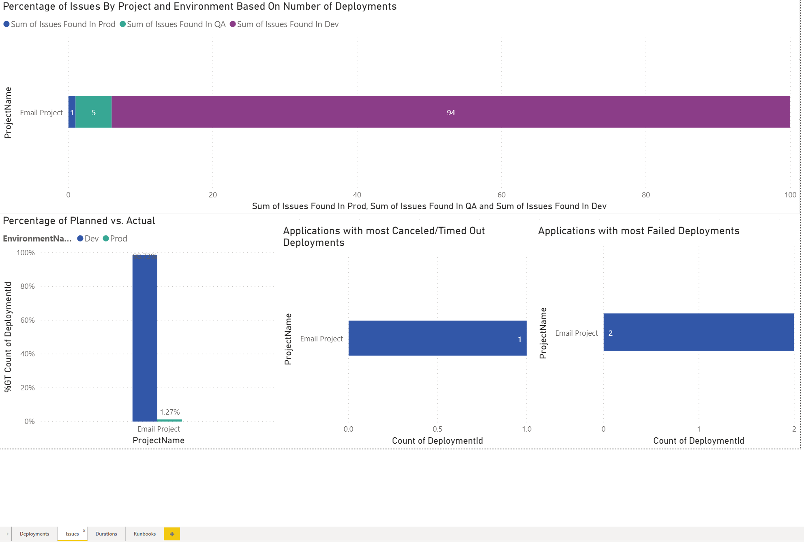
*Cloud Instance: Issues Page*

The third page is called **Durations** and contains all charts relating to execution duration:

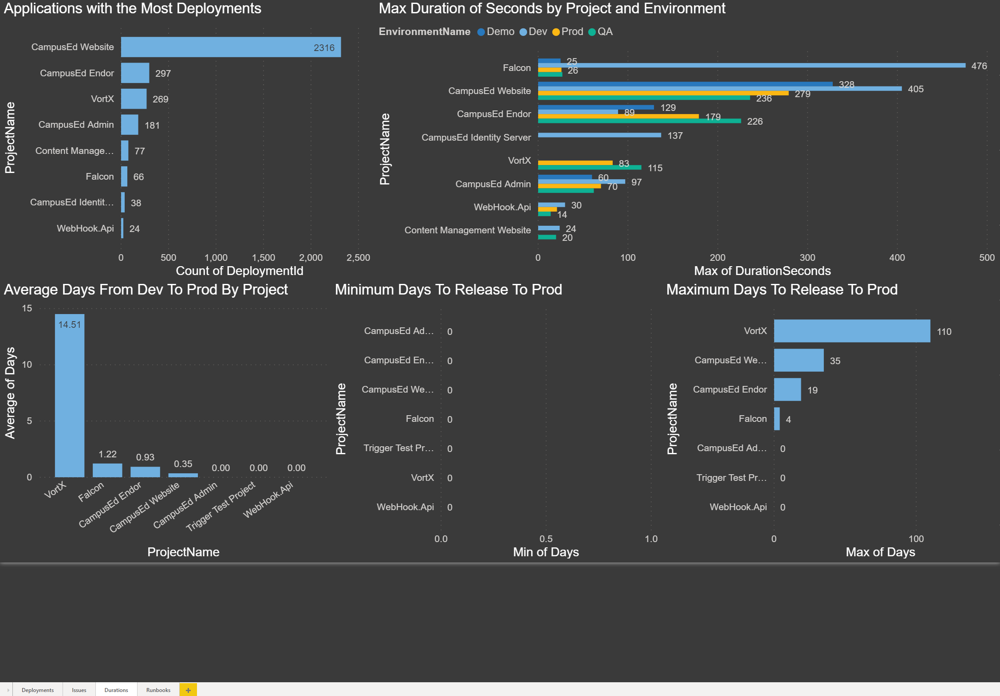
*Local Instance: Durations Page*

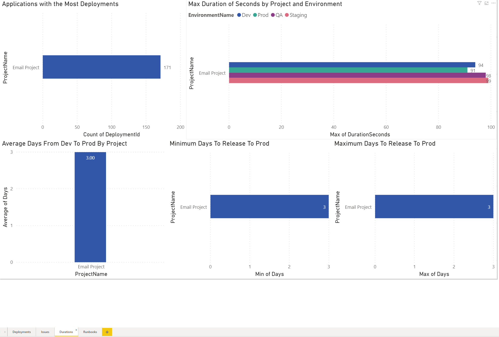
*Cloud Instance: Durations Page*

The final page is called **Runbooks**, this is currently only an option on the local instance of Octopus Deploy because there is no `RunbookHistory` API call on the cloud instance.

*Local Instance: Runbooks Page*

## ROI

So how much has Octopus Deploy saved my company? Let's look at the data we have collected.

Over the past five years, Octopus Deploy has executed 3,572 deployments. Let us say that on a typical manual deployment, each deployment takes 1 hour to deploy to multiple servers. In my case, we have at least one website, one API, and two databases. Our other environments have more web servers, which are in web farms, and more APIs.

At a bare minimum, that's 3,572 hours, and we know for sure it would have taken more time for the larger environments. Manual execution of 3,572 hours, but the Octopus Deploy engines automated execution time tool only 53.5 hours.

If we had a person handling the deployments, this would take approximately 1/3rd of their time each month just to perform deployments at about 60 hours out of a typical 168 hour work month.

If our hourly rate was $80/hr, it would have cost us over $57,000 each year for 5 years for a total of $285,760.00.

Now, if I could convince my company to give me a small bonus out of the $267,360.00, I saved them over the last 5 years that would be awesome, right?

## Conclusion

Now that you can see your data, I hope that you find some of these reports and charts useful, and perhaps you will even think up of new reports and charts to add to this. If you do, comment and share your ideas, and perhaps I can incorporate them into my next version.
