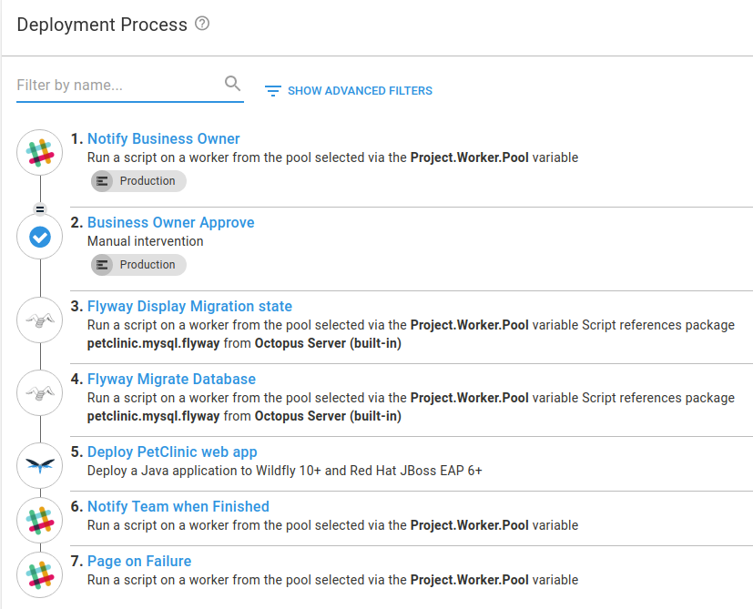
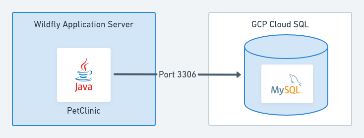
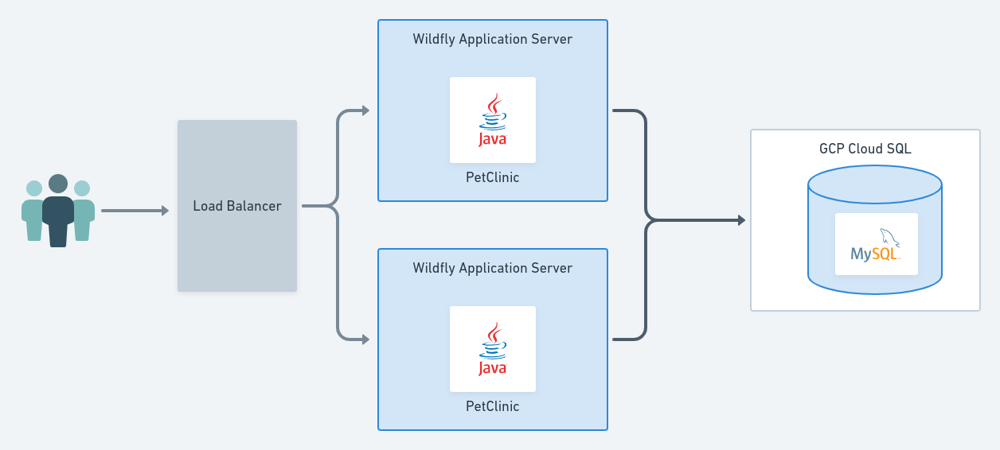
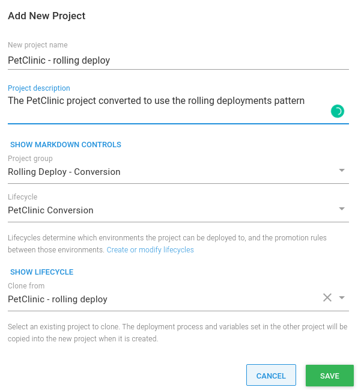
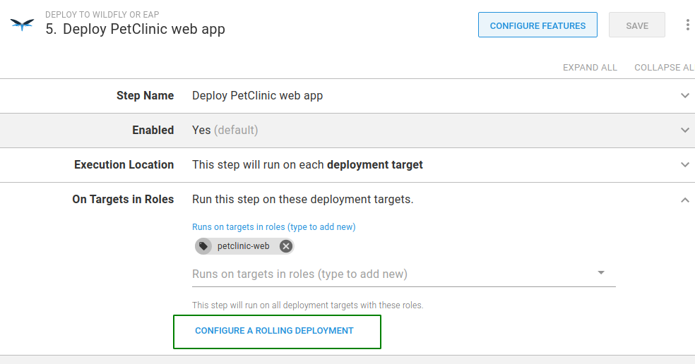
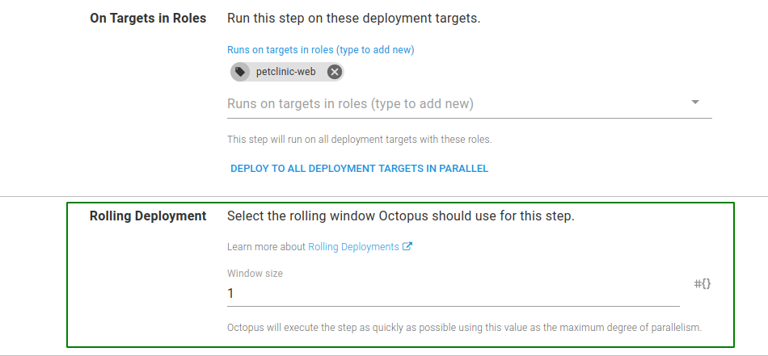
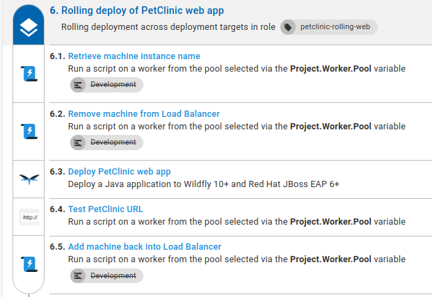
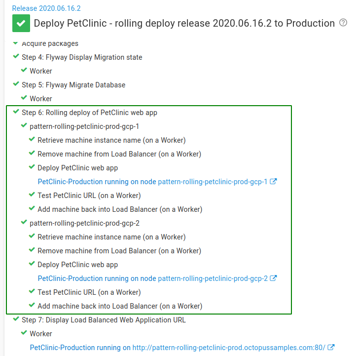

In a previous post this year, I wrote about the [benefits of the rolling deployments pattern](/blog/2020-01/ultimate-guide-to-rolling-deployments/index.md) as a way to reduce application downtime when deploying. Designing an application to fit this deployment pattern is arguably much easier when you’re first creating it. But where do you start with an existing application, and how do you take the application and convert it to use the rolling deployments pattern?

In this post, I’ll show you how to convert an existing application to use the rolling deployments pattern in Octopus with the help of [Child Steps](https://octopus.com/docs/deployment-patterns/rolling-deployments#Rollingdeployments-Childsteps).

<h2>In this post</h2>

!toc

## The application

I am going to use [PetClinic](https://github.com/spring-projects/spring-petclinic) as an example and convert this from a process which runs deployment steps sequentially in Octopus, to a rolling deployment process. PetClinic is a sample Spring Boot application written in Java, that has 2 main components:

- A web front-end
- A database

:::hint
I don’t explain how to build the PetClinic application in this post. If you are new to building Java applications, we have a number of [guides](https://octopus.com/docs/guides?application=java) which include step-by-step instructions to setup CI/CD pipelines for various tools.
:::

For both the sequential and rolling deployment processes, the PetClinic application and [MySQL](https://www.mysql.com/) database are hosted in [Google Cloud](https://cloud.google.com/gcp). All of the infrastructure used in these examples, including the servers, load balancer and databases are re-created regularly using [Operations Runbooks](https://octopus.com/docs/operations-runbooks).

### Some caveats

It’s important to highlight that this post won’t cover every element required for a zero-downtime deployment. It makes some assumptions about the application set-up:

1. The database is already deployed in a highly available configuration. For more information on MySQL high availability, refer to the [documentation](https://dev.mysql.com/doc/mysql-ha-scalability/en/ha-overview.html).
1. Changes to the database are made in a backward and forward compatible way using [Flyway](https://flywaydb.org/).
1. Any required session state is persisted for when an individual server is being deployed to.

## Sequential deployment process

For deployments where you aren’t concerned about any application downtime, Octopus caters for this perfectly by running steps sequentially by default, one after the other.

:::hint
**Start trigger**
It’s also possible to configure your deployment process to run steps in [parallel](https://octopus.com/docs/deployment-process/conditions#start-trigger). However, care should be taken to avoid a situation where steps run in parallel which depend on one another.
:::

The existing PetClinic application is modelled using this sequential deployment technique. The deployment process consists of a number of key steps:

- A [Manual intervention](https://octopus.com/docs/deployment-process/steps/manual-intervention-and-approvals) Approval step (for the `Production` Environment only).
- Flyway DB migration [community step templates](https://library.octopus.com/listing/flyway) steps to display migration state and apply any new database changes.
- A Deploy to [WildFly](https://wildfly.org/) step for the PetClinic web front-end.

In addition, the deployment process includes steps that will post messages to a [Slack](https://slack.com/) channel with deployment progression updates.

The complete deployment process can be seen here:



After [creating a release](https://octopus.com/docs/managing-releases#creating-a-release) in Octopus, you can see an example of the sequential deployment in action to the `Development` environment:


Each step is run one at a time, until the deployment is complete. When the `Deploy PetClinic web app` step is run, the application at this point becomes unavailable to serve requests to users. 

Perhaps unsurprisingly, the infrastructure used in these deployments (per Environment) look like this:



It includes:

- A single [Ubuntu](https://ubuntu.com/) virtual machine hosting the Wildfly application server
- A MySQL database hosted in a Google [Cloud SQL](https://cloud.google.com/sql/) Service.

:::success
**Sample Octopus Project**
You can see the PetClinic sequential deployment process **before** the conversion to a rolling deployment process, in our [samples instance](https://g.octopushq.com/PatternRollingSamplePetClinicNoRollingDeploy).
:::

## Converting to a rolling deployment process

Now that we have seen the deployment process for the existing application, we first need to decide on what our infrastructure will look like for the rolling deployment process. 

### Scaling up servers

In order to reduce downtime and still serve requests for users, we need to scale up the number of servers we use. We’ll also need a load-balancer that we can use to control which servers are available.

In the previous sequential deployment example, we had a single virtual machine per environment. To keep things simple we’ll keep the infrastructure for the `Development` environment the same as before. For the `Test` and `Production` environments however, the infrastructure will look like this:



This includes a *shared* load balancer, and this time two application servers in each environment, connecting into the MySQL database as before.

### Choosing a load balancer

There are many different types of load balancer, but a key requirement for this rolling deployments example is the ability to control which servers are available to serve traffic. For this reason, and as this example is running from Google Cloud, we’ll be using a [Network Load Balancer](https://cloud.google.com/load-balancing/docs/network/). This provides a way to add and remove our servers from the load balancer as part of the deployment process, which we’ll see a little later on. For more information about how to set up a network load balancer, please refer to the [Google documentation](https://cloud.google.com/load-balancing/docs/network/setting-up-network).

:::hint
In this example, the load balancer is shared between both the `Test` and the `Production` environment. To route traffic to the correct place, a different TCP Port is used at the load balancer to identify the intended environment. 
- Port `8080` is used for traffic destined for the `Test` environment.
- Port `80` is used for traffic destined for the `Production` environment.
:::

### Load balancer target pools

Previously, users would access the PetClinic web front-end directly on a single virtual machine. Here we’ll be using dedicated target pools for the `Test` and `Production` environments. A [target pool](https://cloud.google.com/load-balancing/docs/target-pools) is the name given to a group of Virtual Machine instances hosted in Google Cloud. 

### Create a new Project

In order to change our deployment process, and keep the ability to deploy PetClinic sequentially, we need to create a new project. One way to achieve this is by [cloning](https://octopus.com/docs/projects#clone-a-project) the existing project.

In the existing project, under *Settings*:
- Use the overflow menu (...) and select **Clone**:


- Give the new project you are cloning from the original project a name, review the settings and once you are satisfied, click **SAVE**:




### Convert the PetClinic deployment process

Next, we’ll convert the deployment process for the project itself. Not all of the PetClinic deployment process lends itself naturally to the rolling deployments pattern. For this reason, we’ll focus on the web front-end of PetClinic. 

:::hint
**Choosing what to convert**
It’s important to decide for yourself what elements of your project’s deployment process should be converted to use a rolling deployments pattern. In certain situations, it could make things *harder to deploy*.
:::

#### Configuring a rolling deployment

To convert the `Deploy PetCinic web app` step to a rolling deployment, we perform the following actions:

 - Open the step in the deployment process editor, expand the section *On Targets in Roles*, and click **CONFIGURE A ROLLING DEPLOYMENT**:



- In the *Rolling Deployment* option which appears, choose a **Window size**. Here I’ve chosen a Window Size of `1` since we will only deploy to a maximum of two servers per environment:



- Hit **SAVE** to update the deployment step.

#### Adding child steps

So we’ve configured a rolling deployment, but it’s not very intelligent yet. Currently, the process would deploy PetClinic to each server one at a time, taking each instance of the application offline as it deploys.

So next we need to add new steps to our rolling deployment to safely deploy new versions of the PetClinic application to each virtual machine, whilst still serving traffic to users on the other server.

These steps will cover:
1. Retrieving the virtual machine name.
1. Removing the virtual machine from the load balancer *before* the PetClinic deployment.
1. Adding the virtual machine into the load balancer *after* the PetClinic deployment.
1. Testing the PetClinic web front-end is available.

In Octopus, adding multiple steps to a rolling deployment process is done with [Child steps](https://octopus.com/docs/deployment-patterns/rolling-deployments#Rollingdeployments-Childsteps).


:::warning
**gcloud CLI and authorization**
Most of the commands used interacting with Google in this next section make use of the [Google Cloud CLI](https://cloud.google.com/sdk/gcloud). To use the `gcloud` CLI you usually need to authorize it. For further information on gcloud authorization, please refer to the [documentation](https://cloud.google.com/sdk/docs/authorizing).
:::

##### Add a new Child Step

To add a Child step, we open the overflow menu (...) for the existing `Deploy PetClinic web app` step and select **Add child step**:


We are presented with the **Choose Step Template** selector where we choose the required step type.

Next, I’ll briefly walk through the new child steps needed to complete the rolling deployment process. Some of the script examples have been reduced to the minimum needed to highlight the key parts.

##### Retrieve instance name

This [script step](https://octopus.com/docs/deployment-examples/custom-scripts/run-a-script-step) is required so that we can identify the name of the virtual machine hosted in Google Cloud for use when removing and adding to the load balancer. This is achieved by querying Google using the gcloud `instances describe` command:

```powershell
$machineName = $OctopusParameters["Octopus.Machine.Name"]

$instanceName=(& gcloud compute instances describe $machineName --project=$projectName --zone=$zone --format="get(name)" --quiet) -join ", "
```

If a match is found using the machine identified by the Octopus system variable `Octopus.Machine.Name`, the script sets an [Output variable](https://octopus.com/docs/projects/variables/output-variables) with the name as recorded in Google Cloud:

```powershell
Set-OctopusVariable -name "InstanceName" -value $instanceName
```

##### Remove the machine from the load balancer

Once we have the name of the machine we are deploying to, we want to remove it from the load balancer target pool. However, to prevent an attempt to remove the virtual machine from the target pool when it’s not present to start with, we can run the gcloud `target-pools describe` command to check:

```powershell
$instances=(& gcloud compute target-pools describe $targetPoolName --format="flattened(instances[])" --region=$region --project=$projectName --quiet)
```

If the instance is found in the target pool, we run the gcloud `target-pools remove-instances` command supplying the instance name with the `--instances` parameter:

```powershell
$instanceName = $OctopusParameters["Octopus.Action[Retrieve machine instance name].Output.InstanceName"]

$response=(& gcloud compute target-pools remove-instances $targetPoolName --instances=$instanceName --instances-zone=$zone --project=$projectName --quiet)
```

Once the virtual machine has been removed from the load balancer, we can proceed to deploy the PetClinic application.

:::hint
We don’t need to add a new child step to deploy the PetClinic application, as it already exists. Instead we will place that step in the right place once we have added the necessary child steps.
:::

##### Testing the PetClinic application

After the PetClinic front-end has been deployed, we can test if it’s responding to requests by adding a Community [step template](https://g.octopushq.comCommunityContributedStepTemplates) called **HTTP - Test URL** as a child step.

We use a variable of `#{Project.Wildfly.Url}` to test that it returns a HTTP 200 OK response. This will tell us if the application is running. Any other HTTP response will result in a failure.

##### Adding the machine to the load balancer

Lastly, when the PetClinic application has been verified as online, we can add it back to the load balancer target pool. We do this by running the gcloud `target-pools add-instances` command supplying the instance name (as before) with the `--instances` parameter:

```powershell
$instanceName = $OctopusParameters["Octopus.Action[Retrieve machine instance name].Output.InstanceName"]

$response=(& gcloud compute target-pools add-instances $targetPoolName --instances=$instanceName --instances-zone=$zone --project=$projectName --quiet)
```

##### Re-ordering the child steps

Once all of the child steps have been added, you can also reorder them if necessary. In our case we need to move the original `Deploy PetClinic web app` step to the middle so that we don’t deploy the application to the virtual machine *until* it has been removed from the load balancer.

To reorder the child steps:
- Use the overflow menu (...) and select **Reorder child steps**.
- Rearrange the steps in the desired order.
- Click **SAVE** when done.


#### The rolling deployment process

Some of the steps in the rolling deployment process aren’t required for the `Development` Environment. This is because in that environment, we’re not using a load balancer. To skip the steps which don’t need to run, we can make use of an Environment [run condition](https://octopus.com/docs/deployment-process/conditions#environments). This will skip the steps used for the load-balanced environments. 

The complete rolling deployment process is shown here: 



And that’s it! We’ve successfully converted our deployment process from a sequential one to a rolling deployment.

:::success
**Sample Octopus Project**
You can see the complete PetClinic deployment process **after** the conversion to a rolling deployment process, in our [samples instance](https://g.octopushq.com/PatternRollingSamplePetClinicRollingDeploy).
:::



### Switch over to new Infrastructure

:::warning
Switching your DNS over may result in downtime.
:::

### Clean-up

At this point, you can clean up your old Octopus project by either disabling it, and effectively archiving it, or delete it if you no longer need it for any audit requirements.

:::success
**Sample Octopus Projects**
You can see the before and after of the project conversion discussed here in our samples instance.

- [PetClinic project - with no rolling deployments](https://g.octopushq.com/PatternRollingSamplePetClinicNoRollingDeploy)
- [PetClinic project - with rolling deployments](https://g.octopushq.com/PatternRollingSamplePetClinicRollingDeploy)
- [PetClinic Infrastructure Runbooks](https://g.octopushq.com/PatternRollingSamplePetClinicIacRunbooks)
:::

## Conclusion

TODO

## Learn more
- [Octopus Rolling deployments docs](https://octopus.com/docs/deployment-patterns/rolling-deployments)
- [Octopus CI/CD guides](https://octopus.com/docs/guides)
