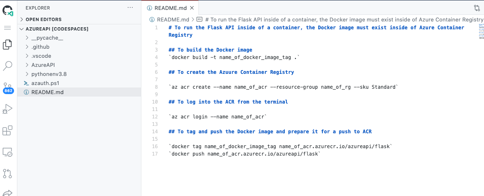
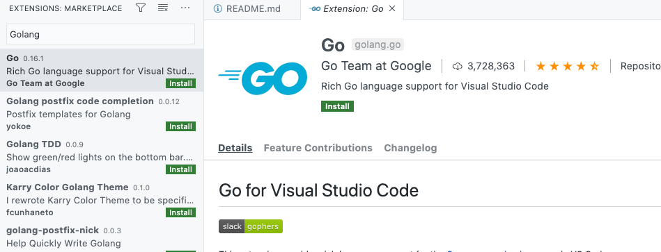

There are many source control systems, but let’s face it, GitHub is arguably the most popular.

GitHub recently stepped their game up in the CI/CD space by introducing GitHub Actions, and at Microsoft Build 2020, they introduced [GitHub Codespaces](https://github.com/features/codespaces).

GitHub Codespaces is like Visual Studio Codespaces, which is VS Code in a UI, except with GitHub Codespaces, it’s built into GitHub, which provides a one-stop-shop for all your development needs.

In this blog post, I’ll walk through the private beta and how to use it if you’ve been accepted into the beta program.

## Prerequisites

To follow along, you need:

- The private beta invitation to GitHub Codespaces. If you don’t already have that, you can [request early access](https://github.com/features/codespaces).
- A GitHub account.
- At least one repository.

## Why GitHub Codespaces?

There’s one big problem with having so many development tools and ways to write code; there’s simply no centralized place to store the specific configurations that you want. Take VS Code for example, let’s say you have a few different machines you work on, or you’re pair-programming with a teammate, to work on the same code across the board and have it look identical, you need a few things:

- Extensions.
- Logged into services, for example, logging into Azure from VS Code.
- Themes.
- Settings in the `settings.json`.
- Runtimes.
- Linters.

You see where this is going. It can be cumbersome to manage.

With something like Codespaces, you don’t have to worry about this. All settings and configurations are in one place, regardless of where you log in from.

Codespaces provides the centralized location for your specific development needs.

## Setting up Codespaces

If the private beta is active, you’ll see a new icon on the top taskbar called **Codespaces**. It should be added automatically, but you may have to log out of GitHub and back in again.

1. Log into GitHub and click on the **Codespaces** icon.
2. Click on the green **New Codespace** button.
3. You will see two options:

- Repository
- Branch

Choose a repository that you’d like to open in Codespaces. The code will show in Codespaces, so anything will work.

4. Click the green **Create codespace** button.

The codespace will open, and you’ll be able to see the code from the repository like you would when using VS Code on the desktop:

## First look at extensions

From an extensions perspective, nothing has changed. Any extensions you could normally use in VS Code can be used in Codespaces.

1. Open the extensions tab:
2. Search for an extension, for example, Golang:

## Settings in GitHub Codespaces

Surprisingly, even the settings are pretty much the same in Codespaces as they are in VS Code, which makes it a familiar and smooth transition:

1. Click on the **Settings** icon on the bottom left corner.
2. From there, you can configure the environment, user environment, and remote Codespaces environment:

## Conclusion

Although GitHub Codespaces is still in private preview, it’s very apparent that it’s the tool of the future. There’s just no need for a developer to leave GitHub. They can now store code and write it all in one place.
