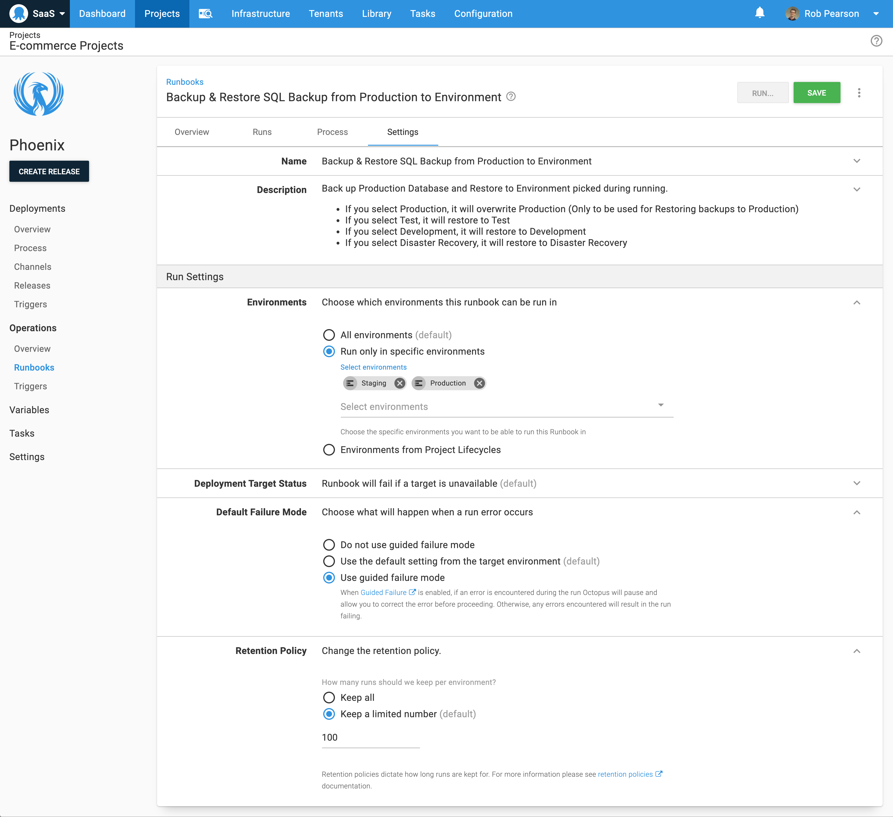
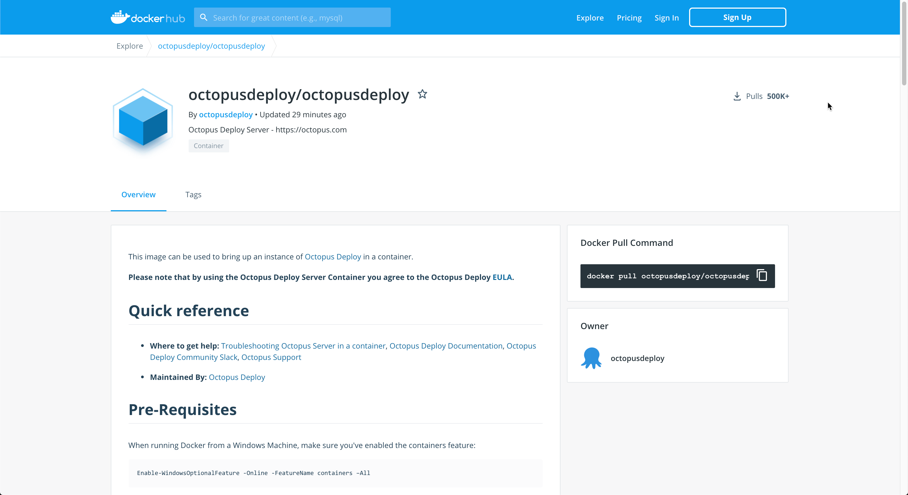

We’re delighted to ship Octopus 2020.3, our third release of the year. This release includes some great updates to improve your day to day Octopus experience.

* [Runbooks++](blog/2020-08/octopus-release-2020-3/index.md#runbooks) is a batch of customer-driven improvements including Octopus CLI support, environment scoping, guided failure mode per runbook and the addition of Runbook retention policies.
* [Jenkins Pipelines](blog/2020-08/octopus-release-2020-3/index.md#jenkins-pipelines) support enables you to integrate with Octopus from your `Jenkinsfile`.
* [Streamlined process editor](blog/2020-08/octopus-release-2020-3/index.md#streamlined-process-editor) enables you to make edit your automated process and jump between steps without saving them in a single update.
* [Octopus Linux Docker image (Early access)](blog/2020-08/octopus-release-2020-3/index.md#octopus-linux-image) is now available in early access which enables teams to run Octopus in a Linux Docker container. 
* [Shields.io badge](blog/2020-08/octopus-release-2020-3/index.md#shieldsio) support enables you to share the status of your Octopus projects on your deployed websites.

This release is the [third of six in 2020](/blog/2020-03/releases-and-lts/index.md), and it includes six months of long term support. The following table shows our current releases with long term support.

| Release               | Long term support           |
| --------------------- | --------------------------- |
| Octopus 2020.3        | Yes                         |
| Octopus 2020.2        | Yes                         |
| Octopus 2020.1        | Yes                         |
| Octopus 2019.12       | Expired                     |
| Octopus 2019.9        | Expired                     |

Keep reading to learn more about the updates.

## Runbooks++ {#runbooks}

We first shipped Runbook automation support in Octopus 2020.11 and it has been one of our fastest growing features ever! We've also received some great feedback which is fantasticsince then we've received some great feedback from our customers. 

In this release, we're shipping a number of improvements to make using runbooks even better.

### Runbook only projects

Octopus now supports a cleaner runbook only style project and the UI reflects this. It's still possible to add deployments to a project at a later date but this makes it easier to have more operations focused projects.

### Octopus CLI support

We have updated the Octopus CLI to add a `run-runbook` command so that you can now execute your runbooks from the command line and scripts on your platform of choice.

### Runbook run settings

We've added a number of new Runbook run settings to enable you to control runbook execution better.

* Environment scoping - You can choose which environments a runbook can be run in.
* Guided failure per runbook - You can customize your guided failure settings per runbook. This enables you to select not to use guided failure mode, use the default setting from the target environment or to always use guided failure mode.
* Runbook retention policies - You can also control your runbook retention to better manage their execution artifacts and clean-up.

[Learn more](https://octopus.com/docs/runbooks)

## Jenkins Pipelines

We have updated our Jenkins plugin to add support integrate with Octopus from your `Jenkinsfile`. Previously, you needed to do this yourself via calls to the Octopus CLI but this is now supported out of the box. 

[Learn more](/blog/2020-07/using-jenkins-pipelines/index.md)

## Streamlined process editor

As a part of our [Config as Code](https://octopus.com/roadmap#pipeline-as-code) work, we have updated our process editor to makes it easier than ever to automate your deployments and runbooks. You can now edit your entire process, including updating multiple steps, and save all your changes with a single click. Previously, you needed to save your changes to each step over and over which could be frustrating for larger updates. This is no longer required as Octopus now tracks all your changes and allows you to save once. 

Try it yourself and I think you'll find it's a far more natural editing experience.

## Octopus Linux Docker image (Early access) {#octopus-linux-docker-image}

Last year, we shifted our Octopus Cloud service from Windows-based virtual machines to  [Linux-based containers running in Kubernetes](https://octopus.com/blog/octopus-cloud-v2-why-kubernetes). We undertook this change to reduce our running costs and increase the performance and scalability of the service. This solution has been running for almost 12 months and we're very happy with the result. 

We made this shift for ourselves but we also envisioned our customers using them to self-host Octopus with our Docker images. Therefore, we're very pleased to announce early access to our Octopus Deploy docker images, which are based on the same code that powers our cloud solution. These images allow Linux users to host Octopus on their operating system of choice.

Checkout our [DockerHub repository](https://hub.docker.com/r/octopusdeploy/octopusdeploy) to get started and I highly recommend the detailed article linked below with more detailed instructions. 

NOTE: Our Docker images are available as an early release therefore we do expect a few bugs and rough edges, and we do not support this version for production deployments. That said, 

[Learn more](/blog/2020-08/introducing-linux-docker-image/index.md)

## Breaking changes

This release includes two broken changes.

* We have deprecated our Azure VM extensions, and we recommend using PowerShell DSC as a replacement. Our documentation covers this decision and links to further articles on how to achieve this with PowerShell DSC. See our [related posts]() for instructions on how to achieve this with Amazon Web Services as well.
* We have updated our [Deploy to IIS step](https://octopus.com/docs/deployment-examples/iis-websites-and-application-pools) to remove support to deploy to Azure App Services. This coincidentally worked however it is no longer supported. We recommend using our [Azure support](https://octopus.com/docs/deployment-examples/azure-deployments) instead.

## Upgrading

Octopus Cloud users are already running this release, and self-hosted Octopus customers can [download](https://octopus.com/downloads/2020.3.0) the latest release now.  

As usual, the [steps for upgrading Octopus Deploy](https://octopus.com/docs/administration/upgrading) apply. Please see the [release notes](https://octopus.com/downloads/compare?to=2020.3.0) for further information.

## What’s coming in Octopus 2020.4?

Check out our [public roadmap](https://octopus.com/roadmap) to see what’s coming next and register for updates. Config as Code is progressing well,  we're adding better support for YAML, XML and application.properties config file updates and we're adding support for built-in Linux Workers on Octopus Cloud.

## Conclusion

Octopus 2020.3 is now generally available and it includes improvements to make it easier for teams to build automated deployment and runbook processes, Jenkins Pipeline support and more. We hope you enjoy it! 

Feel free to leave us a comment, and let us know what you think! Happy deployments!

## Related posts

* [Using Jenkins Pipelines with Octopus](/blog/2020-07/using-jenkins-pipelines/index.md)
* [Introducing the Octopus Server Linux Docker image](/blog/2020-07/introducing-linux-docker-image/index.md)
* [Getting started with PowerShell Desired State Configuration (DSC)](/blog/2019-10/getting-started-with-powershell-dsc/index.md)
* [Installing Tentacles with DSC in AWS CloudFormation templates](/blog/2020-07/dsc-with-aws-cloudformation/index.md)
* [Creating EC2 instance in AWS with CloudFormation](/blog/2020-07/aws-cloudformation-ec2-examples/index.md)