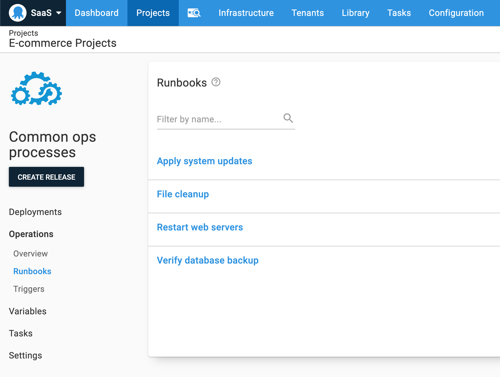
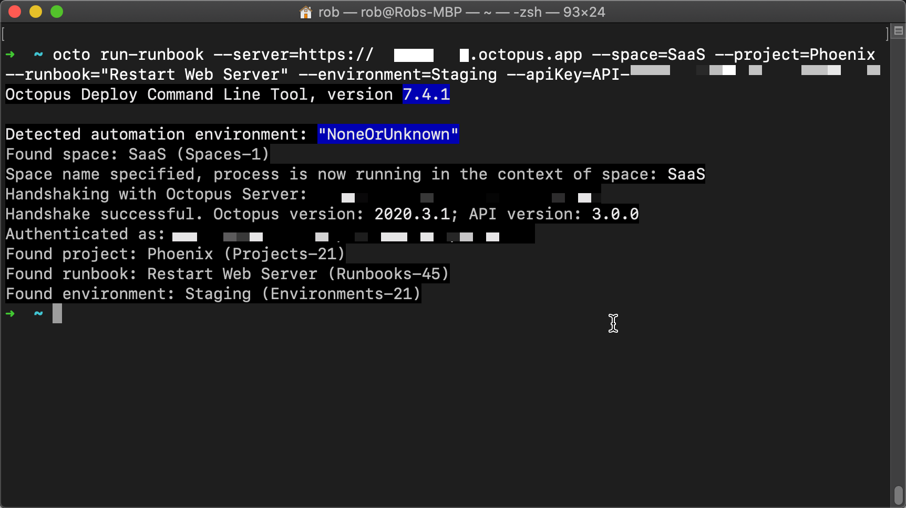
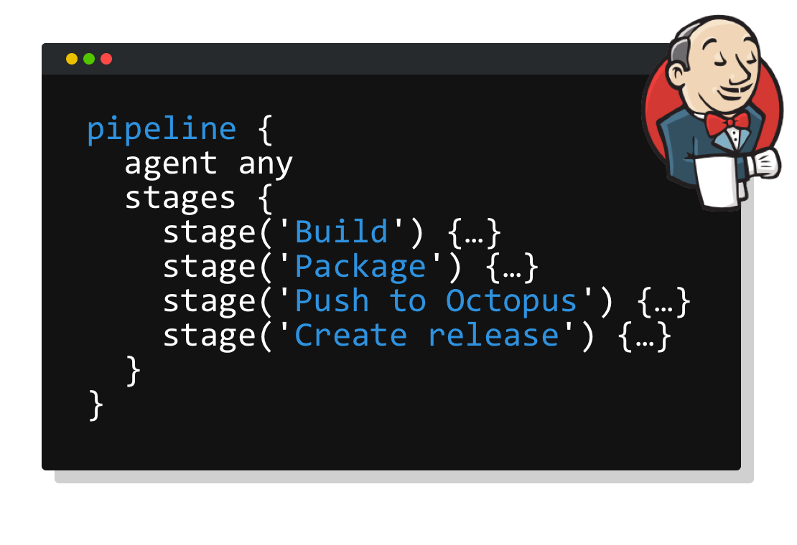
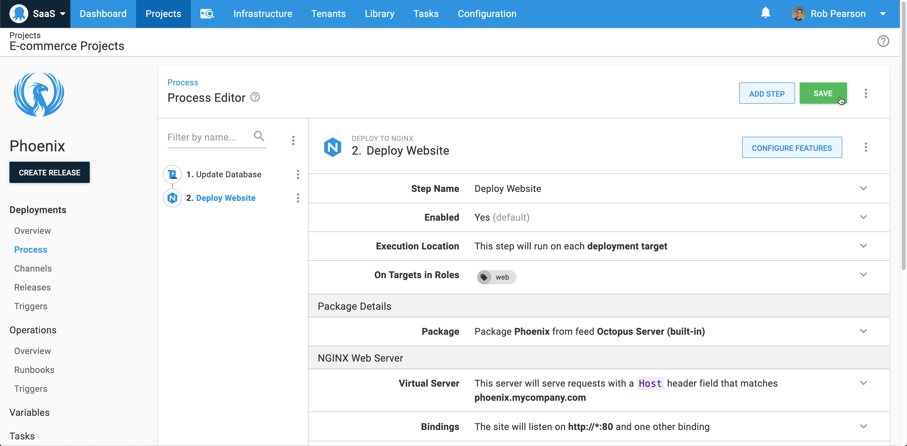

We’re delighted to ship Octopus 2020.3, our third release of the year. This release includes some great updates to improve your day to day Octopus experience.

* [Runbooks improvements](blog/2020-08/octopus-release-2020-3/index.md#runbooks): This release includes a batch of customer-driven improvements, including runbook-only projects, Octopus CLI support, environment scoping, guided failure mode per runbook, and the addition of runbook retention policies.
* [Jenkins Pipelines](blog/2020-08/octopus-release-2020-3/index.md#jenkins-pipelines) support enables you to integrate with Octopus from your `Jenkinsfile`.
* [Streamlined process editor](blog/2020-08/octopus-release-2020-3/index.md#streamlined-process-editor) allows you to edit multiple steps at once and save your changes with a single update.
* [Octopus Linux Docker image (Early access)](blog/2020-08/octopus-release-2020-3/index.md#octopus-linux-image) is now available, making it possible to run Octopus in a Linux Docker container. 

This release is the [third of six in 2020](/blog/2020-03/releases-and-lts/index.md), and it includes six months of long-term support. The following table shows our current versions with long-term support:

| Release               | Long-term support  | LTS end date |
| --------------------- | ------------------ | ------------ |
| Octopus 2020.3        | Yes                | 2021-01-20   |
| Octopus 2020.2        | Yes                | 2020-09-31   |
| Octopus 2020.1        | Yes                | 2020-08-24   |
| Octopus 2019.12       | Expired            | 2020-07-14   |

Keep reading to learn more about the updates.

## Runbooks {#runbooks}

We first shipped Runbook Automation support in Octopus 2019.11, and it has been one of our fastest-growing features ever! We’re thrilled with the usage level and actively listening to your feedback. In this release, we’re shipping several customer-driven improvements to make using runbooks even better.

### Runbook only projects

Octopus now supports a cleaner runbook-only project style, and the UI reflects this. It’s still possible to add deployments to a project at a later date, but this makes it easier to have more operations focused projects. This style is applied if you have a project that only contains runbooks.

### Octopus CLI support

We have updated the Octopus CLI to add a `run-runbook` command to execute your runbooks from the command-line and scripts on your platform of choice.

### Runbook run settings

 

We’ve added new runbook run settings to enable even more advanced control of runbook execution:

* Environment scoping: You can choose which environments a runbook can be run in.
* Guided failure per runbook: You can customize your guided failure settings per runbook. This means you can choose whether to use guided failure mode or not, use the default setting from the target environment, or to always use guided failure mode.
* Runbook retention policies: You can also control your runbook retention to better manage their execution artifacts and clean-up.

[Learn more](https://octopus.com/docs/runbooks)

## Jenkins Pipelines

We have updated our Jenkins plug-in to add support for integrating with Octopus from your `Jenkinsfile`. Previously, you needed to automate this yourself with the Octopus CLI, but this is now supported out-of-the-box. The syntax is much cleaner and more concise.

[Learn more](/blog/2020-07/using-jenkins-pipelines/index.md)

## Streamlined process editor

As a part of our [Config as Code](https://octopus.com/roadmap#pipeline-as-code) feature, we’ve updated our process editor to makes it easier to automate your deployments and runbooks. You can now edit your entire process, including updating multiple steps and save all your changes with a single click. Previously, you needed to save your changes one at a time, which could be frustrating for larger updates. This is no longer required as Octopus now tracks all your changes and allows you to save just once. 

Try it yourself, and I think you’ll find it’s a far more natural editing experience.

## Octopus Linux Docker image (Early access) {#octopus-linux-docker-image}

Last year, we moved our Octopus Cloud service from Windows-based virtual machines to [Linux-based containers running in Kubernetes](https://octopus.com/blog/octopus-cloud-v2-why-kubernetes). We undertook this change to reduce our running costs and increase the performance and scalability of the service. This solution has been running for almost 12 months, and we’re very happy with the result. 

We made this shift for ourselves, but we also envisioned our customers self-hosting Octopus with our Docker images. Therefore, we’re excited to announce early access to our Octopus Deploy Docker images, which are based on the same code that powers Octopus Cloud. These images allow Linux users to self-host Octopus on their operating system of choice.

Checkout our [DockerHub repository](https://hub.docker.com/r/octopusdeploy/octopusdeploy) to get started, and I highly recommend following the **Learn More** link to find more detailed instructions and a thorough example.

**NOTE**: Our Docker images are available as an early release; we expect a few bugs and rough edges, and we do **not** support this version for production deployments. That said, we’re keen for feedback so please kick the tires and contact our [support team](https://octopus.com/support) with any comments or issues.

[Learn more](/blog/2020-08/introducing-linux-docker-image/index.md)

## Breaking changes

This release includes two breaking changes.

* We have deprecated our Azure VM extensions, and we recommend using PowerShell DSC as a replacement. Our documentation covers this decision and links to further articles on how to achieve this with PowerShell DSC. See the [related posts](blog/2020-08/octopus-release-2020-3/index.md#related-posts) below for instructions to accomplish this with Amazon Web Services as well.
* We have updated our [Deploy to IIS step](https://octopus.com/docs/deployment-examples/iis-websites-and-application-pools) to remove support to deploy to Azure App Services. We recommend using our [Azure support](https://octopus.com/docs/deployment-examples/azure-deployments) instead.

## Upgrading

Octopus Cloud users are already running this release, and self-hosted Octopus customers can [download](https://octopus.com/downloads/2020.3.0) the latest version now.  

As usual, the [steps for upgrading Octopus Deploy](https://octopus.com/docs/administration/upgrading) apply. Please see the [release notes](https://octopus.com/downloads/compare?to=2020.3.0) for further information.

## What’s coming in Octopus 2020.4?

Check out our [public roadmap](https://octopus.com/roadmap) to see what’s coming next and register for updates. Config as Code is progressing well, we’re adding better support for YAML, XML, and application.properties config file updates, and we’re adding support for built-in Linux Workers on Octopus Cloud.

## Conclusion

Octopus 2020.3 is now generally available, and it includes improvements to make it easier for teams to build automated deployment and runbook processes, Jenkins Pipeline support, and more. We hope you enjoy it! 

Feel free to leave  a comment, and let us know what you think! Happy deployments!

## Related posts

* [Using Jenkins Pipelines with Octopus](/blog/2020-07/using-jenkins-pipelines/index.md)
* [Introducing the Octopus Server Linux Docker image](/blog/2020-08/introducing-linux-docker-image/index.md)
* [Creating EC2 instance in AWS with CloudFormation](/blog/2020-08/aws-cloudformation-ec2-examples/index.md)
* [Getting started with PowerShell Desired State Configuration (DSC)](/blog/2019-10/getting-started-with-powershell-dsc/index.md)
* [Installing Tentacles with DSC in AWS CloudFormation templates](/blog/2020-08/dsc-with-aws-cloudformation/index.md)