I recently picked up a new Dell XPS 15" laptop after being on a Macbook Pro for 2 years. I looked back at Bob Walkers [Automating developer machine setup with Chocolatey](https://octopus.com/blog/automate-developer-machine-setup-with-chocolatey) blog, and it got me thinking about how I could automate it with [Chocolatey](chocolatey.org/) and [Runbooks](https://octopus.com/docs/runbooks). I would recommend spending time going through Bob's blog before or after reading this blog as it may help if you're new to Chocolatey.

I use Chocolatey when provisioning Cloud and On-Premises servers. When working in Operations and using Infrastructure as Code, I used Chocolatey to install a range of tools on Servers, Laptops, and Desktops. I recently presented a Webinar with [Paul Broadwith](twitter.com/pauby) from Chocolatey about [Operations Automation with Octopus Runbooks and Chocolatey](https://www.youtube.com/watch?v=E0z4QbwTuBg), which showed how easy this was to do with Runbooks on Cloud infrastructure. In the webinar, we focus on using ARM Templates, Octopus Runbooks, and Chocolatey to provision Developer machines and Server on [Azure](https://azure.microsoft.com/en-gb/overview/what-is-azure/).

The problem I am trying to solve here is to automate all of my packages in a single Octopus Runbook using Chocolatey to install every application I use in my day to day role. Also, everyone loves a fresh install of Windows, and I am no different. There's something fresh about a brand new install, and I may look at refreshing my laptop every so often, and I wanted a way to automate that and make it as painless as possible. I'd also like to share this with other team members so they can use this script whenever they want to re-prep their windows laptop or even a server.

!toc

## What is Chocolatey

Chocolatey is a Package Manager for Windows. It's an open-source project that provides Developers, Operations, and everything in between a way to manage, install, and upgrade software across their Windows estate. Chocolatey focuses on making managing Windows software more straightforward, streamlined, and accessible to everyone using a Windows computer. If you want to find out more about installing Chocolatey without Runbooks, check out the Chocolatey Install [doc](https://chocolatey.org/install).

You don't need Runbooks to use Chocolatey, and it's as simple as opening a Windows PowerShell window and running a script to install something like google chrome:

```PowerShell
choco install googlechrome -y
```

If you wanted to install more than a single application, you could write some PowerShell scripts and execute them locally such as:

```PowerShell
Write-Host "Installing SQL Server Management Studio"
choco install sql-server-management-studio -y

Write-Host "Installing SQL Server Developer Edition"
choco install sql-server-2019 -y

Write-Host "Installing Github Desktop"
choco install github-desktop -y
```

You could extend this out to all of your required applications, and source control the script to somewhere like [Github](Github.com) and allows read access, so the script can be run by users or during machine provisioning and this will automate almost all of your application installation.

### Chocolatey Packages

Chocolatey is an open-source tool, and you can get lots of pre-configured packages from the site. In my experience, though, most organizations write their own packages, and you can do this too, and you can see more about this on the [Create Chocolatey Package Page](https://chocolatey.org/blog/create-chocolatey-packages). The main reason for writing your own package is because:

- Company purchased licenses that need to be contained in the package.
- Custom configuration, such as a backup agent that needs to replicate to SiteA from SiteB.
- Community package may not exist.

If you are writing your own package, consider sharing it with the Chocolatey community, and you can read more about that on the [Chocolatey site](https://chocolatey.org/docs/create-packages).

You can install Octopus from a chocolatey package. We publish each new version as soon as it's available, which happens automatically from our [TeamCity](https://www.jetbrains.com/teamcity/) build server once it's available on our website. You can see and read more about the Octopus Deploy Chocolatey Package [here](https://chocolatey.org/packages/OctopusDeploy)

To install Octopus Deploy as a chocolatey package, you can run the following:

```PowerShell
choco install OctopusDeploy -y
```

:::hint
You still need to configure Octopus after using Chocolatey to install, and you can automate this, and there's more information on [Automating Octopus Installation](https://octopus.com/docs/installation/automating-installation).
:::

## Why use Runbooks and Chocolatey

[Runbooks](https://octopus.com/docs/runbooks) is my favorite feature of Octopus Deploy. Due to my Operations background, I can see how it automate all those tasks that take up so much time in Operations that will allow Admins, DevOps Engineers, and similar to automate the mundane away from your day. Being in Operations can be a challenging position to be. It can be a little thankless at times, and it reminds me of times where people wondering what you're doing as everything "just works", and then they come to you and complain what we're even doing "when everything breaks".

Let's be honest, how many times can you install [IIS](https://www.iis.net/) or [SQL](https://en.wikipedia.org/wiki/Microsoft_SQL_Server) before it becomes tedious, repetitive, and error-prone? 

Another benefit of using Chocolatey in Octopus Runbooks is that it helps enable Self-Service when it comes to applications. You can grant people access to the Octopus Project and the Runbook so they can run their own installation of Chocolatey packages.

You can use [Runbooks](https://octopus.com/docs/runbooks) to automate this part away to allow you to focus on more interesting problems:

- [Routine Operations](https://octopus.com/docs/runbooks/runbook-examples/routine)
- [Emergency Operations](https://octopus.com/docs/runbooks/runbook-examples/emergency)
- [Database Operations](https://octopus.com/docs/runbooks/runbook-examples/databases)
- [AWS Operations](https://octopus.com/docs/runbooks/runbook-examples/aws)
- [Azure Operations](https://octopus.com/docs/runbooks/runbook-examples/azure)
- [GCP Operations](https://octopus.com/docs/runbooks/runbook-examples/gcp)
- [Terraform](https://octopus.com/docs/runbooks/runbook-examples/terraform)

## Let's get going

This blog will not deal with installing the Operating System on your developer machine. There are loads of great tools out there that you can use to load the latest Windows Desktop and Server Operating Systems, and I am going to assume you've added the [Octopus Tentacle](https://octopus.com/docs/infrastructure/deployment-targets/windows-targets) as part of this process. Some tools I've used in the past when prepping Servers, Laptops, and Desktops are:

- [Microsoft System Centre Configuration Manager](https://en.wikipedia.org/wiki/Microsoft_System_Center_Configuration_Manager)
- [Windows Deployment Services](https://docs.microsoft.com/en-us/windows/deployment/windows-deployment-scenarios-and-tools)
- [Packer](https://www.packer.io/)

Generally, public cloud providers also provide tools to allow you to do Infrastructure as Code such as:

- [Azure Resource Manager Templates](https://docs.microsoft.com/en-us/azure/azure-resource-manager/management/overview)
- [AWS Cloudformation](https://aws.amazon.com/cloudformation/)
- [Google Deployment Manager](https://cloud.google.com/deployment-manager/docs)
- [Terraform](https://www.terraform.io/)

## Preparation

The first thing I did was see what [Space](https://octopus.com/docs/administration/spaces) I already had in Octopus that could match what I am after. I added this into our [Samples instance](https://samples.octopus.app) called **Target - Windows**. As part of the new Space configuration, I created:

- An Octopus [environment](https://octopus.com/docs/infrastructure/environments) named **Provisioning**

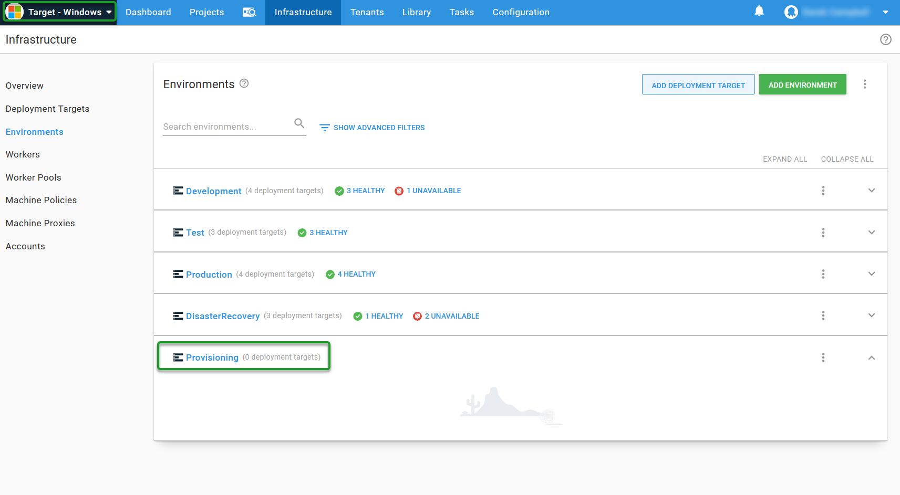

- Added my laptop as a [deployment target](https://octopus.com/docs/infrastructure/deployment-targets) and assigned it the [target role](https://octopus.com/docs/infrastructure/deployment-targets#target-roles) of **Computer**. I used a [Polling Tentacle](https://octopus.com/docs/infrastructure/deployment-targets/windows-targets/tentacle-communication#polling-tentacles) as my laptop was on my local network, but I was using [Octopus Cloud](https://octopus.com/docs/octopus-cloud) and didn't want to open my firewall.

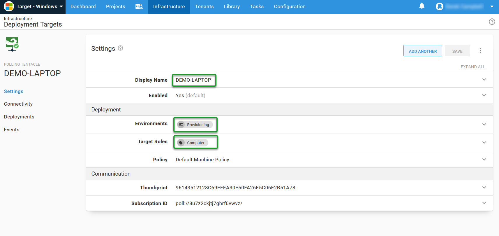

- Checked the Infrastructure tab had my new laptop as healthy.

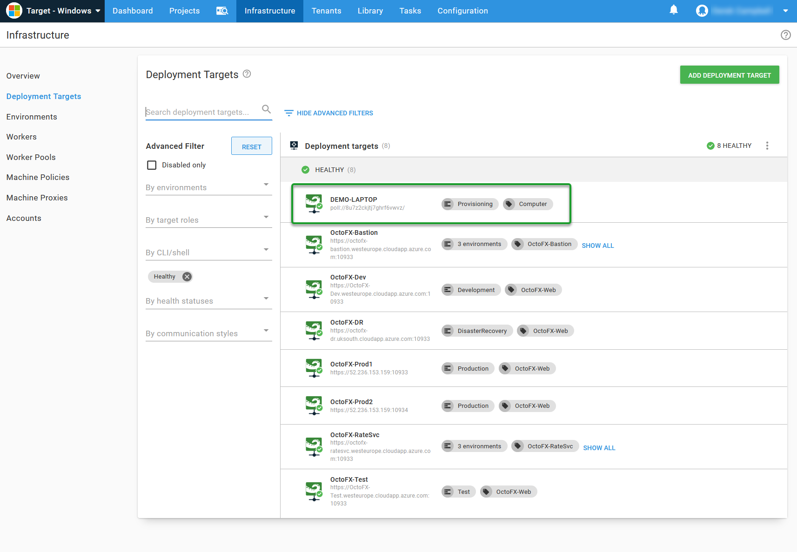

- The next thing I did was create a [Project](https://octopus.com/docs/projects) called **Computer Provisioning**

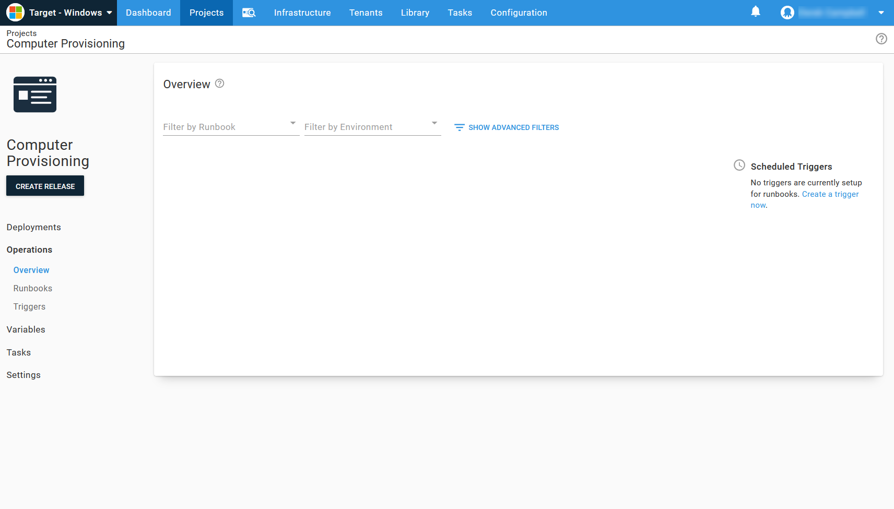

- Created a [Lifecycle](https://octopus.com/docs/getting-started-guides/lifecycle) called **Computer Lifecycle** and added just the Provisioning environment into it, and then assigned it to the project.

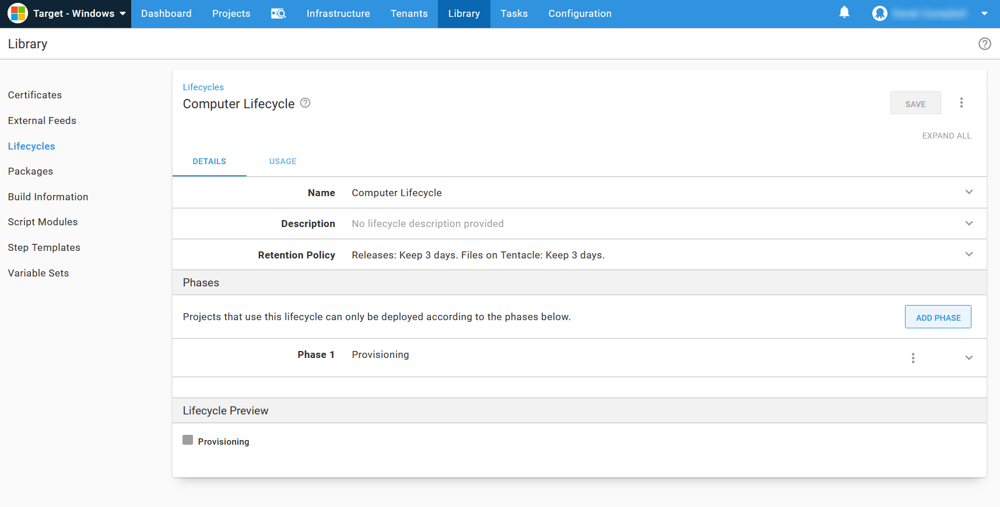

## Runbook Configuration

I want to do more than just install Chocolatey packages, and I'll touch on these briefly as part of this blog.

The first thing you will want to do is browse to the project and add the Runbook named **Install Developer Machine Dependencies**

### Set Timezone, Input & Region

One thing that bugs me about setting up Windows is having to configure my non-default regions, which isn't the US. I use a PowerShell script to set this for all my laptops, desktops, and servers. The below works for me, and you can tweak it to your requirements.

```PowerShell
#Set home location to the United Kingdom
Set-WinHomeLocation 0xf2

#override language list with just English GB
$1 = New-WinUserLanguageList en-GB
$1[0].Handwriting = 1
Set-WinUserLanguageList $1 -force

#Set system local
Set-WinSystemLocale en-GB

#Set the timezone
Set-TimeZone "GMT Standard Time"
```


### Checking if Chocolatey is installed

The next step I used was a community-contributed step template called [Chocolatey - Ensure Installed](https://library.octopus.com/step-templates/c364b0a5-a0b7-48f8-a1a4-35e9f54a82d3/actiontemplate-chocolatey-ensure-installed). This step has a single purpose, and it's to check if Chocolatey is installed and to install if it's not.

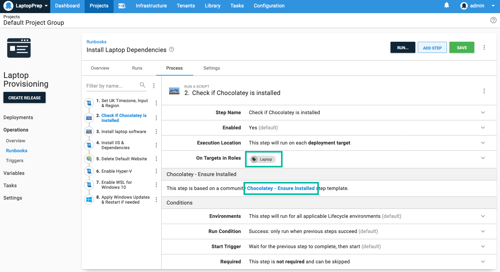

### Install Chocolatey Package Step

If you do browse the webinar, you will see we had different steps for different packages. Paul Broadwith has updated our Chocolatey community step template that installs all of your chocolatey packages in a single step, and you can see it on our [Community Step Template Library](https://library.octopus.com/step-templates/b2385b12-e5b5-440f-bed8-6598c29b2528/actiontemplate-chocolatey-install-package)

I made a list of all of the packages I needed to install on my new laptop, and not all of this you will find useful as I do some webinars, and I can often be found in [Camtasia](https://www.techsmith.com/video-editor.html), [OBS](https://obsproject.com/) as much as I can be found in [VSCode](https://code.visualstudio.com/), SQL and so forth.

The applications I found I needed on my new laptop is below:

```PowerShell
git vscode sql-server-management-studio slack github-desktop rdmfree googlechrome firefox dotnetfx dotnetcore 7zip visualstudio2019professional nordvpn lastpass-chrome lastpass docker-desktop chromium googledrive google-drive-file-stream kubernetes-helm kubernetes-cli minikube zoom notepadplusplus nugetpackageexplorer sdio virtualbox jre8 vlc python foxitreader putty.install sysinternals snagit vagrant packer terraform
```

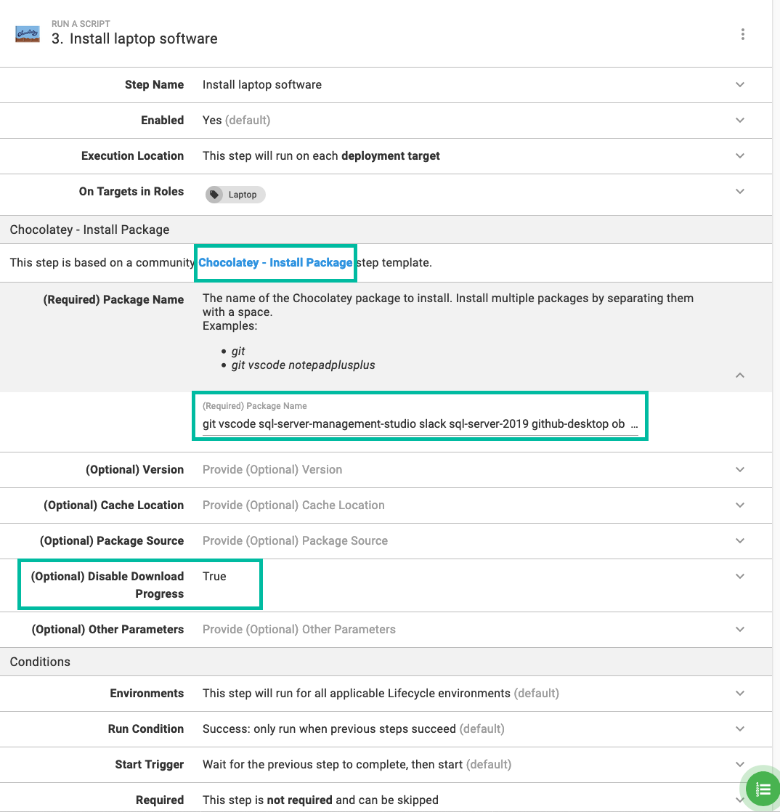

### Install Chocolatey Package step parameters

A few parameters can be set, and I wanted to explain them to get the full picture.

In the **(Optional) Version** Parameter selection, you can specify a specific version of the software you want to install. If you're using more than one package per step and want to set particular software versions, you will need to configure that Chocolatey Install and add the version in an additional step.

In the **(Optional) Cache Location** Parameter selection, you can specify a cache's non-default location. I found this useful when installing SQL without having the Tentacle run as an administrator. I found that SQL can be a little tricky to install without running the Tentacle Service as a local administrator. You can specify a folder such as **C:\Octopus\Applications** as the cache which the Local System User has full access to.

The **(Optional) Package source** parameter is probably the **single most crucial parameter in this step**. If you're doing this at home, then it might be acceptable to use the Chocolatey Package Repository, which is the default setting. However, if you're doing this for a company, please consider using your own package source repositories, such as [Nexus](https://www.sonatype.com/nexus/repository-pro), [Artifactory](https://jfrog.com/artifactory/) or [MyGet](https://www.myget.org/).

The Chocolatey package resource is built by the community for the community. If you're using the community repository for Enterprise or large scale package installation, you will likely be [rate limited](https://chocolatey.org/docs/community-packages-disclaimer#rate-limiting). Be careful, and be kind to the community.

The last two options cover whether you want to see the download progress in your logs, and generally, I turn them off as you can land up with hundreds of thousands of log files. The other is to allow for additional parameters.

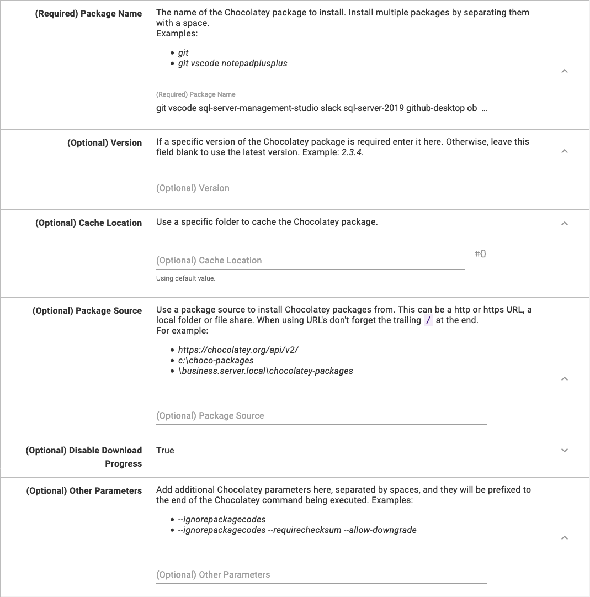

### Installing IIS & Dependencies

The next step was to configure IIS, and it's dependencies. I used our [IIS Runbooks](https://octopus.com/docs/runbooks/runbook-examples/routine/iis-runbooks) examples and ran this install IIS, and all of its features.

### Optional Steps

I'm not a fan of the default website in IIS, so I like to remove it by default. I used the community step template called [IIS Website - Delete](https://library.octopus.com/step-templates/a032159b-0742-4982-95f4-59877a31fba3/actiontemplate-iis-website-delete) and then specified Default Web Site, and it will now remove the Default Web Site as part of this provisioning Runbook in Octopus.

I use [HyperV](https://docs.microsoft.com/en-us/windows-server/virtualization/hyper-v/hyper-v-technology-overview) as my laptop and Server Hypervisor when I can, and I wanted to enable it as part of the laptop provisioning process. I used the **Run a Script** built-in template for this task and used PowerShell to enable HyperV.

```PowerShell
Enable-WindowsOptionalFeature -Online -FeatureName Microsoft-Hyper-V -All
```

The last thing I wanted to do was to avoid installing all of the Windows Updates that had been released since my laptop had been prepped. I used a community step template called [Windows - Apply Windows Updates](https://library.octopus.com/step-templates/3472f207-3934-44db-a4ac-1390167cf7ed/actiontemplate-windows-apply-windows-updates), which will automatically install and reboot your machine as long as you set the parameter to True.

## Publishing the Runbook

Octopus Deploy deployments use Snapshots as a way to store the [Variables](https://octopus.com/docs/runbooks/runbook-variables) and step configuration when the release your deploying has been created. This is maintained as you push your release through your environments.

Runbooks has [Publishing](https://octopus.com/docs/runbooks/runbook-publishing) as a similar concept to the snapshotting of deployments and releases. With Runbooks, you have the concept of Draft and Published. A draft snapshot of a runbook is precisely what it sounds like, a draft version of the currently published version. Drafts are meant to give you a place to work and save a runbook that is a work in progress or has not yet been approved for general use. Draft Snapshots can't be used to create [Scheduled Runbook triggers](https://octopus.com/docs/runbooks/scheduled-runbook-trigger)

The concept of a published snapshot is designed to help avoid confusion when selecting a version of the Runbook you're supposed to run if you're not the author. You can think of it as the "Production" ready version of the Runbook, which has been approved for general use. The published snapshot contains the process, variables, and packages. This allows editing and testing the Runbook without impacting the published version, and once published, the Runbook can be used by Runbook triggers.

## Running the Runbook

You have the Space, the project, the lifecycle, the environment, the laptop, and the Runbook in Octopus. The next step is to run the Runbook to give it a test and ensure it does what you want it to do.

To run the Runbook:

- Open the Runbook project
- Select Operations -> Runbooks
- Select the Runbook you created

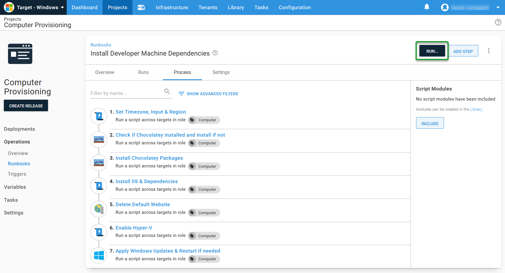

- Select Run
- Select the Environment you want to run it under
- Hit the Run button

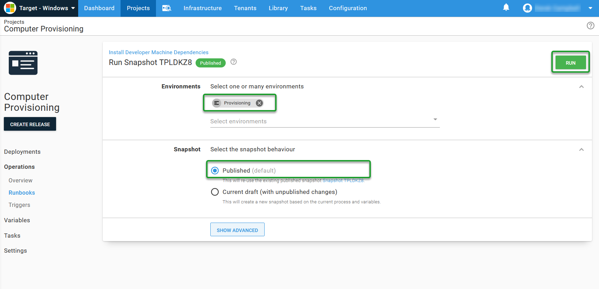

At this point, you can grab a coffee as it will take a little while to install all of the applications and dependencies. After your coffee run, the Runbook should have completed. Your computer should now be fully configured and ready to go instead of going through the pain of next, next, finish installs, and application configuration.

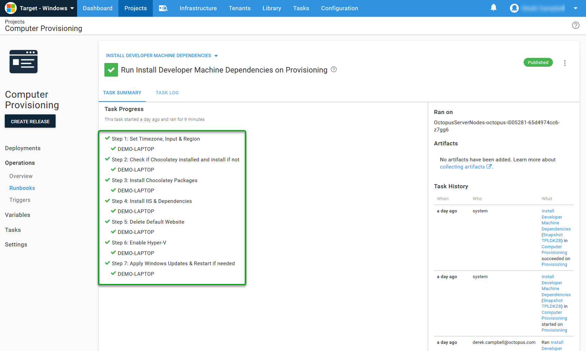

It's now time to check the applications are installed on the new computer. At this point, you should see all of the new applications installed on your computer.

## Other Scenarios

You can see that this is useful for installing applications not just for Ops, DevOps, and Developers but other job types. You could create additional Runbooks for other job types that need different applications. For instance, a Business Analyst may want [PowerBI](https://powerbi.microsoft.com/en-us/), and a DBA might wish to install [SQL Toolbelt](https://chocolatey.org/packages/SqlToolbelt). You could create different Runbooks for different job descriptions or even allow people access to Runbooks to install and configure pre-approved software.

You can also use this approach for all of your Servers so you can install [SQL](https://chocolatey.org/packages/sql-server-2019) on a database server, or [Tomcat](https://chocolatey.org/packages/Tomcat) on a web server.

:::hint
When installing SQL, you will probably want to create your own Chocolatey Package. SQL is a little tricker than some to install as it requires an Administrator account to install quickly, and you will also want to configure things such as default users, groups, and locations of the Database and log files.

When using Octopus to install SQL Developer Edition or SQL express, you can do it without the Tentacle running as a local administrator. Still, you will need to use the optional location for the files. Another gotcha is that if you run the install under a Service account with a named service account, by default, that will use that user as the default SQL Administrator. You will need to connect with that account to give yourself access.
:::

## Upgrading Chocolatey packages

As you can see, you can use Octopus to install applications via Chocolatey, but software gets patched, new features added to it, and security enhancements added all of the time. What happens when you want or need the latest version of the software you installed using Runbooks and Chocolatey?

You [upgrade](https://chocolatey.org/docs/commandsupgrade) it with Chocolatey and Runbooks. This is  easy to do, and one of my favorite commands on logging in to a server, or for running using a Runbook is:

```PowerShell
choco upgrade all -y
```

This command will run on the computer, check against the latest version against the Chocolatey repository you have set, download the new package, and install it. Think of this as almost a Windows Update but for your chocolatey package. You can set this up using Runbooks and using the Deploy a Script step template and using the upgrade command.

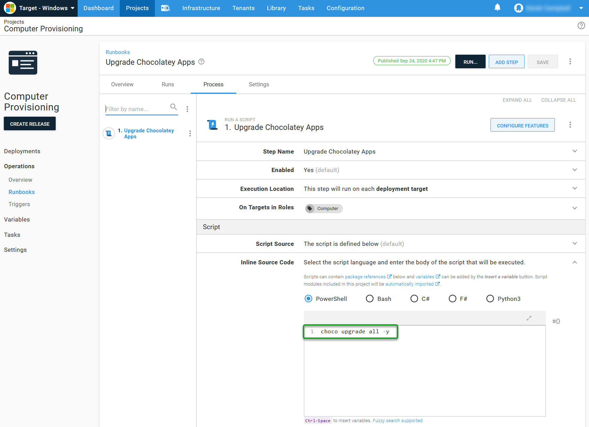

Once you create the Runbook, then select Run, and it will run the Chocolatey script and run an upgrade on all of your applications.

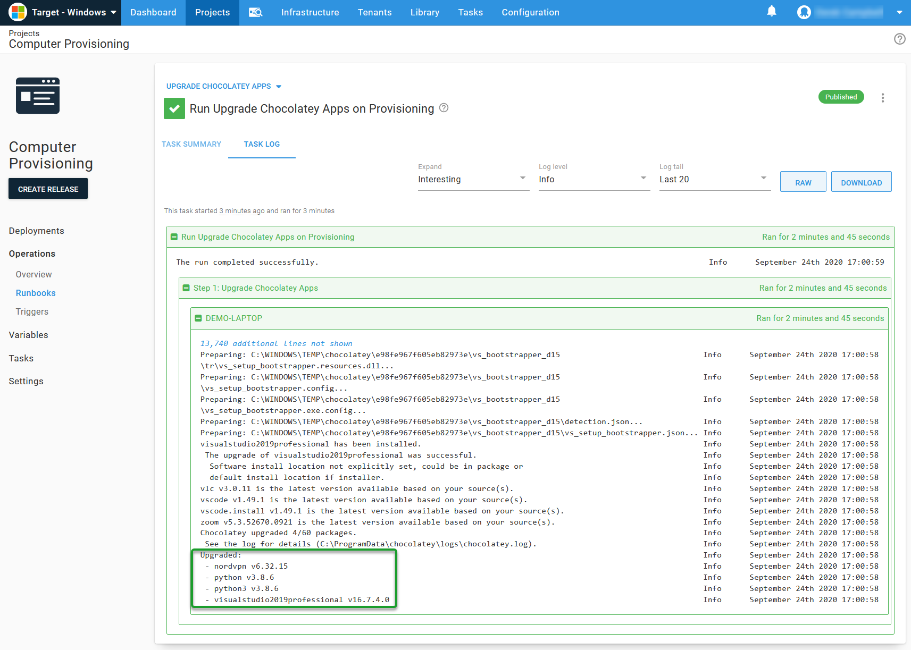

### Upgrading Chocolatey packages on a scheduled trigger

As you now have the upgrade Chocolatey Runbook, and you know that it's working, you can publish the Runbook and set a schedule for when the script runs, much like a [CRON JOB](https://en.wikipedia.org/wiki/Cron) or a [Windows Task Scheduler](https://en.wikipedia.org/wiki/Windows_Task_Scheduler). 

To set this up, select the Triggers option under Operations, and select **Add Scheduled Trigger**.

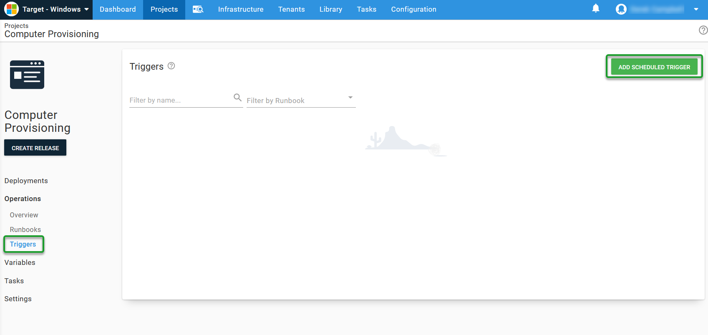

This will take you to add a **New Scheduled Trigger** page, and you will need to input:

- Name
- Description
- Select the Runbook to run on the Scheduled Trigger
- Select the Environment
- Select a schedule of daily or alternative schedule
- Select the Interval at which it should execute
- Select the time the schedule should execute

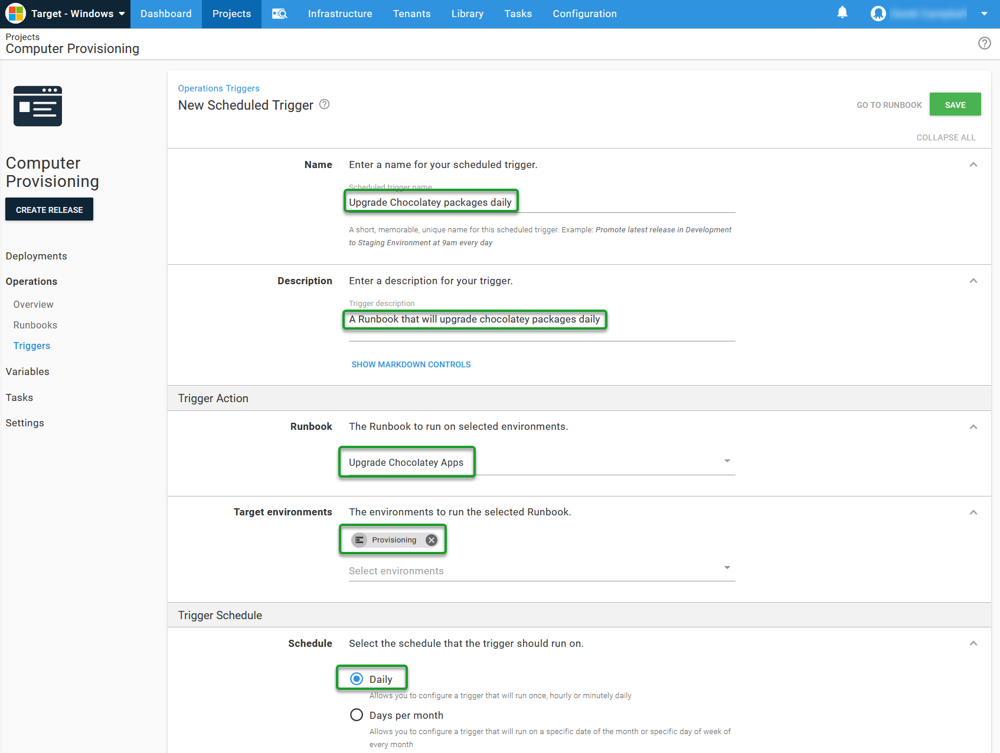

This should now trigger daily at the time you set, and in this instance, I selected 12.30pm as it's when most people go on lunch.

You can see all of the configuration in this blog on our [samples instance](https://samples.octopus.app) and by logging in as Guest, and selecting the **Target - Windows** Space.

## Chocolatey Community Step Templates

There are other Chocolatey Community step templates for Octopus, but they are more for organizations using [Chocolatey for Business](https://chocolatey.org/blog/chocolatey-business-and-professional-coming). I wanted to cover this high level, so you're aware of them.

There's a Community step templated called [Chocolatey - Manage Config](https://library.octopus.com/step-templates/dd45cba9-a39b-43e0-922e-da9fb7818186/actiontemplate-chocolatey-manage-config), which allows you to manage [Chocolatey configuration](https://chocolatey.org/docs/chocolatey-configuration).

The [Chocolatey - Manage Features](https://library.octopus.com/step-templates/718f6e95-e176-4f13-9512-a3a8f1bb10a0/actiontemplate-chocolatey-manage-features) step allows enabling and disabling of [Chocolatey features](https://chocolatey.org/docs/commands-feature) such as allowGlobalConfirmation, allowEmptyChecksumsSecure and more.

The [Chocolatey - Manage Sources](https://library.octopus.com/step-templates/131ba9b0-c95e-464f-a2ff-aacedbcd29a1/actiontemplate-chocolatey-manage-sources) step allows managing of Chocolatey Package Sources. This can be used to specify the location of the chocolatey source, such as an SMB share, a NuGet package server such as [Nexus](https://www.sonatype.com/nexus/repository-pro) or [Artifactory](https://jfrog.com/artifactory/). It's essential to use an Internal package source when using Chocolatey at scale. It's an open-source piece of software with over 1.1 Billion downloads at the time of writing and is used extensively worldwide. If using Chocolatey at scale in an organization, you may be rate-limited if downloading hundreds of packages per minute.

The [Chocolate - Pin Package](https://library.octopus.com/step-templates/81d9b602-7969-4cb2-a9c0-b5c961937db4/actiontemplate-chocolatey-pin-package) step template allows for the pinning versions of packages using the Chocolatey package manager. For instance, you can specify a version applicable to all packages in 'Package Name.'

## Conclusion

Octopus Deploy Runbooks and Chocolatey work well together and give you a lot of flexibility to help you automate the installation and configuration of Laptops, Desktops, and Servers both on-Premises and in the Cloud. They take away the need to install thousands or potentially tens of thousands of applications across your Organizations Infrastructure.
