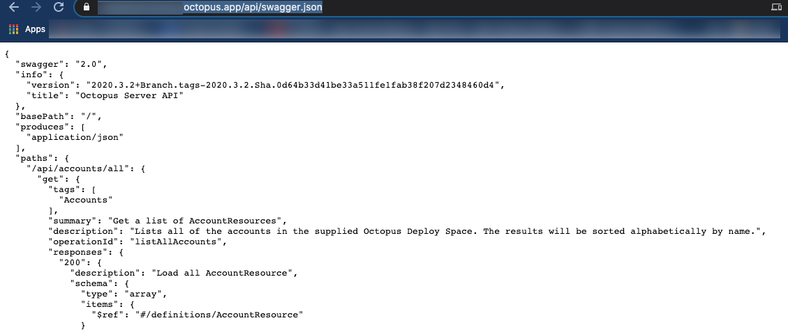
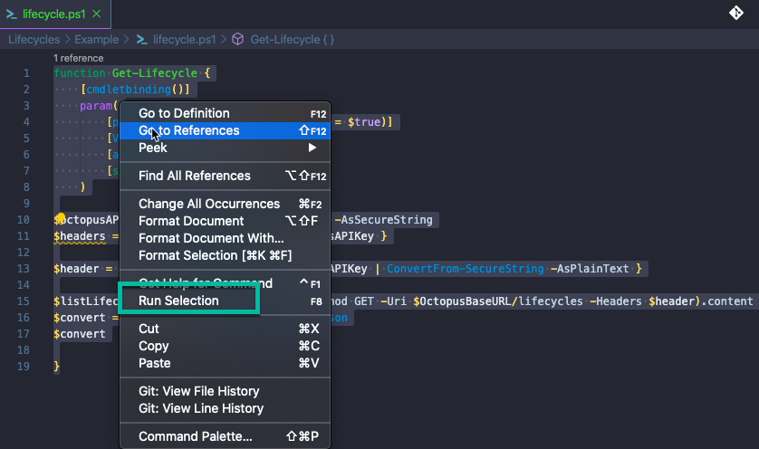

Any platform or solution that you want to use without having to click a million buttons through a UI needs an Application Programming Interface (API) to interact with. An API is the engine under the hood. It’s the way you can interact with an application, platform, and even Internet-of-Things (IoT) devices at the programmatic level.

In this blog post, you’re going to learn how to interact with the Octopus Deploy API using one of the most popular programming languages in the Microsoft and Azure realm, PowerShell.

## Prerequisites

To follow along in this blog post, you will need the following:

- An intermediate level knowledge of PowerShell.
- A text editor or IDE, for instance, [VS Code](https://code.visualstudio.com/download).
- An Octopus Cloud instance or on-premises Octopus Server.

!include <register>

## The Code {#the-code}

When you’re thinking about using something like PowerShell to interact with an API, you’re typically going to go the wrapper route. A wrapper is simply, as it sounds, code wrapped around the API call.

In this blog post, we’re going to take a look at a wrapper around the Lifecycle API.

Below is the code you’ll use:

```powershell
# The function is created and is called Get-Lifecycle

function Get-Lifecycle {

# The cmdletbinding() attribute to ensure the function is an advanced function, which gives us the ability to use PowerShell features like the $PSCmdlet class, error action preferences, etc.
    [cmdletbinding()]

# The one parameter called is the Octopus Deploy server URL. It's a mandatory parameter.
    param(
        [parameter(Position = 0, Mandatory = $true)]
        [ValidateNotNullOrEmpty()]
        [alias('URL')]
        [string]$OctopusBaseURL
    )
# You're prompted to securely pass in the API key
$octopusAPIKey = Read-Host 'Input API Key' -AsSecureString

# The API key is passed in with the X-Octopus-ApiKey authentication method
$headers = @{ "X-Octopus-ApiKey" = $octopusAPIKey }

# The header is converted to plain test so Octopus can read the API key
$header = @{ "X-Octopus-ApiKey" = $octopusAPIKey | ConvertFrom-SecureString -AsPlainText }

# Invoke-WebRequest occurs, AKA, makes the API call to Octopus Deploy and returns the Lifecycles
$listLifecycles = $(Invoke-WebRequest -Method GET -Uri $OctopusBaseURL/lifecycles -Headers $header).content
$convert = $listLifecycles | ConvertFrom-Json
$convert

}
```

## The API

The Octopus Deploy API can be looked at using a swagger definition, which allows you to describe your APIs so that machines (or programming languages) can read them. Because the Octopus Deploy API uses Swagger, it’s easily readable right from an Octopus Deploy Server:

1. Open a web browser.
2. Type in your Octopus Deploy server URL.
3. At the end of the server URL, add the following:

```bash
/api/swaggerjson
```

You will see a JSON output similar to the screenshot below.



The great thing about the Swagger output is, we don’t have to hunt for or guess about anything on the API. For example, in the screenshot above we see under `paths` there is an API call to accounts:

```bash
/api/accounts/all
```

Right from the start, you know what the API landscape looks like, and you get a good idea of how to interact with the API.

Once you know how to interact with the API, it’s time to think about authentication.

## Authentication

Understanding the interactions with an API is, of course, crucial, but if you can’t authenticate to it, you’ll be eating a `403 unauthorized` sandwiches all day. In this section, we’ll take a look at the authentication process, which is quite straight-forward in Octopus.

When you use PowerShell to interact with APIs, you may have seen the following are needed:

- UTF8 encodings
- Base64 converted authentication
- Multiple key/value pairs in the headers hashtable
- Bearer tokens
- Certain .NET namespaces like `System.Net.WebClient` or `System.Net.NetworkCredentials`

With Octopus, it’s quite easy to authenticate. In fact, all you need is an API key that you can generate from an Octopus Server. It doesn’t need to be converted or manipulated in any way.

### Retrieve an API Key

1. Log into the Octopus Web Portal.
2. Under the login name, go to **Profile**.
3. Under **Profile**, click on **My API Keys**.
4. Click on the **NEW API KEY** button. Store the API key in a safe location as you will need it in the next section.

## Make the API Call

Now that we have all of our ducks in a row, AKA, the API key and the code, it’s time to see the API call in action by running the function.

1. Open VS Code and save the [code](#the-code) from the section above in a location of your choosing, for instance, the Desktop.
2. Highlight the code, right click, and choose **Run Selection** as shown in the screenshot below. Using the **Run Selection** option will store the function in memory.



3. Within the terminal, run the following cmdlet:

```powershell
Get-Lifecycle -OctopusBaseURL server_url/api
```

4. Input the API key when prompted.
5. After you type in an API key for the Octopus Server, you will see an output similar to the screenshot below which contains Lifecycle information:


Congrats! You have successfully used PowerShell to interact with the Octopus Deploy API.

## Conclusion

There are several ways to interact with an API. In short, you can interact with pretty much any API with any programming language. Even if there isn’t a wrapper or an available SDK, you can make your own by using a couple of `curls`. If you don’t want to spend your time pointing and clicking in a UI, chances are you want to programmatically interact with a platform, like Octopus Deploy.
