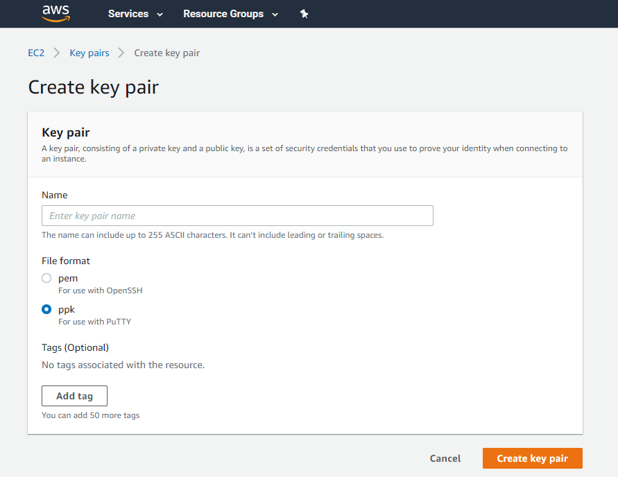
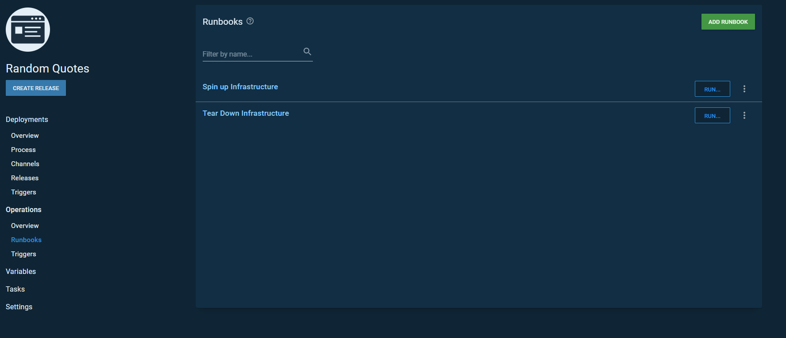
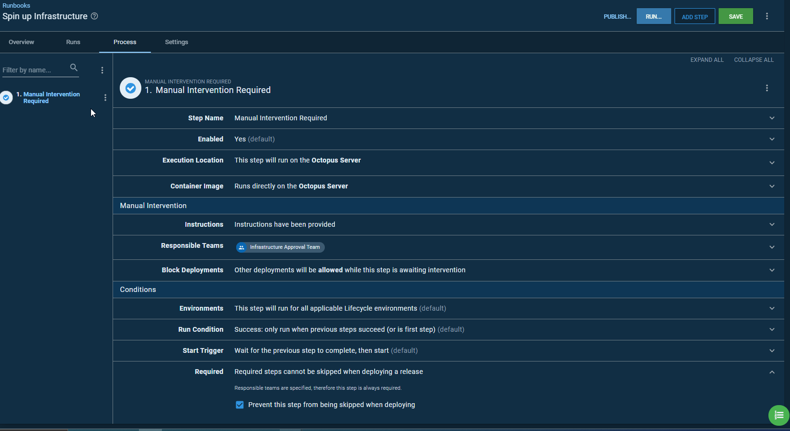
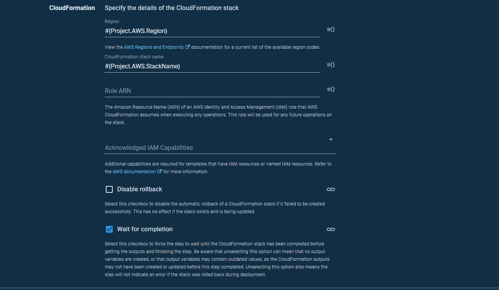

In this blog post, I'll show you how to use Runbooks to create & destroy application servers. Control cloud expenditure and give your organizations teams the ability to safely spin up infrastructure on-demand in a controlled and gated process. 

We will be configuring Octopus Runbooks to spin up infrastructure in AWS using CloudFormation steps. We will also be creating another Runbook to tear down the infrascture and adding a scheduled trigger to run the Tear Down Runbook on a schedule.

## Create Octopus Teams

I want to control who can and can't spin up infrastucutre in AWS or at least provide a way of notifying a controlling team. To do this I need a new team in Octopus with the users that the abilisty to approve my Runbook runs.
 
 When you create the team assign the role Runbook Consumer 

## Create AWS resources

* Credentials 
* Key Pair

### Create AWS Key Pair

A key pair is a private and public key used to prove your identity when connecting to EC2 instances.

In the AWS Management Console, navigate to **{{EC2, Key Pairs, Click *Create key pair*, Name your key pair, click Create Key Pair}}**

:::hint
AWS will automaticly download a .ppk file to your machine. Save this and it can be used later to SSH onto your running instances.
:::

### Create the AWS credentials

The first thing you need is an AWS Access key and Secret key. To get this log into the [AWS Management Console](https://aws.amazon.com/console/) and create an account using Identity and Access Management (IAM).  After the account has been created, click on the user, then **Security Credentials** to create an `Access Key`.

After the access key has been created, save the `Secret Key` as you will only be shown the value *once*.  The `Access Key` and `Secret Key` combination is used to authenticate with AWS.

### Create AWS Account

To deploy CloudFormation templates in Octopus you need to setup an AWS account.

Using your `Access Key` and `Secret Key` [create an AWS account in Octopus](https://octopus.com/docs/infrastructure/deployment-targets/aws#create-an-aws-account).

:::hint
It is possible to AWS IAM roles rather than the IAM credentials. If the Octopus server built in worker or external worker deploying the steps have an IAM role attached then it's possible to use the IAM role rather than the `Access Key` and `Secret Key`.
:::

## Create Octopus Project

Now we have all our resources created we can go ahead and start configuring our Octopus Project and Runbooks to provision our infrastrcure.

If your new to Ocotpus and don't have any projects you will need to create a new one and you can find information on how to do this [here](https://octopus.com/docs/projects). If you have an exiting project that you want to use you can skip this step. 

### Create Project Variables

Before we start creating our Runbooks, it's handy to create some variables for values we need later on when adding steps to our Runbook process.

| Parameter  | Description | Example |
| ------------- | ------------- | ------------- |
| Project.Octopus.Thumbprint | Octopus Instance Thumbprint | 7F226XXXXXXXX |
| Project.Octopus.key | Octopus API Key | API-XXXXXXXX |
| Project.AWS.Account | Octopus AWS Account | MyAccount |
| Project.AWS.KeyPair | AWS Key Pair Name | MyKeyPairName |
| Project.AWS.Region | Name of AWS region| eu-west-2 |
| Project.AWS.StackName | Name cloudformaton stack| octopus-blog-random-quotes-#{Octopus.Environment.Name} |

## Create Runbooks

We need two Runbooks, one to spin up our infrastructure and another to tear it down. Inside our project, to create the Runbooks, navigate to **{{Project, Operations, Runbooks, Add Runbook}}**. Give the Runbook a suitable name. In my case, I'm going to call it **Spin Up Infrastructure**. Go back to the Runbooks screen and create a second Runbook call **Tear Down Infrastructure**

## Build the spin up infrastucture process 

In this section, we will start building out our Runbook process by adding Octopus built in and community steps to provision our infrascture.

### Step one Manaul Intervention

While it's great to provide self service access to provisioning infratructure soemtimes teams still need the ability to approve it. Octopus comes with a built in step pause the Runbooks proccess to get approval from antoher team built into Octopus. 

Click on the Runbook and click **DEFINE YOUR RUNBOOK PROCESS** , Click **ADD STEP**, Search for **manual intervention**, click **Manual Intervention Required** from the list of installed step templates and click **ADD**.

### Step two Deploy an AWS CloudFormation template

Next we need to add a step to deploy our CloudFormation Template. Octopus has first class support for AWS CloudFormation and has built in steps to deploy, update and delete CloudFormation Stacks.

 Click **ADD STEP**, Search for **CloudFormation**, click **Deploy an AWS CloudFormation template** from the list of installed step templates and click **ADD**.

There are a number of feature settings to configure and you can find information on each feature setting [here](https://octopus.com/docs/deployment-examples/aws-deployments/cloudformation).

You can use the AWS Account we created eariler in the AWS Account section.

:::hint
It's possible to use [variable scoping](https://octopus.com/docs/projects/variables#scoping-variables) to using diffrent account when deploying to diffrent environments.
:::

Again you can use variables we created eailer to fill out the CloudFormation Template.

In the template section you need a CloudFormation template that will provision resource in AWS. In this case, I have a template to deploy a Linux EC2 Instance that runs a bash script to install a listening tentacle. In the next step we will register the tentacle in Octopus.

### Step three Register Octopus Tentacle 

In the last step we deployed an AWS CloudFormations tep template to provsion a linux EC2 instance. The cloudFormation template was bootstrapped to run a bash script that installs a listening tentacle. 

 Click **ADD STEP**, Search for **CloudFormation**, click **Deploy an AWS CloudFormation template** from the list of installed step templates and click **ADD**.

## Build the tear-down infrastructure process 

We no need to build out our tear down Runbook to delete the infrastture we created. 

### Step one Manaul Intervention 

### Step two Delete CloudFormation Template

### Step three Delete Octopus Target 

## Tear down on a scheduled trigger 

## Conclusion 

In this blog, I showed you how to use Octopus Runbooks to provision and tear down infrascture in AWS. We added addtional 