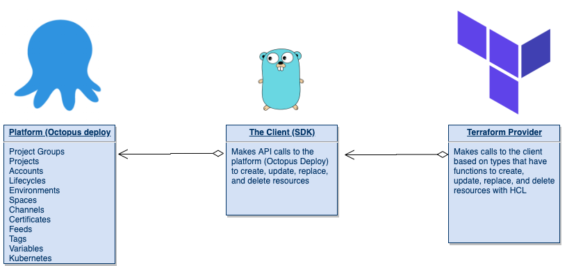

Infrastructure-as-code ([IaC](https://searchitoperations.techtarget.com/definition/Infrastructure-as-Code-IAC#:~:text=Infrastructure%20as%20code%2C%20also%20referred,hardware%20devices%20and%20operating%20systems.)) has made it possible to move past *manually clicking a bunch of buttons to create infrastructure resources*.

Terraform is quickly becoming the go to IaC solution. Terraform is an open-source IaC solution that allows you to define your infrastructure using a fast growing functional-based programming language called Hashicorp Configuration Language (HCL).

In this blog post, you get a first look at the Octopus Deploy Terraform provider and what it has to offer.

## Why IaC?

The further the world goes down the cloud engineering and development route, the clearer it is that we cannot continue creating infrastructure manually. Not only does it take a long time, but it's prone to failures. There's no one person in the world that can say they've never done *something* by mistake when creating a resource manually. Whether it was something as small as a typo, as humans, we're prone to mistakes.

When it comes to IaC, mistakes can still be made in code, but they're much less. When you're writing code and storing it in source control, you can do things to prevent mistakes as much as possible such as:

- Code reviews
- Automated testing to ensure the code works as expected
- A secure place to store the desired state
- A place where everyone can see what's being worked on and collaboration can take place

## What is a Terraform Provider?

A provider is what you interact with when writing HCL code. For example, there's a provider for Azure. The Azure provider gives you the ability to write HCL code to interact with Azure at the code level. That's exactly what the Octopus Deploy provider does as well.

The provider communicates with the client via calls based on packages, types, and models. The provider is what you write to actually write what Terraform resources you're going to use.

For example, let's say you want to create a new project group in Octopus Deploy. There's a resource inside of the Terraform provider that's used to create a project that. That resource in the Terraform provider makes a call to the `ProjectGroup` type, which then calls a function to create a new project group.

## What can the provider do?

At this point you have a bit of background on the client, the provider, and why you would want to use IaC, but how about the actions that the provider can actually do?

The provider can create, update, replace, or delete anything until you're at the project level. This includes:

- AWS accounts
- Azure accounts
- UsernamePassword accounts
- SSH acounts
- Certificates
- Channels
- Environments
- Feeds
- Library sets
- Lifecycles
- Feeds
- Project groups
- Projects
- Deployment targets

Keep in mind that the Terraform provider is still in beta, and we're still adding functionality to it.

The only thing that the provider cannot do is, for example, create the underlying infrastructure in say, Azure or AWS. That's because you would need to use the Azure or AWS provider to, for example, create a virtual machine/EC2 instance.

### The backend

First and foremost, what is a Terraform provider even made of? It's most likely not a question you typically ask yourself. When you're writing a Terraform application, you're writing in HCL, but what is the provider itself made out of?

All backend code for Terraform is written in Golang (Go), a procedural based programming language created by Google. Go makes up some of the most popular tools and platforms today including:

- Terraform
- Docker
- Kubernetes

When you're thinking about the backend, there are two parts - the client and the provider.

### The Client

The client itself is an SDK that makes API calls to the platform that you're working in, in this case, Octopus Deploy. The client is the way you're able with the platform at a client/service level. 

You can find the client SDK [here](https://github.com/OctopusDeploy/go-octopusdeploy).

### Contributing

If you would like to contribute, you absolutely can! It's 100% open source and we're welcoming all contributions via pull requests.

## How is this different to Config as Code?

A big push this year for Octopus Deploy has of course been config as code, so what happens to that since there is a Terraform provider? Well, nothing. Config as Code is still 100% needed. The Terraform provider handles everything before getting to the project.

Config as Code picks up where the Terraform provider leaves off and gives you the ability to manage the Project with code. 

The idea of the Terraform provider is to fill the part of the automated deployments before reaching the project.

## Conclusion

Infrastructure-as-code using Terraform and the power of a fully functional-based programming language under the hood is an ideal scenario for software-defined infrastructure. It gives you the ability to not only automate the work you're doing, but ensure quality and value for everyone using the code.