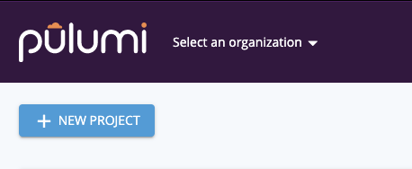
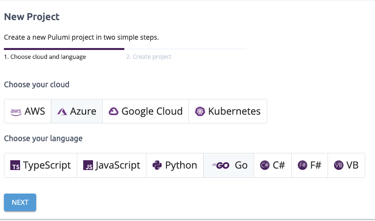
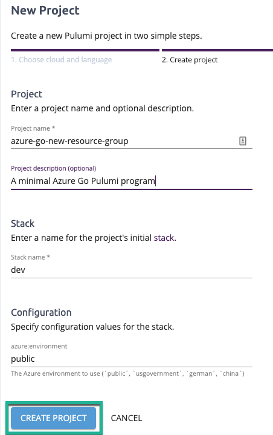

Software-defined infrastructure, or infrastructure-as-code, is a permanent resolution in today's world. There's no reason to go back to the *pointing and clicking* in a portal like you used to. Not only is it time consuming, but it's manual and riddled with issues from hogging everyone's time to manual efforts for large implementations.

The problem is, developers need infrastructure, they want to write it as code, but they may not be comfortable writing in languages like HCL. Better-yet, they're comfortable with the languages they write in. They want a way to take their existing development knowledge and have a simple approach to create cloud services that hits close to home.

Welcome to [Pulumi](https://www.pulumi.com/).

Pulumi combines the power of Infrastructure-as-code and general-purpose programming to make Infrastructure-as-software. It's a way to write code as you normally would in Go, Python, JavaScript, etc. and create infrastructure-as-code.

In this blog post, you're going to create an Azure resource group using a Pulumi project written in Go (Golang) and deploy it with Octopus Deploy.

## Prerequisites

To follow along with this blog post, you should have the following:

- A GitHub account. If you don't have one, you can sign up for free [here](https://www.github.com).
- At least one Linux deployment target.
- An Azure subscription that you have access to.
- An Azure Account set up in Octopus Deploy.

## Why Pulumi and Octopus Deploy?

Pulumi is a multi-language cloud development platform that lets you use programming languages (Go, C#, Python, TypeScript, JavaScript, F#, VB) to build cloud services. Whether you want to build virtual machines, networks, or serverless implementations, and literally anything else, Pulumi has you covered. 

For each language that Pulumi supports, there is an SDK available that you can use to interact with different cloud services. For example, the Azure SDK will allow you to create a resource group.

Using Pulumi is step one in the infrastructure development journey. The second step is deploying the code. How do you get the code to run from an automation perspective? That's where Octopus Deploy takes over.

Octopus Deploy has community steps that you can run Pulumi projects on both Windows and Linux deployment targets, covering any environment you need to work in.

## Setting up a Pulumi Project

Before diving into writing and deploying the code, there are a few preliminary steps that are needed for you to start working with Pulumi.

### Account Setup

To use Pulumi, you need to set up a free account. There are several different ways to authenticate, including:

- GitHub
- GitLab
- Atlassian
- Email/password
- SSO

Pulumi is free forever for individual use, so any authentication method will work just fine.

### Creating a Pulumi Project

Once you are signed in, you'll see a screen similar to the screenshot below.



1. Click the blue **+ NEW PROJECT** button.

      Once you create a new project, you'll see that there are a few different options. Pulumi not only supports multiple programming languages but multiple clouds as well.



  2. For the cloud, choose **Azure**. For the language, choose **Go**. Once you choose the options, click the blue **NEXT** button.


  3. Add in some details about the project. You can either keep them default or add in custom metadata.

- Project name - The name of the project being created.
- Project description - The description of the project being created.
- Stack - The stack name (dev, prod, etc.)
- Configuration - Under configuration, you'll see a few different types that you can use:
    - Public
    - usgovernment
    - german
    - china

For a dev environment, as long as you don't have any regulations, keeping it as `public` will be fine. Once complete, click the blue **CREATE PROJECT** button.



  4. Next, you'll be presented with the **STACK** window. The stack window helps you get started for MacOS, Windows, and Linux. The first place to start is to confirm that you have Pulumi installed.

- For Windows, you can use the [Chocolatey](https://chocolatey.org/) package manager to install Pulumi
- For MacOS, you can use [Homebrew](https://brew.sh/) to install Pulumi

 5. After you install Pulumi, you'll want to create a new directory where the project will live and then change directory (`cd`) into the newly created project directory.

`mkdir azure-go-new-resource-group && cd azure-go-new-resource-group`

6. Once the directory where the Pulumi project will reside is created, you can pull down the project from Pulumi into that directory. You'll need to authenticate, which you'll see how in the terminal output. 

`pulumi new azure-go -s AdminTurnedDevOps/azure-go-new-resource-group/dev`

7. Once the project is pulled down from Pulumi, it's time to deploy it!

`pulumi up`

 8. Now you can open up the new project in an editor or IDE, for example, VS Code.

## Writing Code with Pulumi

The Pulumi project is created and pulled down on localhost. You now have everything you need to start interacting with Pulumi using Go.

The first thing you'll see is that there is already a `go.mod` file, which specifies the required packages. You'll also see a few `yaml` configurations that specify the project and the project name. 

One other file you'll see is the `main.go`, which already has Go code inside of it. With every Pulumi project, you'll see starter code by default that shows you what SDKs and packages are used.

### Azure Example

Instead of using the default code in the `main.go`, let's create something from scratch.

The first thing you'll have to specify is the package name and the imports. Since the code is from `main`, the package that you're using will be `main` as well.

From the standard library, `fmt` and `log` will be used to print output to the screen. The two Pulumi packages are for the Azure SDK and the Pulumi SDK.

```go
package main

import (
	"fmt"
	"log"

	"github.com/pulumi/pulumi-azure/sdk/v3/go/azure/core"
	"github.com/pulumi/pulumi/sdk/v2/go/pulumi"
)
```

Next, you'll create a resource group function that contains three parameters:

- The context from Pulumi
- Resource group name
- location

The `if` statement to see if ctx is nil is for testing an edge case. This will allow us to see if there's an issue with the SDK around the context. If there is, you'll want to know about it right away because the code won't work if there's an issue with the context.

Under the `else` statement, you'll see a very important function, which is `Run()`, and it's called from the Pulumi SDK. The `Run()` function is used to execute the body of a Pulumi program. Per the SDK that you can find on GitHub [here](https://github.com/pulumi/pulumi/blob/master/sdk/go/pulumi/run.go), it does appear to require an anonymous function, specifically to pass in the context.

The core of the code is in `core.NewResourceGroup`, which is creating the resource group. There is also the ability to add in some error handling.

```go
func newResourceGroup(ctx *pulumi.Context, resourceGroupName string, location string) {
	if ctx == nil {
		log.Println("Pulumi CTX is not working as expected... please check issues on the SDK: github.com/pulumi/pulumi/sdk/v2/go/pulumi")
	} else {
		pulumi.Run(func(ctx *pulumi.Context) error {
			resourceGroup, err := core.NewResourceGroup(ctx, resourceGroupName, &core.ResourceGroupArgs{Location: pulumi.String(location)})
			if err != nil {
				log.Println(err)
			}

			fmt.Println(resourceGroup)
			return nil
		})
	}
}
```

Finally, there is the `main` function, which you'll use to run the `newResourceGroup()` function and pass in some parameters at runtime. There is also an empty initialization of the Pulumi context as that's one of the parameters needed in `newResourceGroup()` 

```go
func main() {
	resourceGroupName := "octopuspulumitest"
	location := "eastus"
	ctx := &pulumi.Context{}

	newResourceGroup(ctx, resourceGroupName, location)

}
```

The code all together should look like the code snippet below. 

```go
package main

import (
	"fmt"
	"log"

	"github.com/pulumi/pulumi-azure/sdk/v3/go/azure/core"
	"github.com/pulumi/pulumi/sdk/v2/go/pulumi"
)

func main() {
	resourceGroupName := "octopuspulumitest"
	location := "eastus"
	ctx := &pulumi.Context{}

	newResourceGroup(ctx, resourceGroupName, location)

}

func newResourceGroup(ctx *pulumi.Context, resourceGroupName string, location string) {
	if ctx == nil {
		log.Println("Pulumi CTX is not working as expected... please check issues on the SDK: github.com/pulumi/pulumi/sdk/v2/go/pulumi")
	} else {
		pulumi.Run(func(ctx *pulumi.Context) error {
			resourceGroup, err := core.NewResourceGroup(ctx, resourceGroupName, &core.ResourceGroupArgs{Location: pulumi.String(location)})
			if err != nil {
				log.Println(err)
			}

			fmt.Println(resourceGroup)
			return nil
		})
	}
}
```

## Conclusion

There are a lot of steps that go into getting Pulumi up and running at first, but as you can see, it's super powerful. You can take a programming language that you enjoy using and create the infrastructure or services you need in an environment.

In part 1, you went over creating a new Pulumi project and working with the Pulumi Azure SDK using the Go programming language. In part 2, you will learn how to package up the Go code and deploy it via Octopus Deploy.