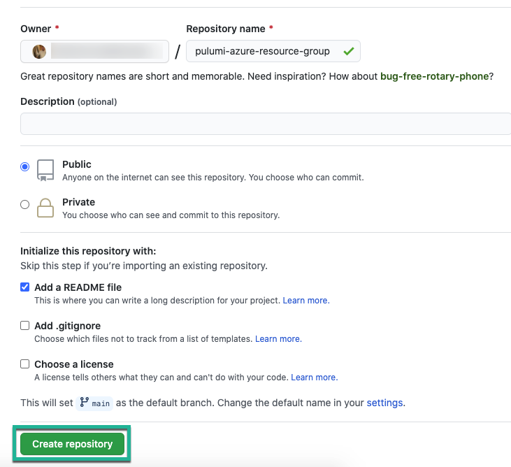
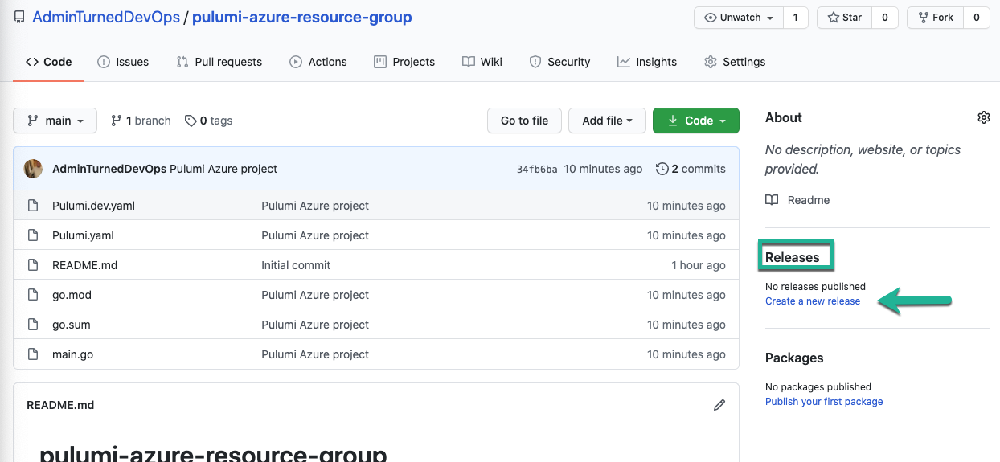

In part 1 of the infrastructure development with Pulumi and Octopus Deploy, you went over not only getting started with Pulumi and creating a new project, but also writing code with the Pulumi SDK that specifies Azure using Go.

In part 2, you'll jump into the deployment aspect, which will be all about packaging up and deploying the Go code you wrote in part 1 using Octopus Deploy.

## GitHub Repo

There are a few different scenarios that can be used to build and package an application:

- A build server
- Pulling a package from an artifact repo
- Zipping up a package
- Many others..

Figuring out which one to use will be five more blog posts in itself because, with all of the different build servers and artifact repos out there, there's no way to cover all of them. Because of that, this blog post covers a free and common scenario, using GitHub.

### Creating a GitHub Repo

First, start off by creating a new GitHub repo.

1. Log into [github.com](https://www.github.com)
2. Under repositories, click the green **New** button.
3. Give the repository a name, for example, this blog post will use the `pulumi-azure-resource-group` name.
4. Because this repository doesn't have any sensitive information, it's okay to keep it `public`.
5. Once complete, click the green **Create repository** button, per the screenshot below.

### Pulling down the Repo Locally and Pushing the Code

1. Clone down the GitHub repo and copy the Pulumi project that you created in Part 1.
2. Commit and push the code to the GitHub repo.

### Creating a Version

For Octopus Deploy to pull in the external feed from GitHub, the GitHub repo needs a release that's built from the code inside of the repo.

3. In the repo, under **Releases**, click **Create a new release**. 

4. Give the release a name and version number, then click the green **Publish release** button.

A release has now been created.

## Setting up an Octopus Project for Pulumi

The code is now written, pushed to GitHub, and is ready to be packaged up for deployment using Octopus Deploy. To do so, you will need to create a new project and utilize the Pulumi community step template.

### Creating an External Feed

1. Open up a web browser and log into the Octopus Deploy portal.
2. Go to Library → External Feeds.
3. Click the green **ADD FEED** button.
4. Under **Feed Type**, choose **GitHub Repository Feed.**
5. For the name, name it *Pulumi Azure Resource Group.*

You don't have to add in any credentials as the repo is public.

### Creating a New Project and Project Group

1. In the Octopus Deploy portal, go to Projects.
2. Click the **ADD GROUP** button.
3. Name the group **Pulumi**.
4. With the new group, add a new project called **Golang-Pulumi**.

### Creating Project Variables

For the Pulumi step template to deploy to Azure, it needs authentication to Azure. You can satisfy this requirement by using a project variable of type Azure Account.

1. Navigate to the project you created and under **Variables**, go to **Project**.
2. Create a new variable of account type **Azure Account.** Ensure that the variable name is **Azure.** This is because the step template searches the project variables for a variable name of **Azure**
3. Select the Azure account that has access to deploy resources.
4. Save the variable.

### Adding in the Deployment Steps

In the process, there will be two deployment steps used:

- Deploy a Package
- Run Pulumi (Linux)

In the project you created, go to Process to start adding in the steps.

1. The first step will be Deploy a Package. Under the Deploy a Package step, specify the name, target roles for the deployment target, and package details. Ensure that the package details are pointing to the GitHub feed and the repo where you stored the Pulumi Azure project.
2. For all of the .NET configurations, ensure you uncheck them. Otherwise, the step template will assume a .NET configuration.
3. Under .NET Configuration Transforms, click the **CONFIGURE FEATURES** button.
4. Uncheck the .NET configurations and choose Custom Installation Directory.
5. For the custom installation directory, choose where you want the Pulumi Azure code to reside. This is also where the Pulumi step will look to create the Azure resource group.
6. Save the step.
7. The second step will be Run Pulumi (Linux). Under Run Pulumi (Linux), specify the name and target roles for the deployment target. 
8. There are a few parameters under the Run Pulumi (Linux) step template that are specific to the step. Let's go over them:
    - Stack Name: The stack name is the full name of the project in Pulumi. It's `OrganizationName/ProjectName/StackName`. For example, mine is `AdminTurnedDevOps/azure-go-new-resource-group/dev`. You can find this information for your stack name in the Pulumi portal.
    - Create Stack: This option is only if you're crate a stack. Because a stack already exists, you don't have to worry about using this option.
    - Command: Pulumi has several commands, but the one you're interested in for this case is `pulumi up`. As you can see, you don't have to type the full command, just type `up`
    - Command Args: One command arg is needed, which is `--yes`. The reason why is because when you run Pulumi, say, from the command line, there's an option that you need to choose to create a resource. The two options are `yes` or `no`. Because we don't have those pop-ups in the step template, we utilize the `--yes` flag.
    - Pulumi Access Token: This is an API key that you can generate in the Pulumi portal under settings.
    - Pulumi Working Directory: The working directory is where you copied the code over to from the previous Octopus Deploy step, **Deploy a Package**.
    - Restore Dependencies: This step is purely for if you're using NodeJS and need to restore dependencies. Because you aren't, you can uncheck the box.

  9. Once complete, save the step.

Once the step is saved, it's time to create a new release.

## Deploying the Code

In the previous section, you created several components in the Octopus Deploy portal, including the steps needed to deploy the code. Now it's time to create a new release and run the continuous deployment process to create a new Azure Resource Group using Pulumi and Octopus Deploy.

1. In the Octopus Deploy project, click the **CREATE RELEASE** button.
2. Click the green **SAVE** button.
3. Deploy to the environment of your choosing. To do this, choose the **DEPLOY TO** option and select the environment. 
4. Once the environment is selected, click the green **DEPLOY** button.

Congrats! You have successfully created an Azure Resource Group using Octopus Deploy and Pulumi.

## Conclusion

When you're taking on the challenge of automating the creation of resources and services, it's no easy task. In fact, nothing is easy when you first start it. However, things become more simple. Combining tools like Octopus Deploy and Pulumi allow you to automate an entire workflow from start to finish so you don't have to worry about manual processes anymore.