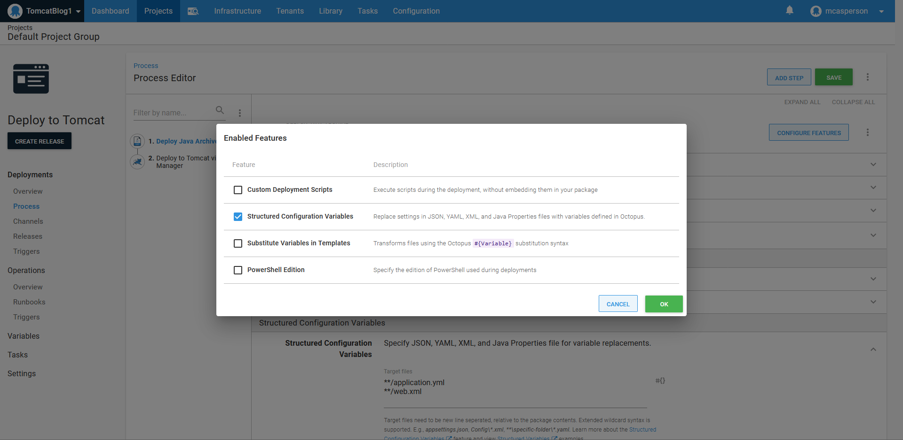
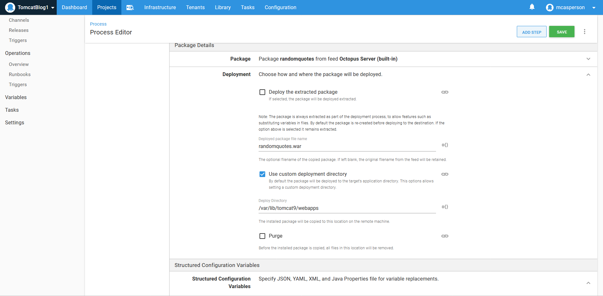
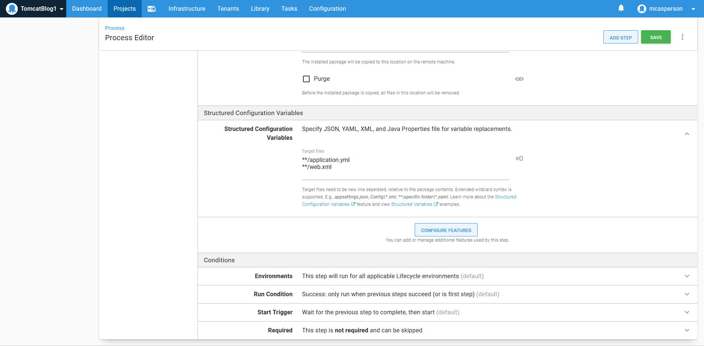
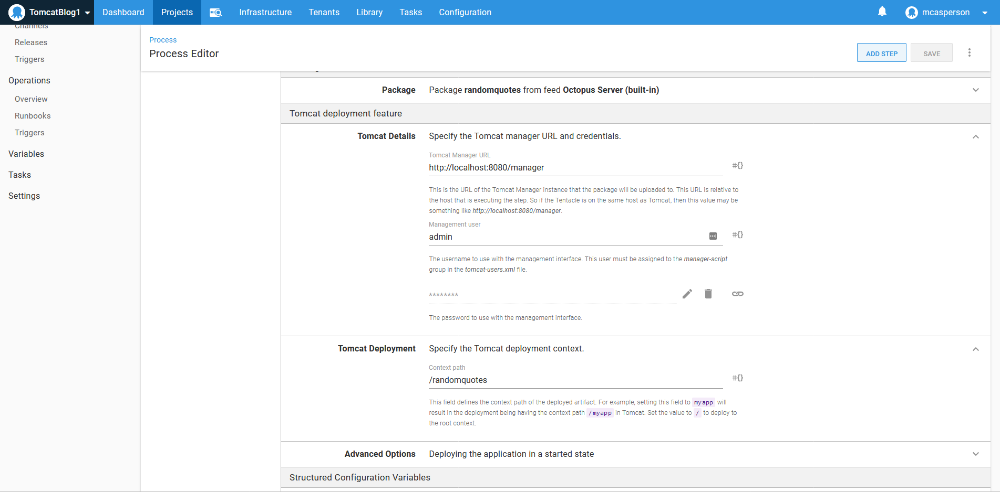
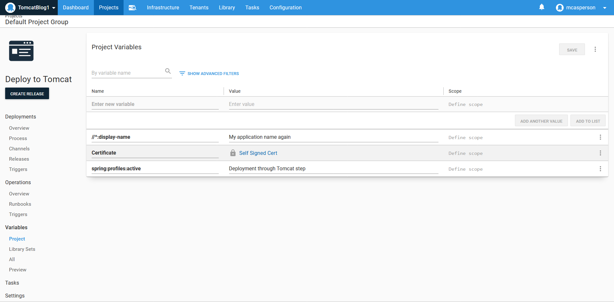
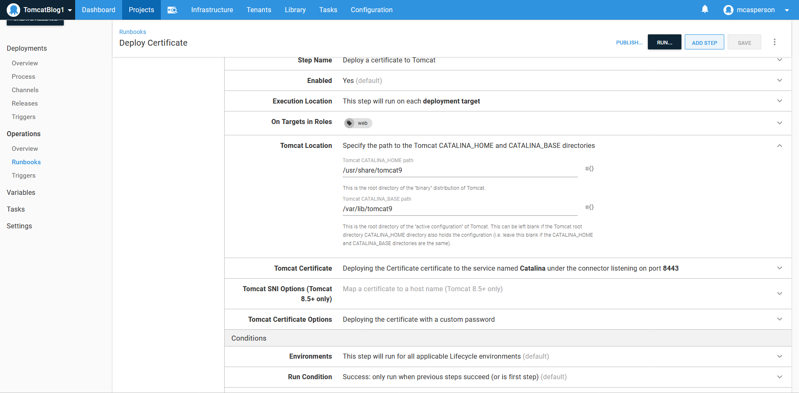
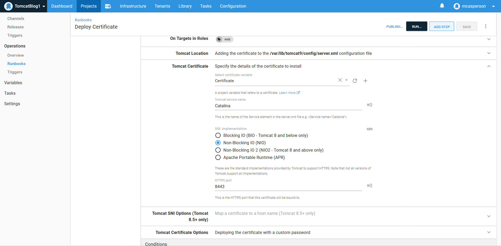

A common challenge when deploying applications to different environments is ensuring the applications are correctly configured for a specific environment. The typical example of this is configuring database connection strings with the credentials required for each environment. These kinds of sensitive credentials shouldn’t be stored in source control, and so some work has to be done to take an application package created by developers working in their local development environments to create a package that can be deployed to shared, but also restricted, environments.

Octopus has had the ability to inject values into JSON files for many years, but Java applications have not typically embraced JSON as a configuration format. Older Java applications lean heavily on XML, while newer libraries like Spring have embraced YAML and properties files for their configuration.

In this post and screencast, I show you how to deploy a Spring application to Tomcat, taking advantage of the new functionality in Octopus 2020.4 to inject values into XML, YAML, and Properties files.

## Screencast

<iframe width="1280" height="720" src="https://www.youtube.com/embed/x1u2iAr_BQ4" frameborder="0" allow="accelerometer; autoplay; clipboard-write; encrypted-media; gyroscope; picture-in-picture" allowfullscreen></iframe>

## Preparing the Linux web server

For this example, I am using Ubuntu 20.04. To install Tomcat and the manager application, we run:

```
sudo apt-get install tomcat9 tomcat9-admin
```

We then need to create a user that can access the manager application by modifying the `/var/lib/tomcat9/conf/tomcat-users.xml` file. An example of this file is shown below:

```xml
<?xml version="1.0" encoding="UTF-8"?>
<tomcat-users xmlns="http://tomcat.apache.org/xml"
              xmlns:xsi="http://www.w3.org/2001/XMLSchema-instance"
              xsi:schemaLocation="http://tomcat.apache.org/xml tomcat-users.xsd"
              version="1.0">
  <role rolename="manager-script"/>
  <role rolename="manager-gui"/>
  <user username="admin" password="Password01!" roles="manager-gui,manager-script"/>
</tomcat-users>
```

If you run into issues accessing the manager application, it may be because of a security setting restricting access from only the localhost IP address. This restriction is defined in the file `/usr/share/tomcat9-admin/manager/META-INF/context.xml` file. Below is an example where the **Valve** implementing the filtering has been commented out:

```xml
<?xml version="1.0" encoding="UTF-8"?>
<Context antiResourceLocking="false" privileged="true" >
    <!-- Comment out the Valve below to remove the address filtering -->
    <!--<Valve className="org.apache.catalina.valves.RemoteAddrValve"
    allow="127\.\d+\.\d+\.\d+|::1|0:0:0:0:0:0:0:1" />-->
  <Manager sessionAttributeValueClassNameFilter="java\.lang\.(?:Boolean|Integer|Long|Number|String)|org\.apache\.catalina\.filters\.CsrfPreventionFilter\$LruCache(?:\$1)?|java\.util\.(?:Linked)?HashMap"/>
</Context>
```

## Generating the self signed certificate

To generate a self signed certificate, run the following commands:

```
openssl genrsa 2048 > private.pem
openssl req -x509 -new -key private.pem -out public.pem
openssl pkcs12 -export -in public.pem -inkey private.pem -out mycert.pfx 
```

The resulting PFX file can then be uploaded to the Octopus certificate store.

## The sample application

The application we are deploying is called Random Quotes, and the source code is available from [GitHub](https://github.com/OctopusSamples/RandomQuotes-Java). This application has two configuration files that we want to modify during deployment: [application.yml](https://github.com/OctopusSamples/RandomQuotes-Java/blob/master/src/main/resources/application.yml) and [web.xml](https://github.com/OctopusSamples/RandomQuotes-Java/blob/master/src/main/webapp/WEB-INF/web.xml). These files represent a mix of the newer YAML configuration style used by Spring, and the older XML style used by servlet applications.

Specifically, we will set the active Spring profile in the YAML file and the application display name in the XML file.

To build the application, run the command:

```
mvn package
```

Then upload the WAR file in the `target` directory to the Octopus built-in feed.

## Deploying the application with a file copy

Java applications can be deployed in two different ways with Octopus. 

The generic solution is to copy the WAR file to a directory on the target machine. Most application servers have a directory that they monitor for new files and then deploy the application automatically. For Tomcat, that directory is `/var/lib/tomcat9/webapps`.

To deploy a Java archive to a directory, use the **Deploy Java Archive** step.

Injecting values into configuration files is performed through the **Structured Configuration Variables** feature, which must be manually enabled:



The step is then configured to deploy the Java WAR file to the `/var/lib/tomcat9/webapps` directory:



The `application.yml` and `web.xml` files are then defined as targets for property replacement:



## Deploying the application via the manager

The second way to deploy applications to Tomcat is with the **Deploy to Tomcat via Manager** step. This step takes advantage of the API exposed by the manager application.

To configure the step, we need to point it to the manager API at http://localhost:8080/manager, and define the credentials we added to the `tomcat-users.xml` file:



## Defining the variables

We need to define two variables to match the properties in the YAML and XML files that we want to replace.

For YAML files, the syntax is a colon separated property hierarchy, resulting in a variable name of **spring:profiles:active**. For XML files XPath is used as a syntax, that results in a variable name of **//*:display-name**:



## Configuring HTTPS

Configuring an HTTPS certificate is done with the **Deploy a certificate to Tomcat** step.

It requires that the CATALINA_HOME and CATALINA_BASE directories are defined. These are defined in the system service file at `/lib/systemd/system/tomcat9.service`, and in our case are defined as `/usr/share/tomcat9` and `/var/lib/tomcat9`:



We then expose HTTPS access via port 8443:



## Conclusion

In this example, we deployed a web application with generic configuration files that support local development and injected variables defined in Octopus during deployment to configure the resulting application for a specific environment. This demonstrates how you can take an application archive created with no environment specific settings and customize it when being deployed to shared and restricted environments.

We also deployed a certificate to configure HTTPS access on our Tomcat server.

The end result was a Spring Boot application customized for a shared environment and securely exposed over HTTPS.

Happy deployments!