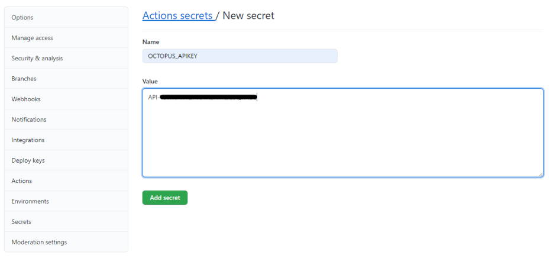
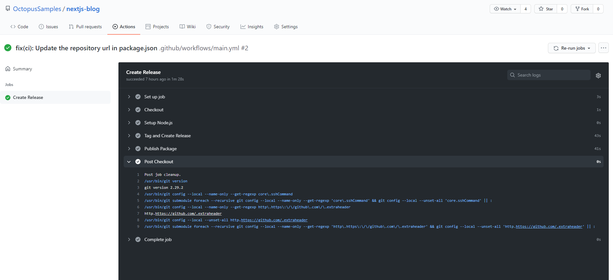
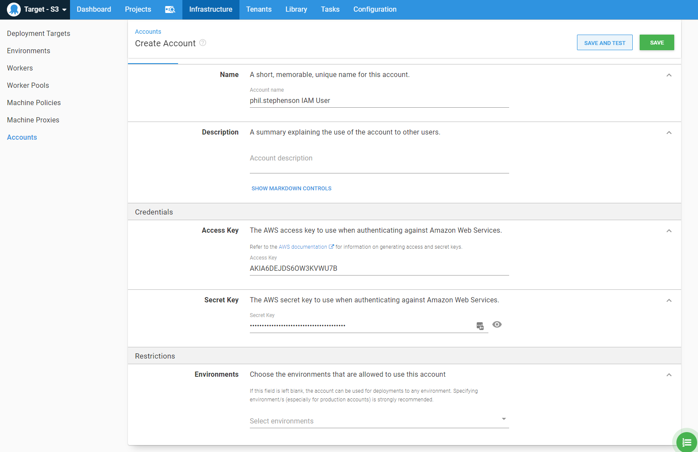
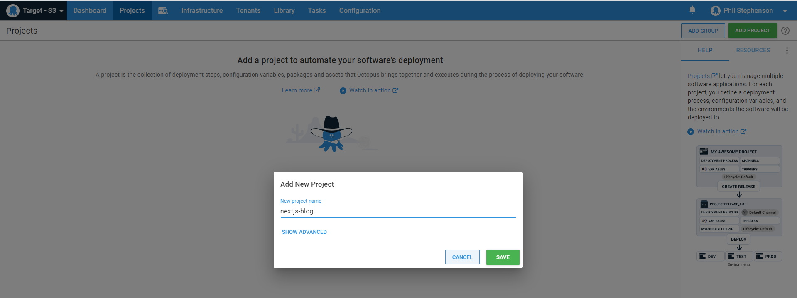
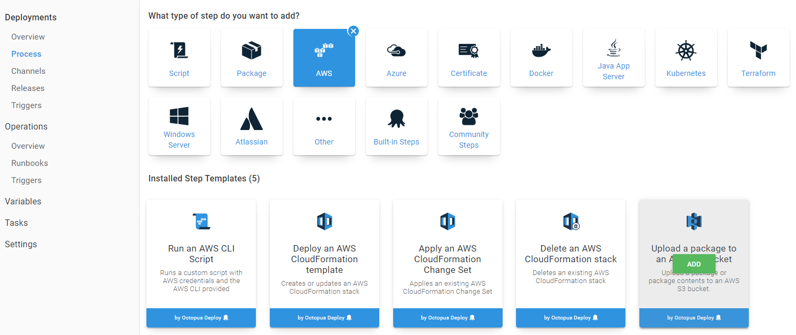
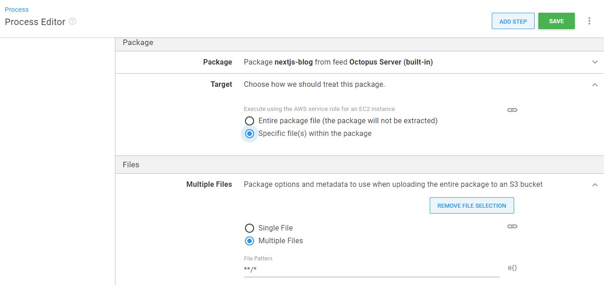
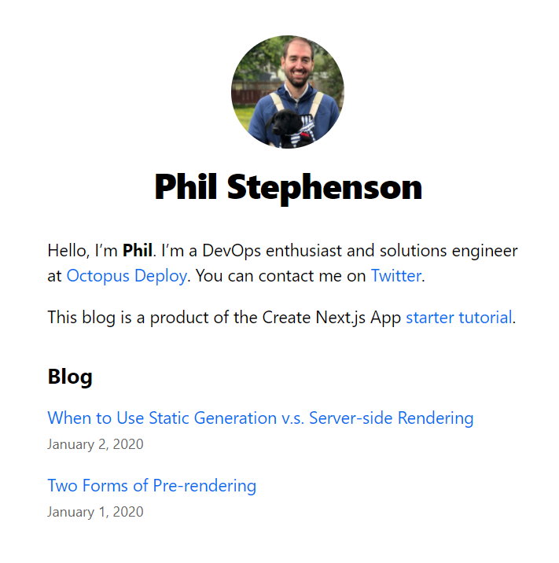

Static content websites deserve proper automation just as much as the rest of your software. Popular frameworks like [Next.js](https://nextjs.org/) and [Create React App](https://github.com/facebook/create-react-app) support features to bundle your site's assets into files, but deploying those assets somewhere with a web server is up to you. In this post, we'll use [GitHub Actions](https://github.com/features/actions) to bundle a Next.js blog and deploy it to [AWS S3](https://aws.amazon.com/s3/) using Octopus Deploy.

Our project's source code can be found [here](https://github.com/OctopusSamples/nextjs-blog) on GitHub.

## Build and Package

Before we can deploy our blog using Octopus, we'll need to package the site and push it to a package repository. Packaging our site is useful for many reasons and you can read more about why it's important in [this previous blog post](https://octopus.com/blog/deploying-nodejs) by my colleague Matt Casperson.

For simplicity, we'll use Octopus'es [built in repository](https://octopus.com/docs/packaging-applications/package-repositories/built-in-repository). And since our project is already hosted on GitHub, let's setup a GitHub Action that helps us create our package. Our workflow should look something like this:

For each push to our `main` branch, we'll
- Checkout the source code
- Run `npm ci` to get our `node_modules` dependencies (implicit in this step is having node.js setup in our Actions environment)
- Tag our commit with a new version number
- Use `next export` to generate our static asset files
- Bundle those assets into our package
- Finally, push our package to the Octopus built-in repository

Let's start with a GitHub Action template that at least checks out our source code, runs `npm ci`, and generates our assets:

```yaml
// main.yml - https://github.com/OctopusSamples/nextjs-blog/blob/main/.github/workflows/main.yml
on:
  push:
    branches:
      - main
jobs:
  release:
    name: Create Release
    runs-on: ubuntu-latest
    steps:
      - name: Checkout
        uses: actions/checkout@v2
      - name: Setup Node.js
        uses: actions/setup-node@v2
        run: |
          npm ci
          npm run export
```

`npm run export` runs the following [npm script](https://docs.npmjs.com/cli/v6/using-npm/scripts) in our package.json file:
```json
"scripts": {
  "build": "next build",
  "export": "next build && next export"
},
```

See [next.js documentation](https://nextjs.org/docs/advanced-features/static-html-export) for more info on `next export`.

This is a good start, but now we need some way to create new version numbers to give to our package.

### Tagging with semantic-release

Each package in the Octopus built in feed requires an **ID** and a **version**, such that the name of the file is `ID.version.ext`. For example: `nextjs-blog.0.1.0.zip`. The version numbers must be valid [semantic versions](https://octopus.com/docs/packaging-applications/create-packages/versioning#semver). You could just tag your releases manually each time you want to release, but that's time consuming and requires a human. Where's the fun in that? What if wanted to automate this process? Building logic with a home-rolled solution to generate new, valid semantic versions sounds challenging. Luckily, there is an excellent open source project called [semantic-release](https://semantic-release.gitbook.io/) that does just that.

semantic-release works by evaluating our commit messages based on some pre-defined convention. Depending on the format of our recent commit messages, the library will generate the next appropriate semantic version after finding the most recent version and updating either the major, minor, or patch version accordingly. The details of this library are out of scope for this blog post, but definitely check this project out if you've never used it before.

There is even a community contributed [GitHub Action for Semantic Release](https://github.com/marketplace/actions/action-for-semantic-release). Let's use this project to generate our new version automatically and tag our commit:

```yaml
...
  - name: Tag and Create Release
    id: semantic
    uses: cycjimmy/semantic-release-action@v2
    env:
        GITHUB_TOKEN: ${{ secrets.GITHUB_TOKEN }}
```

Because our primary git branch is named `main`, we needed a small piece of configuration in our `package.json` to tell semantic-release to evaluate commits only on pushes to the `main` branch:
```json
"release": {
  "branches": [
    "main"
  ]
}
```

Now that we've built and tagged our new release, it's time to create our package and publish it to Octopus.

### Pack and Publish with octopackjs

If you've ever tried creating packages with plain ol' npm, it can be quite frustrating.
- The `npm pack` [command](https://docs.npmjs.com/cli/v6/commands/npm-pack) exposes very few cli parameters.
- You cannot explicitly define the name of the generated package.
- The version of the package must come from the `version` key in `package.json` and cannot be overridden with a cli parameter.
- Your package root *must* contain the `package.json` file
- You cannot easily define the directory structure that ultimately ends up in your package.

It just seems as if npm was designed exclusively for the bundling of your packages for consumption by... other npm projects - not for deployment.

[octopackjs](https://github.com/OctopusDeploy/octopackjs) is an open source project maintained by Octopus that is uniquely designed for bundling and pushing your packages to an Octopus server. After running `npm run export`, Next.js places our static asset files in a directory named `out`. Let's write a small node script using octopackjs to package that directory and push it to our Octopus server:

```js
// publish.js - https://github.com/OctopusSamples/nextjs-blog/blob/main/publish.js
const octo = require('@octopusdeploy/octopackjs');
const octopusUrl = 'https://samples.octopus.app';
octo.pack()
    .appendSubDir('out', true)
    .toFile('.', (err, data) => {
        console.log('Package Saved: ' + data.name);
        octo.push(data.name, {
            host: octopusUrl,
            apikey: 'MY-API-KEY',
            spaceId: 'Spaces-604',
            replace: true
        },
        err => err ? console.error(err.body) : console.log('Package Pushed to ' + octopusUrl));
    });
```

See [our documentation](https://octopus.com/docs/octopus-rest-api/how-to-create-an-api-key) for creating API keys for use with Octopus Deploy. Security conscious readers might notice right away that it appears my API key is just hard coded directly into our script - a big no no! Let's use an environment variable here instead:

```js
octo.push(data.name, {
    ...
    apikey: process.env.OCTOPUS_APIKEY,
    ...
```

We can inject this environment variable using an [encrypted secret in GitHub Actions](https://docs.github.com/en/actions/reference/encrypted-secrets). First we'll add our `OCTOPUS_APIKEY` secret to our repository (follow the instructions in the Actions docs):



Now, we'll reference our secret in our `main.yml` GitHub Action template:
```yaml
...
- if: steps.semantic.outputs.new_release_published == 'true'
name: Publish Package
env:
    OCTOPUS_APIKEY: ${{ secrets.OCTOPUS_APIKEY }}
run: |
    npm ci
    npm run export
    OCTOPUS_APIKEY="$OCTOPUS_APIKEY" node publish.js
```

Now that we've set up our Action, let's make a commit, push and watch it go!



:::hint
In this example, we're *pushing* our package from GitHub Actions to our Octopus Cloud instances at https://samples.octopus.app. If you're running an Octopus Server that is not publicly accessible from github.com, you might instead consider pushing to a third-party package repository (e.g. Artifactory, Nexus) and have your Octopus Server pull from that repository by setting it up as an [external feed](https://octopus.com/docs/packaging-applications/package-repositories).
:::

## Deploy

Now that we've setup our continuous integration process, it's time to deploy our website! We'll use Octopus Deploy to upload our package to AWS S3. Conveniently, it already has a [built in step template](https://octopus.com/docs/deployment-examples/aws-deployments/s3) designed for this. For static content sites like the one we've built here, S3 buckets are a great choice because they require very little configuration (no need to install and configure a web server), are inexpensive, and of course you benefit from the reliability of the AWS cloud platform.

### AWS S3

Setting up an S3 bucket is pretty simple and there are many tutorials out there to help with that so we won't walk through it here step by step. I would recommend following along with the AWS documentation specifically for [Hosting a static website using Amazon S3](https://docs.aws.amazon.com/AmazonS3/latest/dev/WebsiteHosting.html).

Octopus will need an [AWS AccessKey](https://docs.aws.amazon.com/general/latest/gr/aws-sec-cred-types.html#access-keys-and-secret-access-keys) to upload packages to your S3 bucket. It's a good idea (although not mandatory) to set up a separate [IAM user](https://docs.aws.amazon.com/IAM/latest/UserGuide/id_users.html) with explicit permissions to your new bucket. See [this page](https://docs.aws.amazon.com/IAM/latest/UserGuide/id_credentials_access-keys.html) for help with managing access keys for IAM users.

:::hint
Save your Access Key ID and Key Secret somewhere safe and accessible to you later on. We'll need those two values to set up our AWS account in Octopus Deploy
:::

### Octopus Deploy

In the Octopus Accounts section, create a new [AWS Account](https://octopus.com/docs/infrastructure/deployment-targets/aws). I like the name of my account to match or reference in some way the name of the AWS IAM user:



Next, let's create a new Octopus project called `nextjs-blog`:



To use our AWS Account in our `nextjs-blog` project, we'll need to create an AWS Account variable in the variables section in our project:


:::hint
See [this page](https://octopus.com/docs/projects/variables/aws-account-variables) for more info on AWS Account variables in Octopus
:::

Lastly, let's create our one and only step in our project by adding the Upload a package to an AWS S3 bucket step:



Configuring this step is straightforward. You can follow along with [our documentation](https://octopus.com/docs/deployment-examples/aws-deployments/s3) that explains what each option means and has links for more information.

The one section I want to point out here is the Package Target options. By default, the step is setup to just deploy the entire package file without extracting it. Our asset files though are inside the package and we need them extracted and placed at the root of the bucket for S3 to serve them. To accomplish this, follow these steps:
1. Select the `Specific file(s) within the package` option.
2. Click `ADD A FILE SELECTION`
3. Select `Multiple Files` (as opposed to `Single File`)



The default file pattern `**/*` will select all files and directories in our package, which is exactly what we want.

4. Lastly, enter a `Canned Acl`. Read more about these [here](https://docs.aws.amazon.com/AmazonS3/latest/dev/acl-overview.html#canned-acl). For my set up, I used `bucket-owner-full-control`

Finally, create a release, cross your fingers, and deploy! :tada:

If all goes well, we should be to see our website here: http://octopus-nextjs-sample.s3-website-us-west-2.amazonaws.com/



## What else?

Did you get stuck anywhere trying to follow along? Check out the project's source code on GitHub [here](https://github.com/OctopusSamples/nextjs-blog) and you can also see the deploy project set up in our Octopus Deploy Samples space at https://samples.octopus.app/app#/Spaces-604/projects/nextjs-blog.

Want to serve your website using an SSL certificate? Checkout the [AWS CDN product CloudFront](https://docs.aws.amazon.com/AmazonS3/latest/dev/website-hosting-cloudfront-walkthrough.html).

If you have a much larger Next.js site and it's impractical to generate static assets, Next.js also supports serving your app with a [dynamic backend with Node.js](https://nextjs.org/docs/deployment#nodejs-server). See this [great Digital Ocean tutorial](https://www.digitalocean.com/community/tutorials/how-to-deploy-a-next-js-app-to-app-platform) for setting up that kind of deployment for your Next.js app.

Thanks for reading, and happy deployments!
