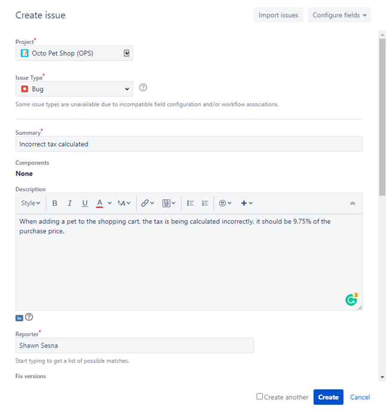

Continuous Integration (CI) typically involves three components: a source control server, issue tracking, and a build server.  Tools such as Azure DevOps combine all components into a single solution whereas other configurations have them separated such as using GitHub for source control, TeamCity for build, and Jira for issue tracking.  When it comes to Continuous Delivery (CD), commits and isue tracking are extremely important to ensure the correct version of software is deployed.  The Octopus Deploy product employs a feature called [Build Information](https://octopus.com/docs/packaging-applications/build-servers#build-information) which allows you to tie releases of your software to specific commits and isues.  

It is important to note that while commits will work in all cases, issue tracking will only function if you have one of the following integrations configured in Octopus Deploy
- Azure DevOps Issue Tracking
- GitHub Issue Tracking
- Jira Integration

In this post, I'll walk you through configuring Octopus Depoloy to include build information and commits and how this information can be used during the deployment process.

## Setup
For this demonstration, I'll be using the second scenario described above: GitHub, TeamCity, and Jira, which is a fairly common configuration.  While I'll be addressing these specific technologies, the overall configuration will be similar regardless of which toolset you use.

## To be determined
This demonstration utilizes [OctoPetShop](https://github.com/OctopusSamples/OctoPetShop), a fictitious pet store application written in .NET Core consisting of a web front-end, two services, and a database.  This post assumes you have some familiarity with Git and GitHub and will not cover project creation or initial check-in of code.

### Create a bug
We'll start off by logging a bug in Jira for the OctoPetShop application.  This post assumes you already know how to create a project  within Jira.


  
Once the issue has been created, we'll need to take note of the of the `key` value as we'll need this to correctly tag our commits.  In this case, the value is `OPS-1`.


At this point, we're done in Jira.

### Tie commit to issue
Tying a commit to an issue can vary depending on the issue tracker you are using.  For Jira, your commit message needs to use the following format:

```
git commit -m "[key-value] Commit message"
```

For our example, our commit message would look like this

```
git commit -m "[OPS-1] Fixed tax rate calculation.  Tax rate now pulled using new tax rate service"
```

### Configure build to push build information
Octopus Deploy provides first-class integration with many [build servers](https://octopus.com/docs/packaging-applications/build-servers) in the form of plugins such as:
- Azure DevOps
- TeamCity
- Jenkins
- Bamboo

In addition to the available plugins, Octopus Deploy also provides integration with online-only build servers like:
- CircleCI
- GitHub Actions
- BitBucket Pipelines
- Appveyor

:::warning
The online-only build servers listed above are considered experimental and are not officially supported by Octopus Deploy.
:::

For this demonstration, we're using TeamCity.  Simply fill out the form for the plugin and you're done!  


Issuing a build, we can see that our change has been picked up by the build server.


### Configure Issue Tracking integration
As stated previously, the issue tracking for build information will not work until you configure the corresponding integration in Octopus Deploy.  For this demonstration, we need to configure the Jira integration.  Navigate to the `Configuration` tab in Octopus Deploy and click on `Settings`.  Click on `Jira` and fill in the required information


With our integration configured, let's pop over to the `Library` tab and choose `Build Information`.  On this page, we can see the build information has been uploaded to Octopus Deploy for the packages for OctoPetShop.  Clicking on one of these will show the commits and issues related to it.


The build information contains links to the build it came front, the commits it contained and the work items (issues) it was associated with.

The keen eyed observer would have seen a feature we've yet to discuss, [Release Notes](https://octopus.com/docs/releases/release-notes).  All of the issues integrations contain an entry for `Release Note Prefix`.  Any commit message that starts with the defined Release Note Prefix will automatically get included in the Release Notes of a release.  In our case, the value is `Release note:`.  Let's create another commit to test this out.

```
git commit -m "Release note: Tax Rate service introduced for domestic orders."
```

Once the build completes we can see our Release Note in the commit message for the latsest version of our package.  Though the commits, release notes, and issues are contained within different versions of the package, Octopus Deploy will aggregate the information if the deployments are in different stages before Production.

