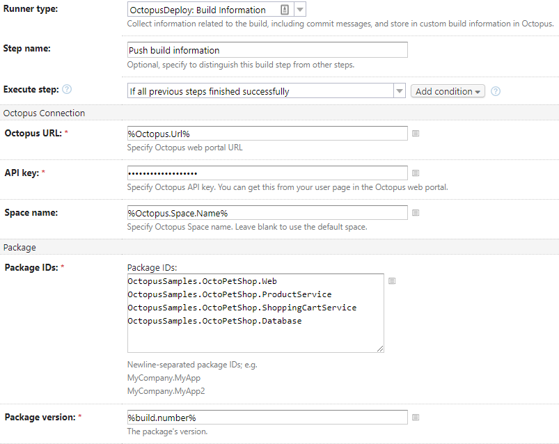
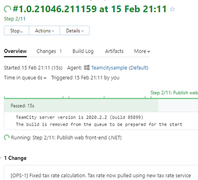
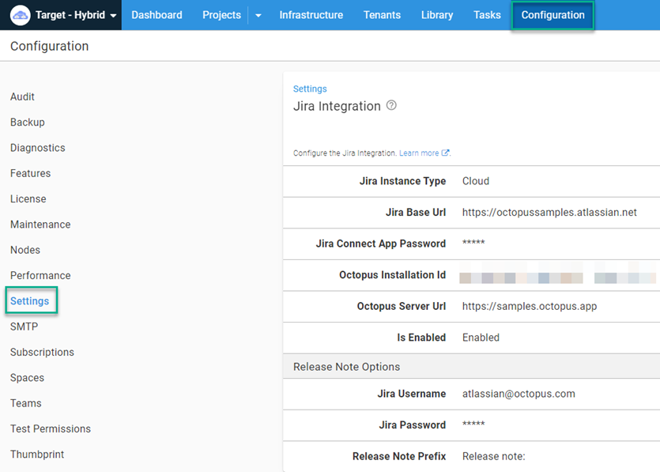
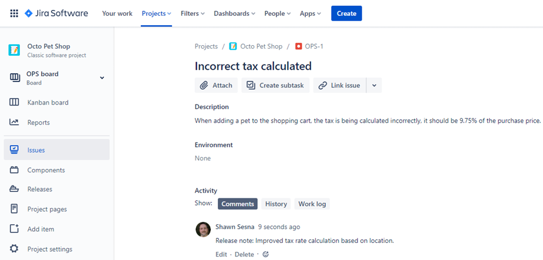
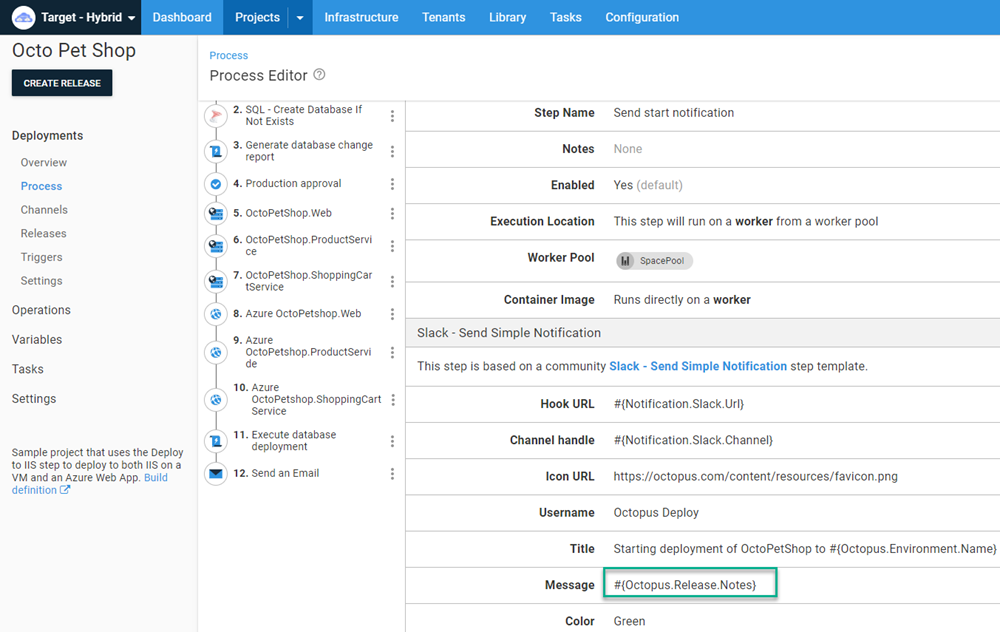
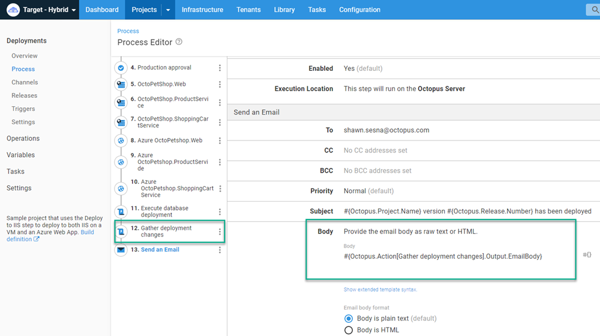
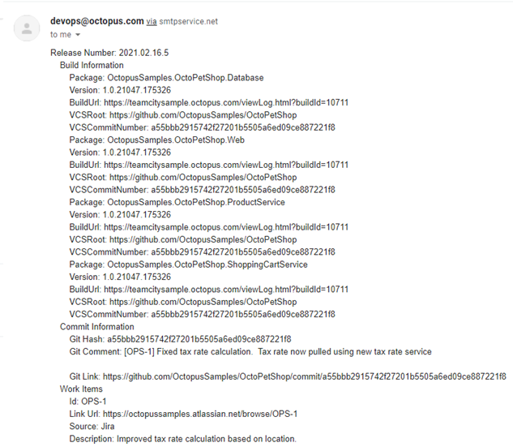

Continuous Integration (CI) typically involves three components: a source control server, issue tracking, and a build server.  Tools such as Azure DevOps combine all components into a single solution whereas other configurations have them separated such as using GitHub for source control, TeamCity for build, and Jira for issue tracking.  When it comes to Continuous Delivery (CD), commits and issue tracking are extremely important to ensure the correct version of software is deployed.  Octopus Deploy has a feature called [Build Information](https://octopus.com/docs/packaging-applications/build-servers#build-information) which allows you to include commits and issues as part of your release.  

:::hint
It is important to note that while commits will work in all cases, issue tracking will only function if you have one of the following integrations configured in Octopus Deploy
- Azure DevOps Issue Tracking
- GitHub Issue Tracking
- Jira Integration
:::

In this post, I'll walk you through configuring TeamCity and Octopus Depoloy to include build information and how this information can be used during the deployment process.

## Example scenario
For this demonstration, I'll be using the second scenario described above: GitHub ([OctoPetShop](https://github.com/OctopusSamples/OctoPetShop)), TeamCity, and Jira.  While I'll be addressing these specific technologies, the overall process will be similar regardless of which toolset you use.

### Create an issue
We'll start off by logging a bug in Jira for the OctoPetShop application.  This post assumes you already know how to create a project within Jira.


  
Once the issue has been created, we'll need to take note of the of the `key` value as we'll need this to correctly tag our commits.  In this case, the value is `OPS-1`.


### Tie commit to issue
Tying a commit to an issue can vary depending on the issue tracker you are using.  For Jira, your commit message needs to use the following format:

```
git commit -m "[key-value] Commit message"
```

For our example, our commit message would look like this

```
git commit -m "[OPS-1] Fixed tax rate calculation.  Tax rate now pulled using new tax rate service"
```

## Configure build to push build information
Octopus Deploy provides first-class integration with many [build servers](https://octopus.com/docs/packaging-applications/build-servers) in the form of plugins:
- Azure DevOps
- TeamCity
- Jenkins
- Bamboo

In addition to the available plugins, there are some community supported integrations with online-only build servers:
- CircleCI
- GitHub Actions
- BitBucket Pipelines
- Appveyor

For this demonstration, we're using TeamCity.  Add a new step to your build definition, choosing the `Octopus Deploy: Build Information` runner.  Fill in the required values:
- Octopus URL: URL to your Octopus server
- API key: API key with permissions to push build information
- Space name: Name of the space to push to (leave blank for default)
- Package IDs: List of packages to apply the build information to



Issuing a build, we can see that our change has been picked up by the build server.



## Configure Issue Tracking integration
As stated previously, the issue tracking for build information will not work until you configure the corresponding integration in Octopus Deploy.  For this demonstration, we need to configure the [Jira integration](https://octopus.com/docs/releases/issue-tracking/jira).  Navigate to the `Configuration` tab in Octopus Deploy and click on `Settings`.  Click on `Jira` and fill in the required information:
- Jira Instance Type: Cloud or Server
- Jira Base Url: Url to Jira
- Jira Connect App Password: Password for the connection
- Octopus Installation Id: Id of your Octopus Installation from the Octopus Deploy plugin in Jira
- Octopus Server Url: Url to your Octopus server
- Is Enabled: Check box for enabling the integration



With our integration configured, let's pop over to the `Library` tab and choose `Build Information`.  On this page, we can see the build information has been uploaded to Octopus Deploy for the packages for OctoPetShop.  Clicking on one of these will show the commits and issues related to it.


The build information contains links to the build it came from, the commits and the work items (issues) it was associated with.

### Release Note Prefix
The keen eyed observer would have seen a feature we've yet to discuss, `Release Note Prefix`.  The Release Note Prefix feature provides a method of overriding the title of the work item.  Octopus Deploy will look through the comments of a work item, looking for the specified prefix which I've defined as `Release note:`.  When it finds a comment with the prefix, it will override the title of the work item with whatever text comes after the prefix.

:::hint
All of the Octopus Deploy issues integrations contain the `Release Note Prefix` feature.
:::

The title of our issue is "`Incorrect tax calculated`", which doesn't make for a terribly useful release note.  Instead, we'd like it to show up as "`Improved tax rate calculation based on location.`"

To do this, we add a comment to the Jira issue using our defined prefix,



In Octopus, we can see that the title of the Work Item has been updated to the desired value.


## Keeping everyone informed
So far we've shown how the build information can be accessed via the Octopus Deploy UI.  However, not everyone in an organization may have access to Octopus Deploy such as Quality Assurance (QA) teams.  Octopus deploy has some built-in variables that can be utilized to disseminate the build information.

### Project release notes template
In the settings of a project is a space where you can define a [release notes template](https://octopus.com/docs/releases/release-notes#Release-Notes-Templates).  The template allows you to customize the display of the build information related to the packages.  Here is an example template

```
#{each workItem in Octopus.Release.WorkItems}#{if Octopus.Template.Each.First == "True"}WorkItems:#{/if}
- [#{workItem.Id}](#{workItem.LinkUrl}) - #{workItem.Description}
#{/each}

Packages:
#{each package in Octopus.Release.Package}
- #{package.PackageId} #{package.Version}
#{each commit in package.Commits}
    - [#{commit.CommitId}](#{commit.LinkUrl}) - #{commit.Comment}
#{/each}
#{/each}
```

:::warning
The Octopus.Release.Package variable is **only** available for use in release notes templates, it is not available during a deployment process such as a Run a script step.
:::

With a template defined, the release notes are acessible during a deployment via the `Octopus.Release.Notes` variable.  Using something like Slack, you can include the Build Information in the message.



Since each package was tagged with the build information, the resulting message would look like this


Without the Release Notes template (or manually entered release notes), the `Octopus.Release.Notes` variable is empty.

### Octopus.Deployment.Changes
Another method of accessing the build information is the `Octopus.Deployment.Changes` variable.  Using a `Run a script` step, you could iterate through the changes, constructing a message and set an [Output Variable](https://octopus.com/docs/projects/variables/output-variables)

```PowerShell
$changeListRaw = $OctopusParameters["Octopus.Deployment.Changes"]
$changeList = $changeListRaw | ConvertFrom-Json

foreach ($change in $changeList)
{
    $emailBody = "Release Number: $($change.Version)`r`n"
      
    $emailBody += "    Build Information`r`n"
    foreach ($buildInformation in $change.BuildInformation)
    {
        $emailBody += "        Package: $($buildInformation.PackageId)`r`n"
        $emailBody += "        Version: $($buildInformation.Version)`r`n"
        $emailBody += "        BuildUrl: $($buildInformation.BuildUrl)`r`n"
        $emailBody += "        VCSRoot: $($buildInformation.VcsRoot)`r`n"
        $emailBody += "        VCSCommitNumber: $($buildInformation.VcsCommitNumber)`r`n"
    }

    $emailBody += "    Commit Information`r`n"
    foreach ($commit in $change.Commits)
    {
        $emailBody += "        Git Hash: $($Commit.Id)`r`n"
        $emailBody += "        Git Comment: $($Commit.Comment)`r`n"
        $emailBody += "        Git Link: $($Commit.LinkUrl)`r`n"
    }

    $emailBody += "    Work Items`r`n"
    foreach ($workItem in $change.WorkItems)
    {
        $emailBody += "        Id: $($WorkItem.Id)`r`n"
        $emailBody += "        Link Url: $($WorkItem.LinkUrl)`r`n"
        $emailBody += "        Source: $($WorkItem.Source)`r`n"
        $emailBody += "        Description: $($WorkItem.Description)`r`n"
    }
}

Set-OctopusVariable -name "EmailBody" -value $emailBody
```

Using something like a `Send an email` template, you could set the `Body` of the email to the value of the output variable



This will allow you to send an email to stakeholders letting them know the progress of the deployment



## Conclusion
The Build Information feature of Octopus Deploy is a incredibly powerful communication tool.  I hope this post demonstrates the different ways it can be utilized in your CI/CD pipeline.  Happy Deployments!
