One of my favorite features in Octopus Deploy is [Multi-Tenancy](https://octopus.com/docs/deployments/patterns/multi-tenant-deployments), where each customer gets their own version of an application, either hosted on unique infrastructure per customer, or hosted by the customer themselves. The multi-tenancy feature in Octopus Deploy solves many problems.  My [previous article](blog/2021-02/release-management-with-octopus/index.md) was a deep dive into the new [Deploy Child Octopus Deploy Project](https://library.octopus.com/step-templates/0dac2fe6-91d5-4c05-bdfb-1b97adf1e12e/actiontemplate-deploy-child-octopus-deploy-project) step template and covered a variety of scenarios, but it didn't include multi-tenancy.  In this article, I do a deep dive into the multi-tenancy functionality of the new step template, and how you can use it to better manage your multi-tenancy releases.

:::success
This article assumes you read the [previous article](blog/2021-02/release-management-with-octopus/index.md). It will touch on similar topics, but it isn't a full rehash.
:::

## Sample application

Like the previous article, I have a sample application where each component is an Octopus Deploy project.  


There are a few key differences:

- These projects have been updated to use [Octopus Deploy's Multi-Tenancy feature](https://octopus.com/docs/deployment-patterns/multi-tenant-deployments).
- Two additional projects have been added, a single sign-on project and a data conversion project.

The sample application is a SaaS application with the following business rules:

- Every customer gets the "core" product consisting of the Database, the Web API, and Web UI.
- Every customer gets a **Staging** and **Production** environment.  The **Staging** environment allows their engineers to test any changes before being deployed to **Production**.
- Customers can purchase the scheduling service, single sign-on app, and data conversion at an additional cost.
- Customers can pay extra for earlier access to changes deployed in the **Test** environment.
- Certain customers must give their consent before a release deployment to the **Production** environment.
- Purchasing a module requires a redeployment of the core components, configuration files need to be updated, and the services need to be recycled to pick up the new functionality.
- Customers want downtime kept to a minimum.

In a nutshell, while we wish everything were simple, the real-world is messy.  
With that all in mind, let's meet our sample customers:

- **Internal**: This is an internal test customer used by everyone to test changes.  This customer exists across all four environments, **Development**, **Test**, **Staging**, and **Production**.
- **All Pets**: This customer has paid for all the extra components plus access to preview releases in the **Test** environment.
- **Pet Life**: The bare-bones customer only has the four "core" components in the **Staging** and **Production** environments.
- **Pet World**: This customer has purchased the scheduling service and single sign-on app for use in the **Staging** and **Production** environments.
- **Dogs Only**: This customer has purchased the scheduling service and data conversion service for use in the **Staging** and **Production** environments.

## Multi-Tenancy and the Deploy Child Octopus Deploy Project step template

I've worked with customers who went the route of a single massive project to handle everything.  They deployed the software in one go, but outage windows were quite large because unchanged components were also redeployed.  

That often lead to the question, "How do I skip steps where the package hasn't changed?"  

The problem with that approach is that a web deployment rarely "just" pushes out a server package.  Additional steps are needed to configure items such as branding or running integration tests.  

Each component in Octopus Deploy needs to be assigned to a unique project. A parent project will handle the orchestration. Up until this point, there hasn't been a step to solve several use cases seen in the real-world.

- Minimize downtime by only deploying what has changed.
- Minimize build time by only building what has changed.
- Minimize the number of decisions a person has to make.
- Single responsibility principle, each project deploys one thing to the best of its ability.
- Tenants are assigned to different projects.
- Tenants are assigned to different environments per project.
- Tenants are on different release schedules.
- Tenants require their own set of approvals, but a person should only have to approve a release once.
- Applications have to be deployed to tenants in a specific order.
- A customer might approve their change on Tuesday for a Thursday night deployment.

The new [Deploy Child Octopus Deploy Project](https://library.octopus.com/step-templates/0dac2fe6-91d5-4c05-bdfb-1b97adf1e12e/actiontemplate-deploy-child-octopus-deploy-project) step template helps solve these use cases.  You will have a parent project for your application with a single deployment process.  You shouldn't have to worry about tenant and project assignments.  It has the necessary guard clauses to ensure the same process will work for the **Internal Customer** with all the bells and whistles _and_ **Pet Life** with only the core components.


Before moving onto the scenarios, let's take a moment to examine how the step template handles different use cases for a multi-tenant parent project.

### Tenants not assigned to child projects

The step template will automatically detect if you are doing a deployment with a tenant, and run additional logic:

- Is the tenant assigned to the child project?  If no, exit the step, log a message and proceed onto the next step.
- Is the tenant assigned to the child project for that specific environment?  If no, exit the step, log a message, and proceed to the next step.
- Is the child project configured to run multi-tenant?  If no, run the child project without supplying a tenant.

### Choosing a release

One of the step template's core business rules is to pick the last successfully deployed release in the source environment.  Multi-tenancy makes this a bit more complicated.  Consider this scenario:

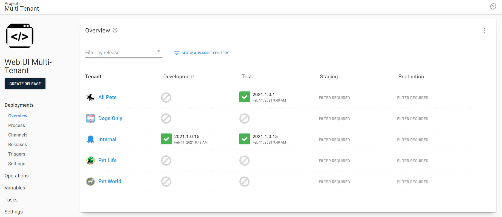

- **Internal**: Has the latest bleeding-edge release, `2021.1.0.15` ready to go to **Staging**.
- **All Pets**: Has an older release, `2021.1.0.1` ready to go to **Staging**.
- **Pet Life**, **Pet World**, and **Dogs Only** aren't assigned to the **Test** environment.

What release will be picked by step template when it promotes the latest `2021.1.0.x` release to **Staging**?  The answer:

- **Internal**: 2021.1.0.15
- **Pet Life**: 2021.1.0.15
- **Pet World**: 2021.1.0.15
- **Dogs Only**: 2021.1.0.15
- **All Pets**: 2021.1.0.1

You must provide the step template with a destination environment (**Staging**), a channel (**Default**, if no channel is provided), and a release number pattern (`2021.1.0.*`).  

With this information the step template will:

1. Use the channel's lifecycle to calculate the source environment, which is **Test**.
2. Pull all the releases for the channel matching the `2021.1.0.*` pattern.
3. Loop through those releases to find the last release successfully deployed to **Test**.  Note, that is not the newest release created, but the last one deployed to **Test**.

Multi-tenancy adds some complexity.

- Only **All Pets** and **Internal** are assigned to the **Test** environment.
- Tenants can have different releases.

The excellent news is Octopus already figures this out for us.  If we were to pick the `2021.1.0.15` release from the **Filter by release** drop-down menu, the dashboard would change to this:


The step template hooks into that logic already provided by Octopus Deploy.  Internally, the logic looks at `2021.1.0.15` for **All Pets** and determines that is not the correct release to promote to **Staging**.  **All Pets** is assigned to the **Test** environment, and that release hasn't been deployed to that environment.  Whereas with **Internal**, that release has been deployed to **Test** so it can be deployed to **Staging**.

When the step template looks at **Pet Life**, it sees that tenant isn't assigned to the **Test** environment.  It will then pick the latest release from the  **Test** environment, regardless of the tenant.  

## Using the Deploy Child Octopus Deploy Project step template

This section walks through configuring some common parent project scenarios.  You can view the final project on the [samples instance](https://samples.octopus.app/app#/Spaces-603/projects/release-orchestration-multi-tenant/deployments) by logging in as a guest.

### Scaffolding

There is some scaffolding to configure for users and lifecycles.  Please see the scaffolding section in the [previous article](blog/2021-02/release-management-with-octopus/index.md#scaffolding).  

After you've configuring the users and lifecycles, it's time to create a project.  When you create the project, remember to select the new lifecycle created above.


Ensure the project is configured to require a tenant for all deployments.

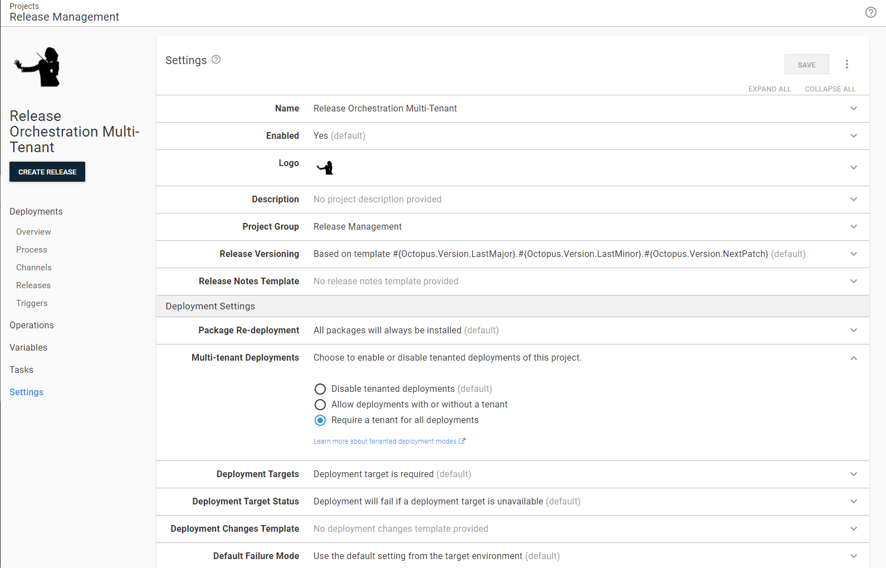

After that, head over to the variables screen and add the API key and the release pattern.


For each tenant, connect the newly created project for the **Staging** and **Production** environments.  

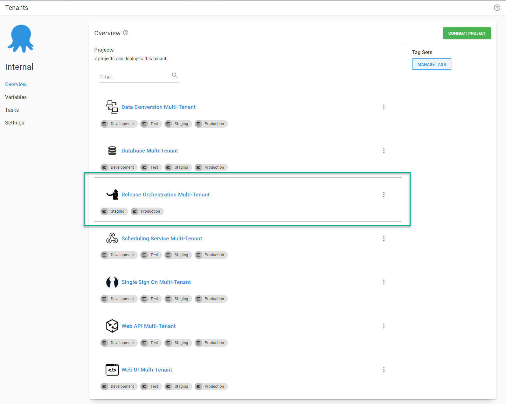

### Scenario: Deploying the latest release for the tenant from Test to Staging

In this scenario, we will configure the parent project to deploy all the child components from **Test** to **Staging** in a specific order.  At this stage, we are not concerned with approvals.  

#### Add the steps

Go to the newly created project's deployment process and add a `Deploy Child Octopus Deploy Project` step for each child project.

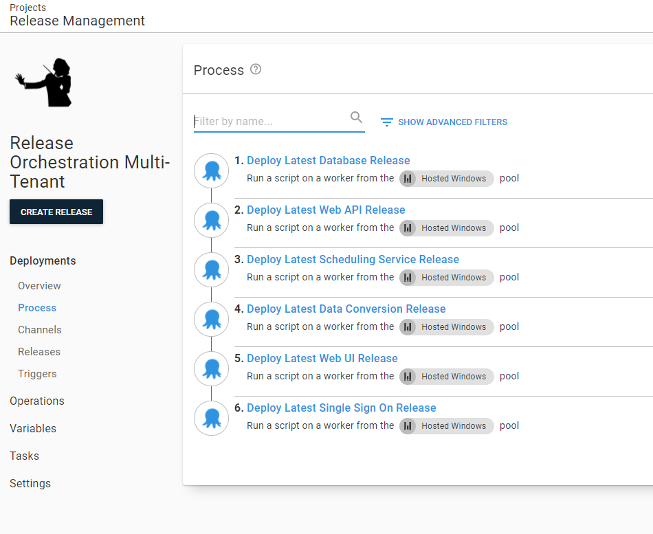

Here are the values for each parameter:

- **Octopus API Key**: The API key variable, `#{Project.ChildProjects.ReleaseAPIKey}`.
- **Octopus Child Space**: Accept the default value. This example isn't creating a release orchestration project in another space.
- **Child Project Name**: The name of the child project.
- **Child Project Channel**: Accept the default (empty) value The child project only has one channel.
- **Child Project Release Number**: The release pattern variable, `#{Project.ChildProjects.ReleasePattern}`.
- **Child Project Release Not Found Error Handle**: Accept the default value, which says if the release doesn't exist, skip it.
- **Destination Environment Name**: Accept the default value. Use the same environment as the parent project. 
- **Source Environment Name**: Accept the default (empty) value This example will let the step template decide the source environment.
- **Child Project Prompted Variables**: Accept the default (empty) value. There are no prompted variables. 
- **Force Redeployment**: Accept the default value. The example won't redeploy an existing release.
- **Ignore Specific Machine Mismatch**: Accept the default value. We're not adding deployment target triggers yet.
- **Save Release Notes as Artifacts**: Accept the default value.
- **What If**: Accept the default value. We're not adding the approvals yet.
- **Wait for finish**: Accept the default value. This example will wait for the deployment to finish.
- **Wait for Deployment**: Accept the default value. 30 minutes should be more than enough.
- **Scheduling**: Accept the default value. This example requires a specific order for child projects.
- **Auto Approve Child Project Manual Interventions**: Accept the default value. This setting isn't needed right now as the example doesn't deal with manual interventions.
- **Approval Environment**: Accept the default value. This setting isn't needed right now as the example doesn't deal with manual interventions.
- **Approval Tenant**: Accept the default value. This setting isn't needed right now as the example don't deal with manual interventions. 

#### Create the release and deploy it

After adding and configuring the steps, it's time to create a release.  I will be making many changes to the parent project in this article; you might see `2021.1.0-RCx` for the release numbers.  

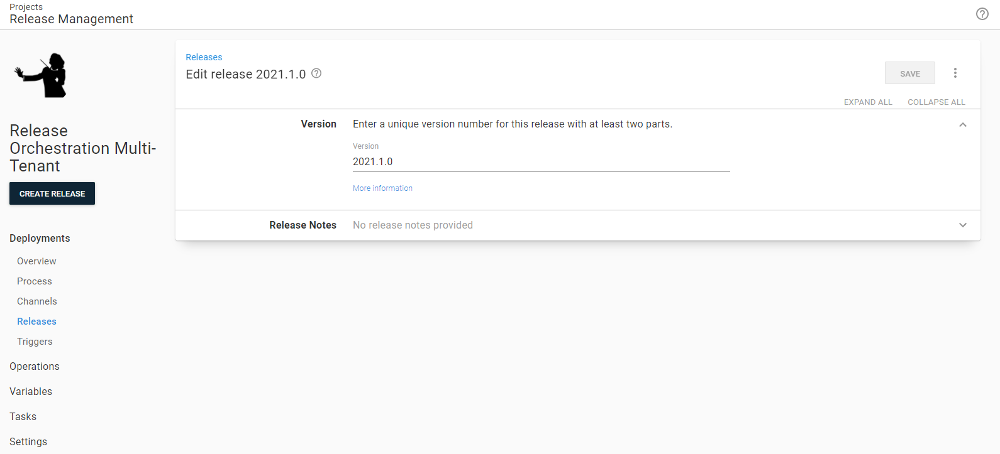

First, deploy the release to the **All Pets** tenant.  


Wait for the release to finish.  For the Web UI project, you should see release `2021.1.0.1` get picked up to deploy.

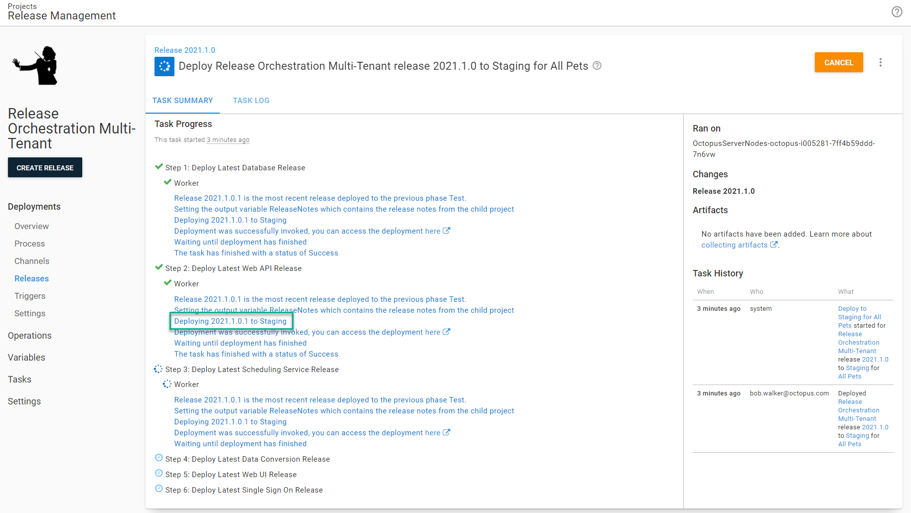

For the other projects, we should see `2021.1.0.15` get picked up.

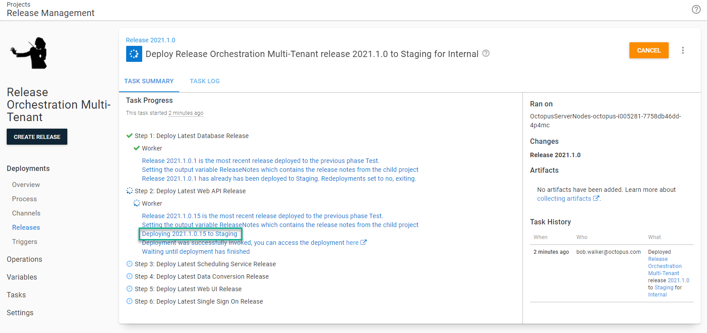

#### Deploy the release for tenants not assigned to Test

Now let's see when the tenant is _not_ assigned to **Test**, such as the case with **Pet Life**, **Pet World**, and **Dogs Only**.

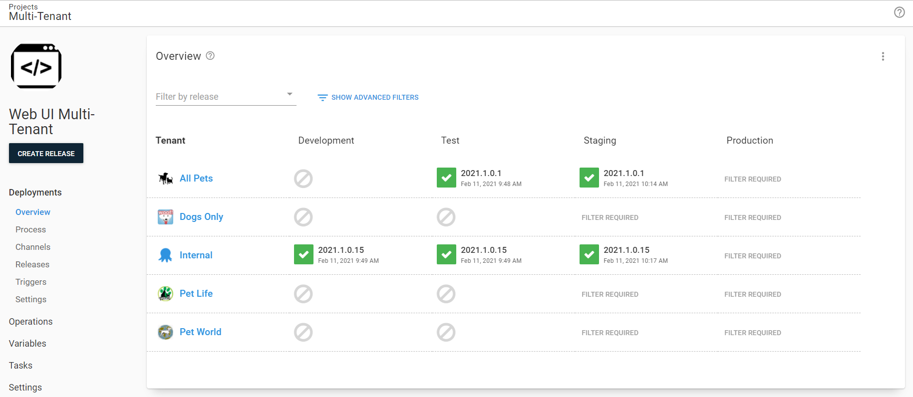

**Pet Life** is also not assigned to the scheduling service, single sign-on, or data conversion service projects.

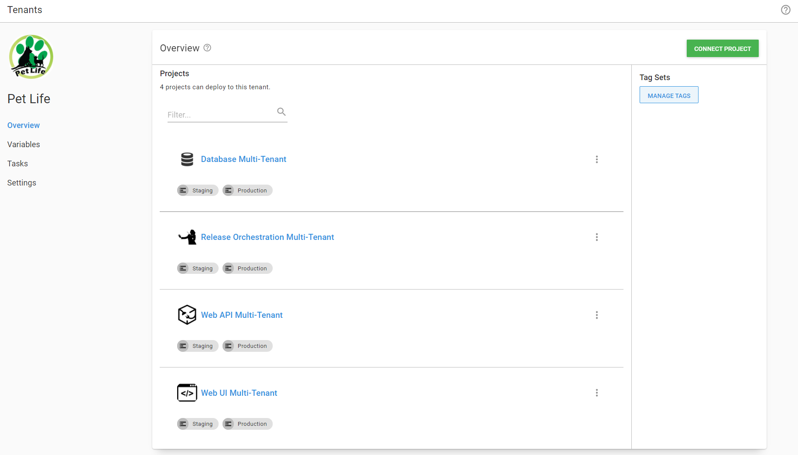

A couple of things will happen when deploying the parent project to **Staging** for **Pet Life**  

- Release `2021.1.0.15` for the Web UI project will be selected as it is the most recent successful release to **Test**.
- The scheduling service, data conversion service, and single sign-on projects will be skipped.

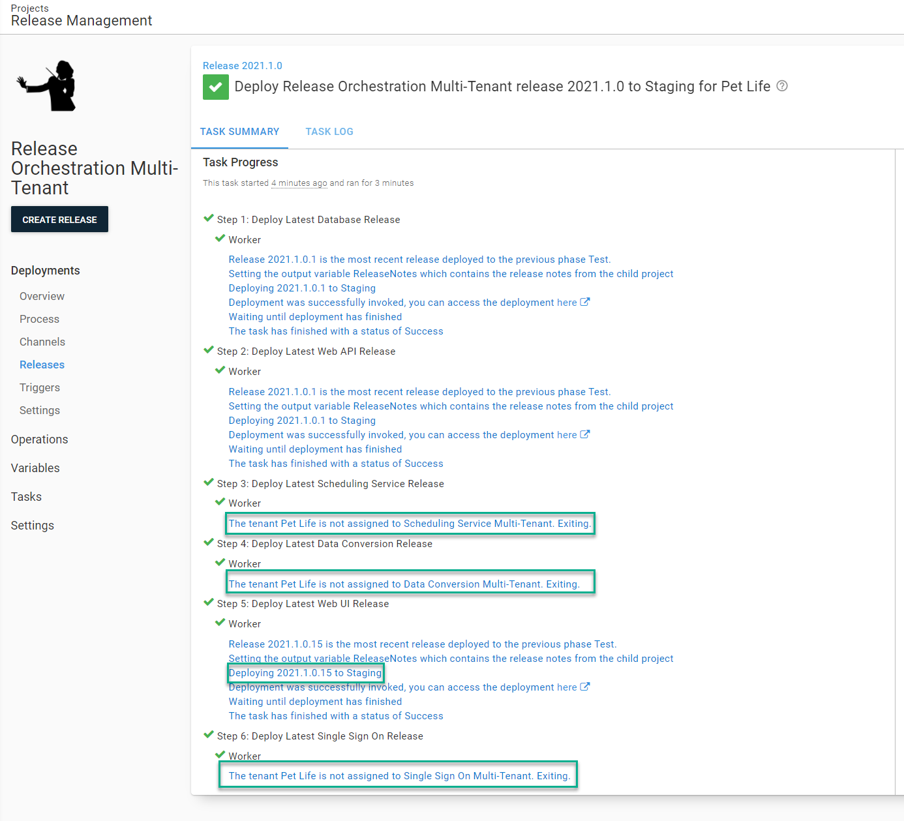

So far, we've configured the parent project to do deployments only.  If we stop here, we are in a better spot than before.  We can push out all the components assigned to a tenant in a specific order.  Also, the process will skip steps not assigned to the tenant automatically.  When managing multi-tenant applications, this alone is a win.  But we can take a step further.  Let's move to approvals.

### Scenario: Approval in the parent project

It's common to have manual interventions in child projects.  In this example application's case, each component project has two or three manual interventions.  That means we are looking at 8 to 18 approvals, depending on the tenant, to submit.  That is very tedious.

All the approvals are in the parent project and flow down to the child project in an ideal configuration.

What exactly is the person approving, though?  With Octopus Deploy, all manual interventions occur as part of a deployment.  It is a chicken/egg scenario.  To solve the chicken/egg scenario, the step template provides "what-if" functionality, which will do everything up to the point of kicking off a deployment.  Also, the step template gathers all the release notes to aid in approvals.

The flow of the parent project is:

1. Run Deploy Child Octopus Deploy Project step templates in what-if mode.
2. Do all the necessary manual interventions.
3. Run Deploy Child Octopus Deploy Project step templates in normal mode.

When running in what-if mode, the following output parameters are set for use later in the process:

- **ReleaseToPromote**: The release number that meets all the requirements.  When no release is found, this is set to N/A.  When the release has already been deployed to the target environment, it will indicate that.
- **ReleaseNotes**: The release notes of the child project.  Includes the commit history and issues associated with the project when using build information.
- **ChildReleaseToDeploy**: Indicates if there is a child release to deploy.  It will either be True or False.  Use this variable in variable run conditions.

#### Create the what if steps

To configure this, you need to first clone all the existing steps.  You can do that by clicking on the overflow menu `...` next to each step.


Rename each of the cloned steps.  Update the parameters in the cloned steps to:

- **Save Release Notes as Artifacts**: Set to `Yes`.
- **What If**: Set to `Yes`. 

#### Add the manual intervention steps

Before we do anything else, add the manual intervention steps.  One of the features of the manual intervention step is it can provide instructions to the approvers.  We can use the output variables from the step template to create useful instructions for our users.  For example:

```
Please approve releases for:

**Database: #{Octopus.Action[Get Database Release].Output.ReleaseToPromote}**
#{Octopus.Action[Get Database Release].Output.ReleaseNotes}

**Web API: #{Octopus.Action[Get Web API Release].Output.ReleaseToPromote}**
#{Octopus.Action[Get Web API Release].Output.ReleaseNotes}

**Scheduling Service: #{Octopus.Action[Get Scheduling Service Release].Output.ReleaseToPromote}**
#{Octopus.Action[Get Scheduling Service Release].Output.ReleaseNotes}

**Data Conversion: #{Octopus.Action[Get Data Conversion Release].Output.ReleaseToPromote}**
#{Octopus.Action[Get Data Conversion Release].Output.ReleaseNotes}

**Web UI: #{Octopus.Action[Get Web UI Release].Output.ReleaseToPromote}**
#{Octopus.Action[Get Web UI Release].Output.ReleaseNotes}

**Web UI: #{Octopus.Action[Get Sign Sign On Release].Output.ReleaseToPromote}**
#{Octopus.Action[Get Single Sign On Release].Output.ReleaseNotes}
```

I like to avoid duplicating effort. Let's add that as a variable.

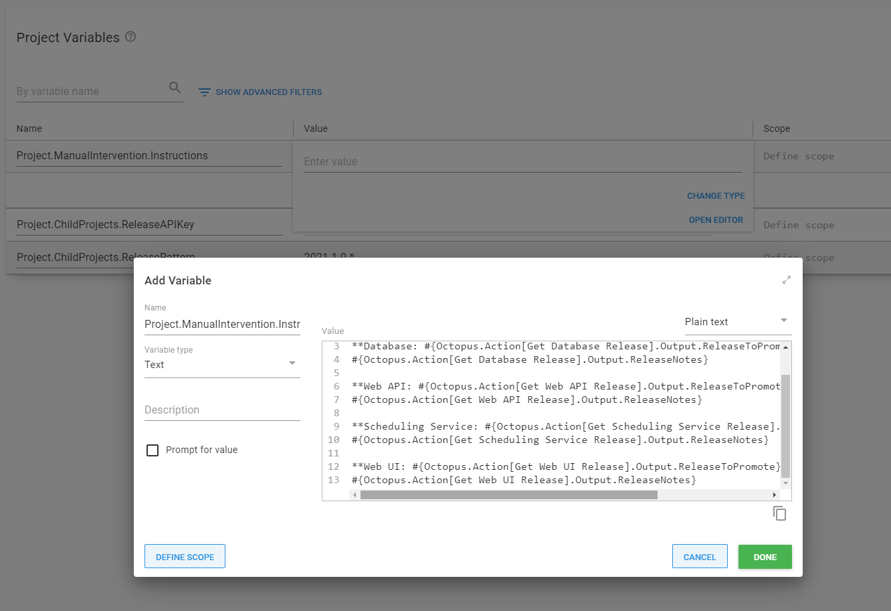

With all that in place, we can add the manual interventions with the instructions sent to that new variable and only run for the **Production** environment.

:::success
The responsible teams list in the manual intervention is combined with an OR.  Anyone from any team on that list can approve the manual intervention.  If you require approval from multiple teams, you will need multiple manual intervention steps.
:::

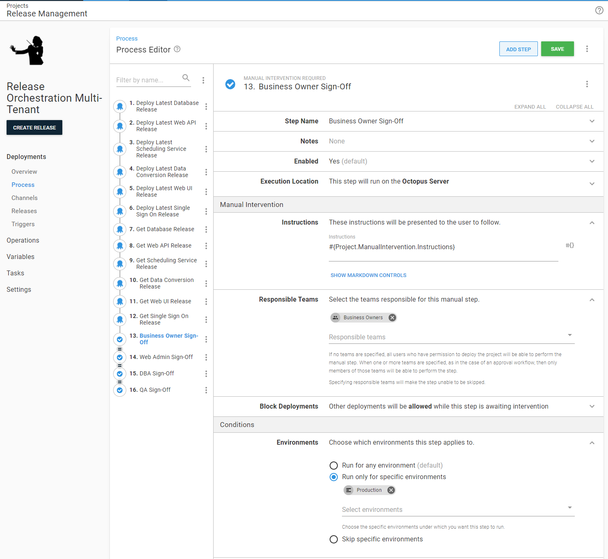

#### Reorder the steps

After the deployment, approvals don't make sense, reorder the steps by clicking the overflow menu `...` next to the **Filter by name** text box and click the **Reorder** button.  


Move all the steps you set to do a "what if" above the "non-what if" steps.  When finished, your process should look something similar to this.

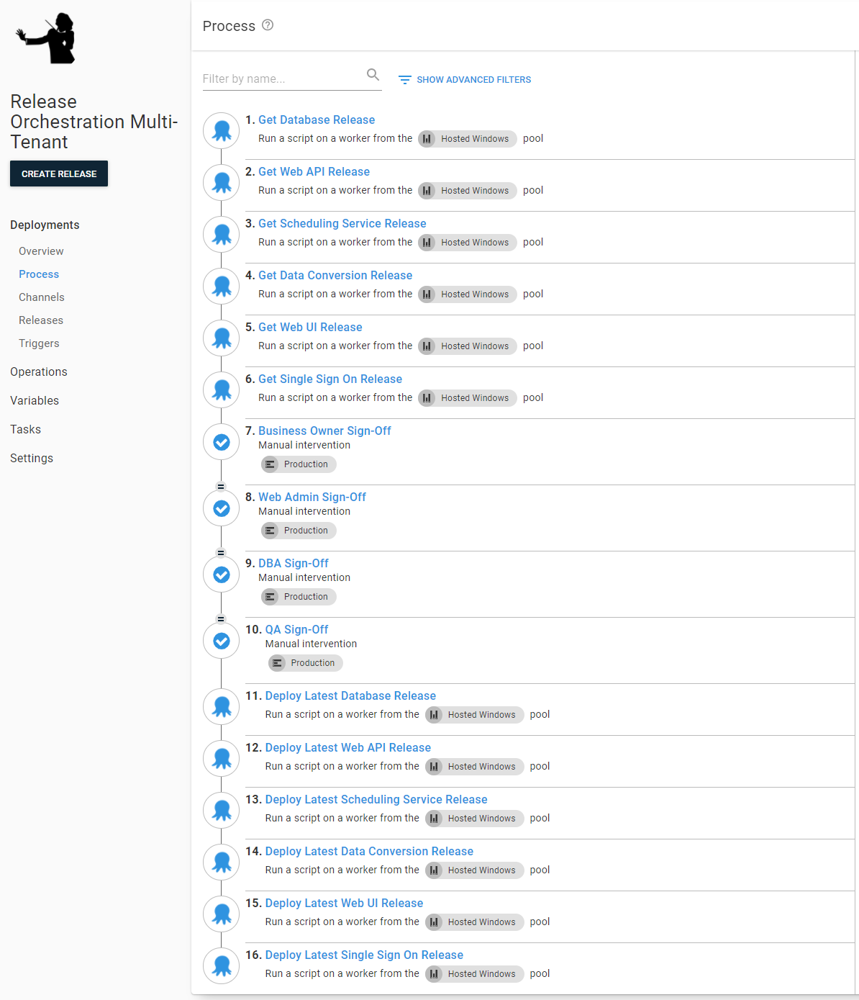

#### See auto-approvals in action

Please create a new release and deploy it to **Staging** for one of the tenants.  Once that release is complete, promote it to release to **Production**.  During this deployment, you'll see the manual interventions and auto-approvals in action.  First, the manual intervention should have the version being deployed along with the release notes.

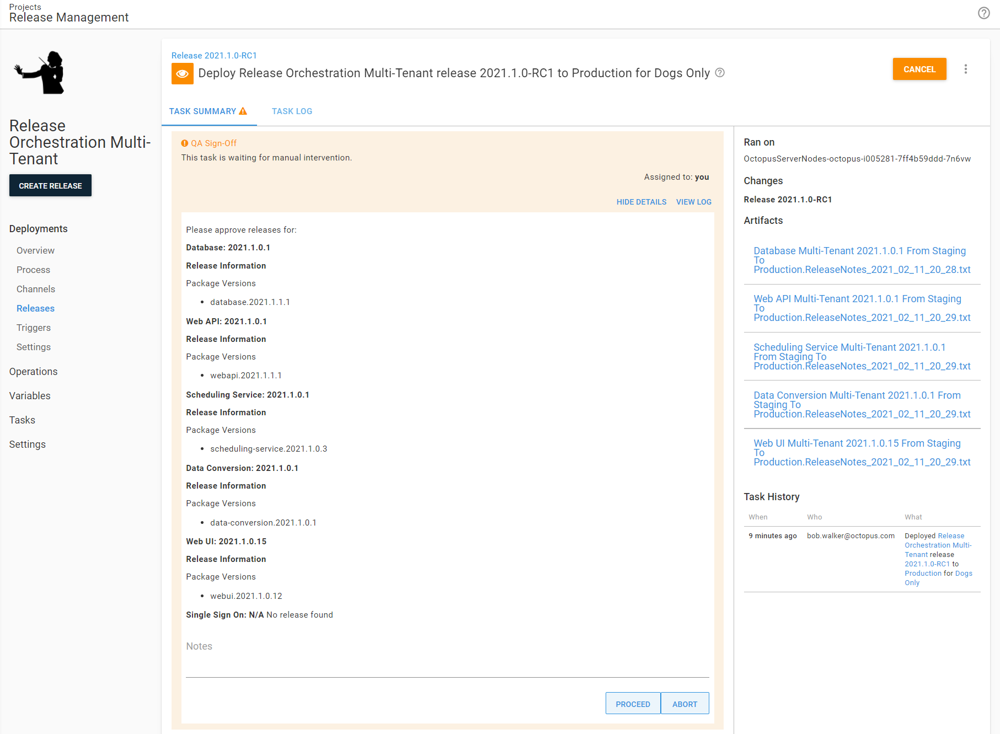

After every group has approved the release, the deployments will kick-off.  If you go to a specific deployment, you will see a message similar to this in the child projects.


And with that, the release to **Production** is complete!  Now you have a single place to approve all the child project deployments for a specific tenant.

### Scenario: Approve today, deploy tomorrow

I've worked places where specific customers are required to sign-off on a release before going to **Production**.  The chances of them approving a deployment _during_ the actual deployment is slim.  They will most likely approve on Tuesday for deployment on Thursday (or *shudder* 3 AM Saturday).  For extra fun, let me remind you of this rule from earlier.

> Certain customers, such as **All Pets** and **Pet World** must give their consent before a release is deployed to the **Production** environment.

**All Pets** and **Pet World** require specific approval.  All the other customers only require a single approval, which will occur for the **Internal** tenant.  

It doesn't make sense to have a deployment sitting in **Production** awaiting manual intervention for days.  A **Prod Approval** environment that sits between **Staging** and **Production** can solve this problem.  

:::success
The **Prod Approval** environment will _only_ be used for parent projects.  Child project's lifecycles will remain the same.
:::

This scenario walks through the steps to add the **Prod Approval** environment to a multi-tenant application to meet those rules.

#### Add the new environment and configure the lifecycle

Add the **Prod Approval** environment.  You will notice this environment in my screenshot sits between **Staging** and **Production** on this page.  I clicked the overflow menu `...` to reorder the environments on this page.


Now that the new environment has been added, update the lifecycle used by this release orchestration project.


:::success
Keep an eye on the **Default Lifecycle.**  By default, that lifecycle doesn't have explicit phrases defined.  Instead, it auto-generates the phases using the entire environment list.  To remove **Prod Approval** from the **Default Lifecycle**, you will need to add explicit phases.
:::

#### Update the deployment process

Next, update the approval steps to only run in the **Prod Approval** environment.  At the same time, configure the non-what-if steps to skip the **Prod Approval** environment.  The updated deployment process will look like this:

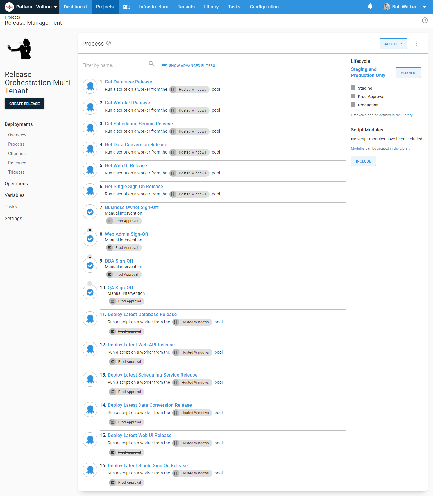

Next, head over to the variables screen and add in two new variables:

- **Project.ChildProject.Approval.Environment.Name**: Stores the **Prod Approval** environment name.
- **Project.ChildProject.Deployment.Environment.Name**: Stores the name of the destination environment for the deployment.  For all environments except **Prod Approval**, the name will match the current environment.  When running this on the **Prod Approval** environment, the deployment environment name is **Production**.


Go into each step implementing the `Deploy Child Octopus Deploy Project` and update the following parameters:

- **Destination Environment Name**: Update to `#{Project.ChildProject.Deployment.Environment.Name}`.
- **Approval Environment**: Update to `#{Project.ChildProject.Approval.Environment.Name}`.

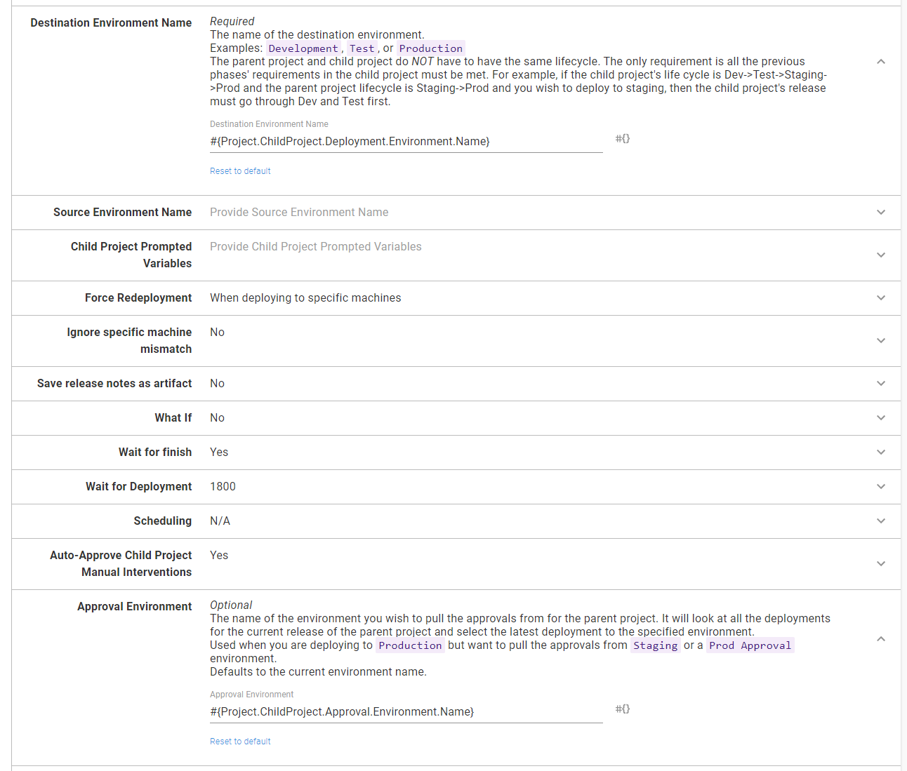

:::success
By doing this, we are telling the step template to pull approvals from the **Prod Approval** environment rather than the **Production** environment during a **Production** deployment.  That means we can approve at 11 AM and schedule it to deploy at 7 PM.
:::

#### Set the tenant approvals

Finally, we need to set the approval tenant.  By default, the approval tenant is the current tenant's name.  That default will only apply to **All Pets**, **Pet World**, and **Internal**.  Everyone else will use **Internal**.  There are a few ways to accomplish this.  I am going to use a project variable template with the default set to Internal.

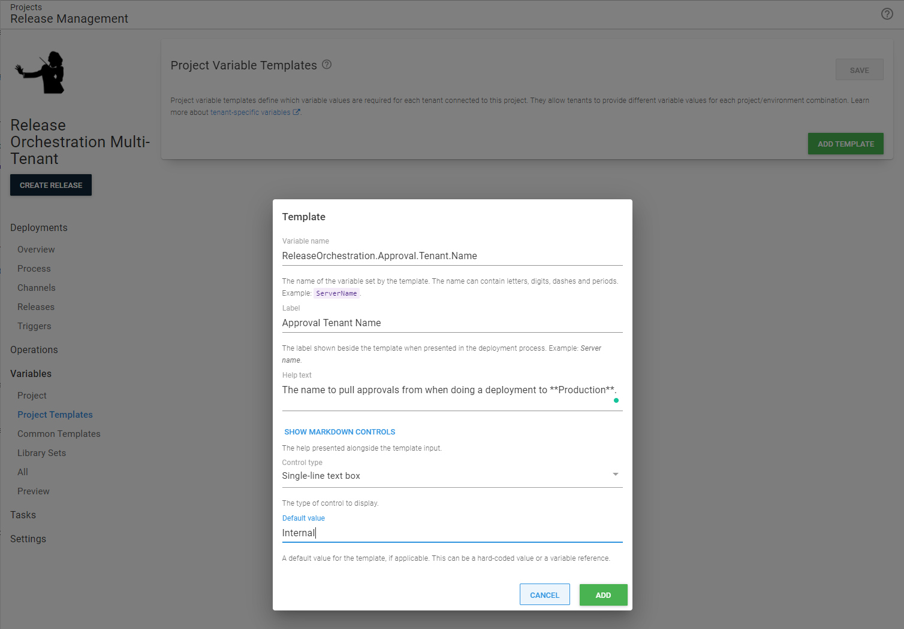

Go to **Internal**, **All Pets**, and **Pet World** and assign the **Prod Approval** environment for the Release Orchestration Project.

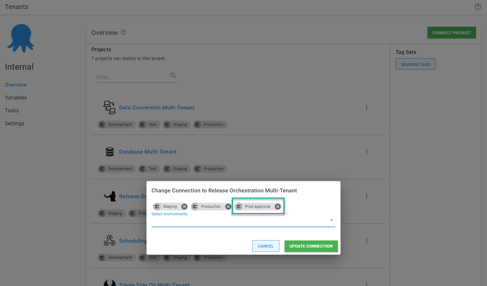

For **All Pets** and **Pet World**, we will change the approval tenant name to `Octopus.Deployment.Tenant.Name` in the **Production** environment.  That is because the **Production** environment is where we need to pull the approvals.

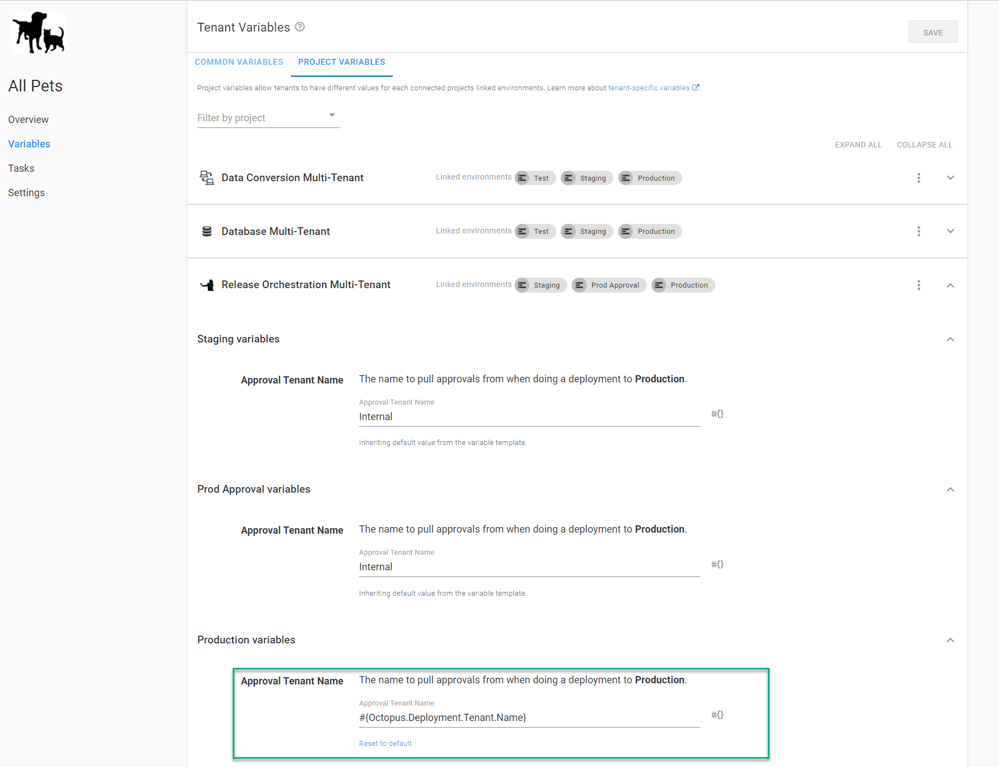

For each of the "non-whatif" steps, set the approval tenant to the variable created earlier.

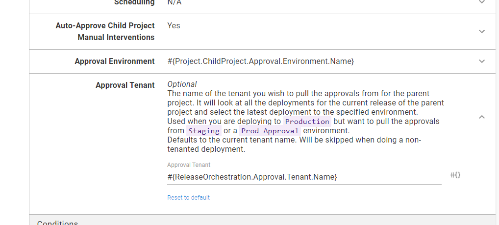

Going back to the approval screen will show **Pet Life** and **Dogs Only** don't run on the **Prod Approval** environment.  All the other tenants do.

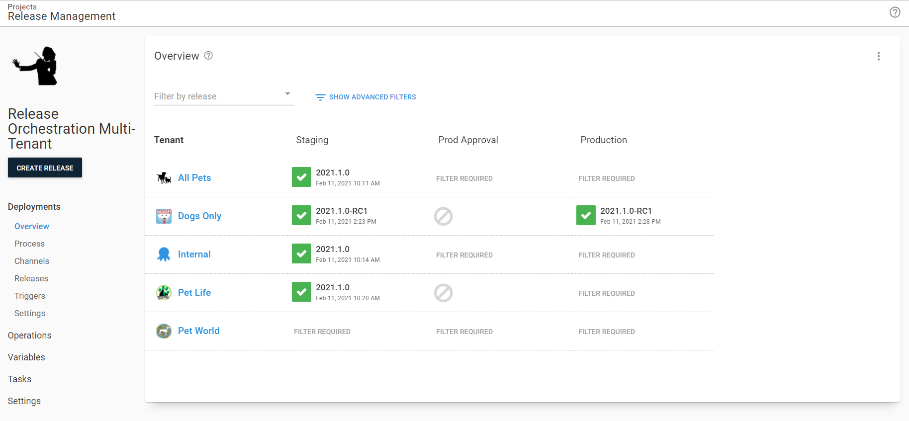

#### Seeing approvals in action

Let's see this all in action.  First, let's deploy the **Internal** through **Staging** and onto **Prod Approval**.  As you can see, only the what if steps and approval steps will run in the **Prod Approval** environment.


Now promote that release to **Production** for **Internal**.  The approvals are picked up from the **Prod Approval** environment for the **Internal** tenant.

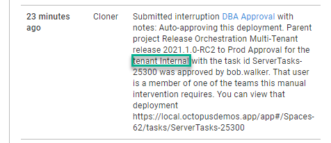

Now that **Internal** has been promoted through **Prod Approval**, we can move onto **Pet Life** and **Dogs Only**.  Promoting the release through **Staging** and onto **Production** will show the **Internal** tenant's approval.


When the same release is deployed to **Production** for **All Pets**, we will see the approvals will come from the **All Pets** tenant.

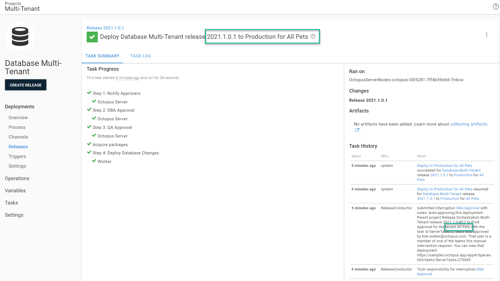

:::success
The step template looks for approvals for the current release only.  Creating a new release will require another round of approvals.  Even for a patch release, such as `2021.1.1`.  
:::

Approvals in a real-world setting are complex.  Hopefully, with this functionality, that process can be a bit smoother.  

## Conclusion

This article covered some of the multi-tenancy scenarios for the [Deploy Child Octopus Deploy Project](https://library.octopus.com/step-templates/0dac2fe6-91d5-4c05-bdfb-1b97adf1e12e/actiontemplate-deploy-child-octopus-deploy-project) step template.  If you'd like to see more scenarios, please see my [previous article](blog/2021-02/release-management-with-octopus/index.md).

Octopus Deploy's multi-tenancy feature was designed to make life easier for companies who install software on distinct infrastructure.  I see and hear about all the various quirks customers run into with that model.  The more customizations are offered, the harder it is to manage deployments.  Those quirks were a primary driver in writing this step template.  A person shouldn't need to consult a spreadsheet to know which releases to deploy to which customers.  Something like that introduces the potential for errors because of a manual process.  That is the goal of this step template, to remove as much psychological weight from multi-tenant deployments as possible.

I hope you find this step template useful for your multi-tenancy projects.  Until next time, Happy Deployments!
