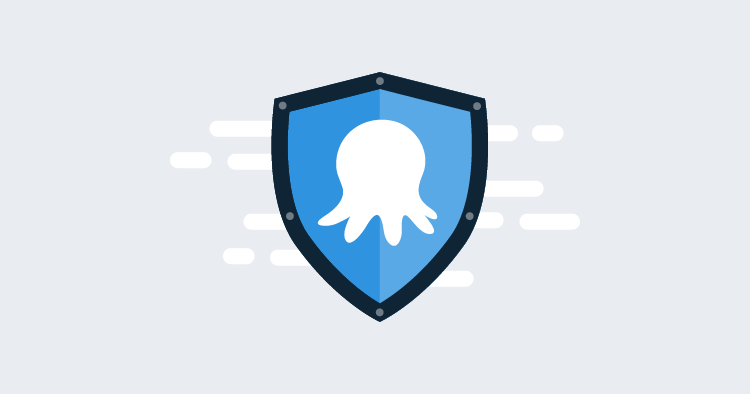

It comes with no surprise that software products have security vulnerabilities and when they do occur having effective communications from the vendor is critical to ensure systems are secure.

Currently Octopus product security vulnerabilities are disclosed in CVE databases and in our product release notes however, we believe we can enhance this communication to better protect our customers.

## How do we currently notify customers about product security vulnerabilities?

When we discover or are notified of a security vulnerability in our products we patch the vulnerability, create a CVE, create a [GitHub issue](https://github.com/OctopusDeploy/Issues) and update our release notes with the fix and the CVE number.

In terms of notifying our customers of security vulnerabilities we have always assumed that our customers are either reading the release notes or are periodically checking CVE databases for any security vulnerabilities. However, we believe we can do better here to help our customers have the information they need to ensure their environments remain secure.

To address this we are now introducing Octopus Security Advisories!

## What are Octopus security advisories?

Octopus security advisories are essentially the aggregation of the relase notes, CVE details and extra information we want to provide to our customers in one place so customers do not have to be hunting around for information.

Some of the information provided in the security advisories will be:
- Vulnerability risk based on an Octopus assessment (more to come on this)
- Details about the vulnerability including versions affected, versions fixed and other relevant information
- Whether there is any known exploits for the vulnerability that we are aware of

## When will Octopus post a security advisory?

The Octopus security team will post a security advisory under the following circumstances:
- Preliminary advisories in circumstances where there is a critical or high risk vulnerability that impacts multiple Octopus products.
- With the release of a CVE and patch to fix a specific vulnerability in an Octopus product
- If we believe our customers could be targeted by bad actors for example providing guidance on identifying fake Octopus Deploy emails

## Where will Octopus security advisories be posted to?

Security advisories will be posted to the [Octopus Deploy Blog](https://octopus.com/bloghttps://octopus.com/blog) and a link to the security advisory posted to the [Octopus Deploy Twitter](https://twitter.com/OctopusDeploy) feed.

## More information

For more information about Octopus Deploy's security journey through 2021 you can see our [roadmap](https://github.com/OctopusDeploy/Issues/issues/6523)

If you need to report a vulnerability please contact us at security@octopus.com
