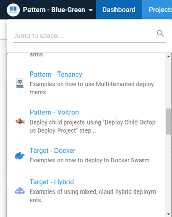
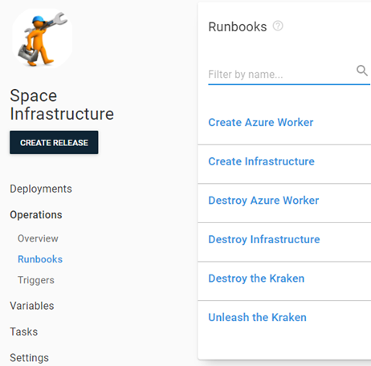

Though it may not seem like it at first glance, Octopus Deploy is a huge product.  The product is so large that people who have worked at Octopus for years still don't know it all.  To address the vastness of our product, we have developed extensive documenation and produced a wide variety of videos demonstrating common usage.  However, not everyone enjoys pouring through documenation or searching videos that might pertain to what they're trying to accomplish.  Some people just want, "How do I do X?"  To that end, we've created the [Samples](https://samples.octopus.app) Octopus instance.

## Samples
The Samples instance is meant for people who are experienced at using Octopus Deploy and are looking to see how to solve specific problems.  The examples in Samples are modeled after real-world scenarios and are often somewhat complex, meaning new users may find it overwhelming to digest.

### Signing in
Samples is a publicly available instance for anyone to utilize.  Simply go to https://samples.octopus.app and select Guest (the `I have an account` option is meant for members of the Advisory Team.)

Guest gives you access to all available Spaces and the projects within.  Guest allows you to view all aspects of the project including deployment processes, step details, runbooks, and variables.  Release creation and executing deployments are restricted, however.

### Navigation
The examples in Samples have been spread across multiple Spaces to make it easier to find what you're looking for.  The name of each space is prefixed by a naming convention that fall into two categories; Pattern or Target.

#### Pattern
As the word suggests, spaces prefixed with `Pattern` demonstrate different types of patterns that you can implement.  Examples include:
- [Blue/Green deployments](https://samples.octopus.app/app#/Spaces-302)
- [Canary deployments](https://samples.octopus.app/app#/Spaces-542)
- Multi-project deployment orchestration
  - [Pattern - Voltron](https://samples.octopus.app/app#/Spaces-603)
  - [Pattern - Monolith](https://samples.octopus.app/app#/Spaces-362)

These are just a few of the Pattern spaces that are available.

#### Target
Spaces prefixed with `Target` demonstrate how to deploy to specific technologies such as different database types:
- [MySQL](https://samples.octopus.app/app#/Spaces-242)
- [Postgres](https://samples.octopus.app/app#/Spaces-243)
- [SQL Server](https://samples.octopus.app/app#/Spaces-106)

Or web servers:
- [IIS](https://samples.octopus.app/app#/Spaces-202)
- [Tomcat](https://samples.octopus.app/app#/Spaces-203)
- [Wildfly](https://samples.octopus.app/app#/Spaces-85)

Again, this is not an exhaustive list of what is available.

### Runbooks
All examples in the Samples instance are fully functional and perform the deployments to actual targets.  We employ runbooks to provision and configure the targets for deployment.  Space-wide infrastructure is created in the `Space Infrastructure` project of the space:

Runbooks that create project specific infrastructure are contained within the project itself.  It is in these runbooks you can find different ways to implement Infrastructure as Code running on Cloud services such as Amazon AWS (CloudFormation), Microsoft Azure (ARM templates) and even Google Cloud Platform.

### Build servers
Most of the examples in Samples are backed by a build from a compatible build server.  Each project contains a link back to the build definition that built it.  We've implemented examples for:
- Azure DevOps
- TeamCity
- Jenkins
- Bamboo
- CircleCI
- GitHub Actions
- BitBucket Pipelines

## Conclusion
Octopus Deploy does its very best to give its customers to tools they need to be successul.  Whether your learning style is reading, visual, or by example, Octopus has you covered.

