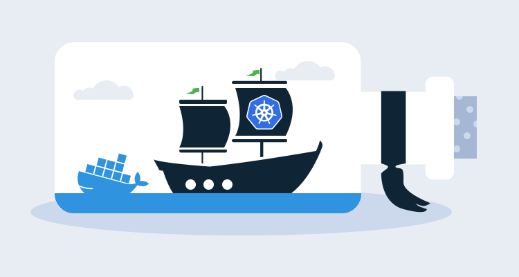

Microservices can be a powerful design pattern that allow large teams of developers to deliver code to production without requiring code to be coordinated in a single codebase and released on a common schedule. Deploying these microservices can be a challenge though, as the cost of orchestrating Kubernetes resources and promoting between environments is paid by each individual microservice.

Octopus has a number of useful features to help streamline and manage microservice deployments. In this post and screencast, we’ll run through the process of deploying the sample microservice application created by Google called [Online Boutique](https://github.com/GoogleCloudPlatform/microservices-demo).

## Screencast

<iframe width="1280" height="720" src="https://www.youtube.com/embed/pJjriVVLWQ0" frameborder="0" allow="accelerometer; autoplay; clipboard-write; encrypted-media; gyroscope; picture-in-picture" allowfullscreen></iframe>

## Creating the deployment template

If you look at the [YAML containing all the Kubernetes resource definitions](https://github.com/GoogleCloudPlatform/microservices-demo/blob/master/release/kubernetes-manifests.yaml), you will notice a pattern where each deployment is exposed by a matching service. Pairing deployments and services like this is a common practice in Kubernetes deployments, and this pattern is captured by the **Deploy Kubernetes containers** step in Octopus.

You will also notice that the deployment definitions are largely similar for the majority of the microservices. They all define:

* A container
* A port the container is exposed on
* Resource requests and limits
* GRPC liveness and readiness probes
* Environment variables

The similarities between deployment resources is easy to see using a diff tool:

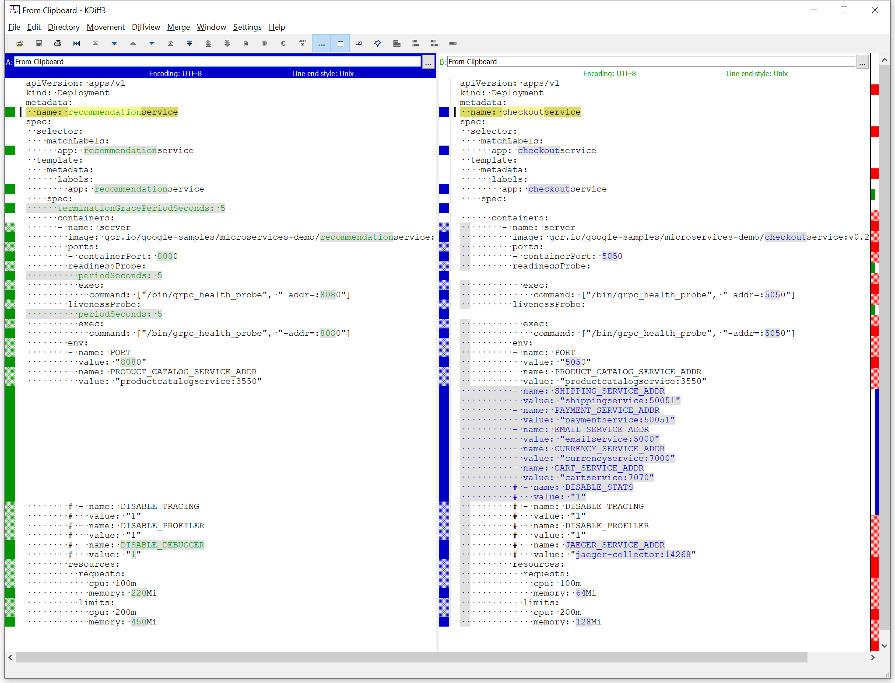

*A diff of two microservice deployments. They share a common set of properties.*

To remove the boilerplate code required to define a deployment and its associated service, we take advantage of a feature in Octopus called [step templates](https://octopus.com/docs/deployment-process/steps/custom-step-templates). The YAML below, which can be added to a **Deploy Kubernetes containers** step via the **Edit YAML** option in the deployment section, captures the fields used by most of the microservice applications in their deployments, with application specific values replaced with variables:

```yaml
apiVersion: apps/v1
kind: Deployment
metadata:
  name: "#{ServiceName}"
spec:
  template:
    metadata:
      labels:
        app: "#{ServiceName}"
    spec:
      terminationGracePeriodSeconds: "#{if ServiceTerminationGracePeriodSeconds}#{ServiceTerminationGracePeriodSeconds}#{/if}"
      containers:
      - name: server
        image: "#{ServiceImage}"
        ports:
        - containerPort: "#{ServicePort}"
        envFrom:
        - secretRef:
            name: "mysecret-#{Octopus.Deployment.Id | ToLower}"
        resources:
          requests:
            cpu: "#{ServiceCPURequest}"
            memory: "#{ServiceMemoryRequest}"
          limits:
            cpu: "#{ServceCPULimit}"
            memory: "#{ServiceMemoryLimit}"
        readinessProbe:
          initialDelaySeconds: "#{if ServiceReadinessProbeInitialDelaySeconds}#{ServiceReadinessProbeInitialDelaySeconds}#{/if}"
          periodSeconds: "#{if ServiceReadinessProbePeriodSeconds}#{ServiceReadinessProbePeriodSeconds}#{/if}"
          exec:
            command: ["/bin/grpc_health_probe", "-addr=:#{ServicePort}", "#{if ServiceReadinessProbeTimeout}-rpc-timeout=#{ServiceReadinessProbeTimeout}s#{/if}"]
        livenessProbe:
          initialDelaySeconds: "#{if ServiceLivenessProbeInitialDelaySeconds}#{ServiceLivenessProbeInitialDelaySeconds}#{/if}"
          periodSeconds: "#{if ServiceLivenessProbePeriodSeconds}#{ServiceLivenessProbePeriodSeconds}#{/if}"
          exec:
            command: ["/bin/grpc_health_probe", "-addr=:#{ServicePort}", "#{if ServiceLivenessProbeTimeout}-rpc-timeout=#{ServiceLivenessProbeTimeout}s#{/if}"]
```

There are a few interesting aspects of this YAML to call out.

The `if` syntax (for example `#{if ServiceTerminationGracePeriodSeconds}#{ServiceTerminationGracePeriodSeconds}#{/if}`) provides a way to return the variable value if it has been defined, or an empty string if the variable has not been defined. Octopus will ignore empty YAML properties where appropriate to avoid validation errors when deploying the final resource.

The list of individual environment variables has been replaced by `envFrom.secretRef`. This allows Kubernetes to inject environment variables based on the values saved in an external secret. The secret we reference here is called `mysecret-#{Octopus.Deployment.Id | ToLower}`, and will be created as a custom resource later in the step.

Next, we have the service template. Unlike the deployment template, the service template is the same for all microservices. This YAML can also be added to the step via the **Edit YAML** option in the service section:

```yaml
apiVersion: v1
kind: Service
metadata:
  name: "#{ServiceName}"
spec:
  type: ClusterIP
  selector:
    app: "#{ServiceName}"
  ports:
  - name: grpc
    port: "#{ServicePort}"
    targetPort: "#{ServicePort}"
```

Finally, we create the secret that holds the environment variables exposed to the pod as a custom resource.

This resource uses the [Octopus variable repetition syntax](https://octopus.com/docs/projects/variables/variable-substitutions#VariableSubstitutionSyntax-Repetition) to add all matching Octopus variables as fields in the secret resource:

```yaml
apiVersion: v1
data:
#{each var in EnvironmentVariables}
  #{var}: "#{var.Value | ToBase64}"
#{/each}
kind: Secret
metadata:  
  name: mysecret
type: Opaque
```

During deployment, Octopus appends the string `-#{Octopus.Deployment.Id | ToLower}` to the name of each custom resource. This ensures that each resource is immutable and tightly coupled to the deployment resource it is paired with. So the final name of this secret will be `mysecret-#{Octopus.Deployment.Id | ToLower}`. This matches the secret name from the deployment `envFrom.secretRef` property.

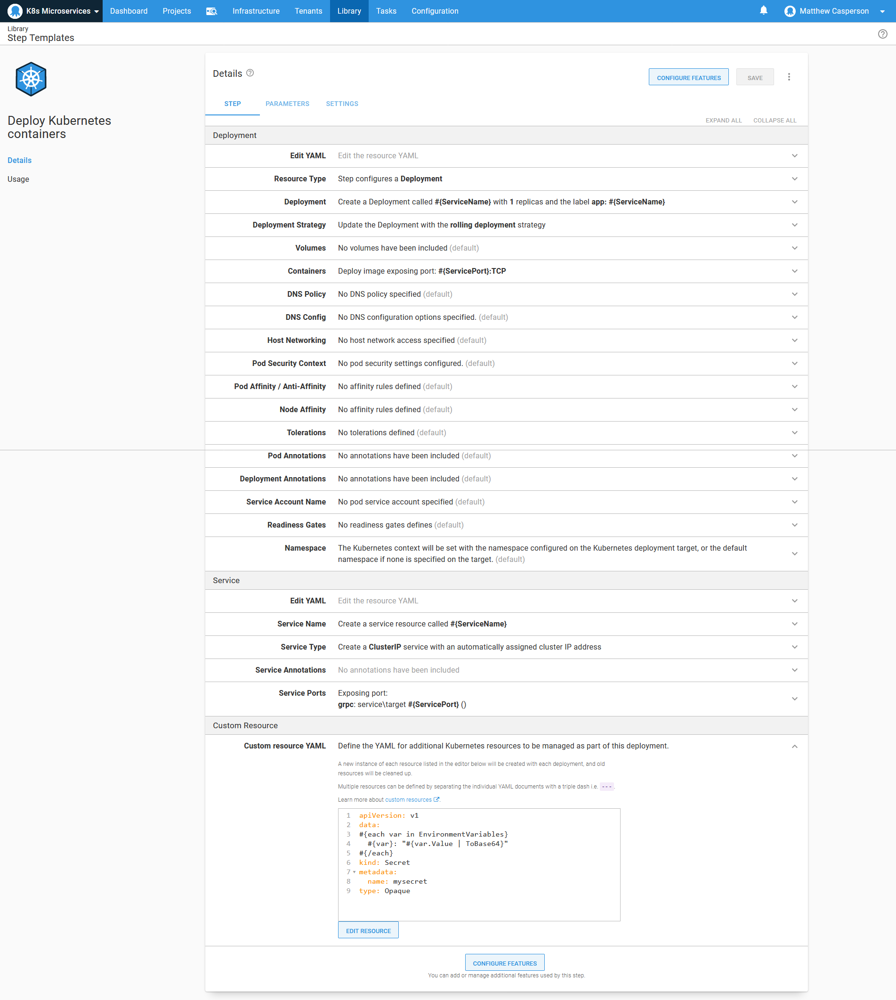

*The step template with a deployment, service, and custom resource.*

The variables injected into the secret take the form `GroupName[VariableName].VariableProperty`, for example, `EnvironmentVariables[REDIS_ADDR].Value`, `EnvironmentVariables[PORT].Value`, or `EnvironmentVariables[LISTEN_ADDR].Value`. These variables are expected to be defined by the project using the step template.

The variables that make up the deployment are then exposed as parameters:

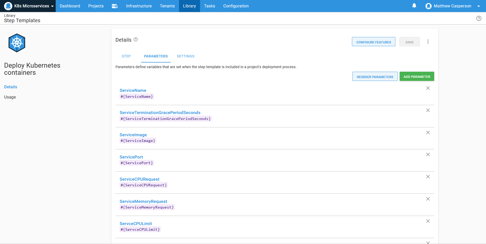

*The step template parameters.*

The container image name is defined as a package, allowing the image version to be selected during release creation:

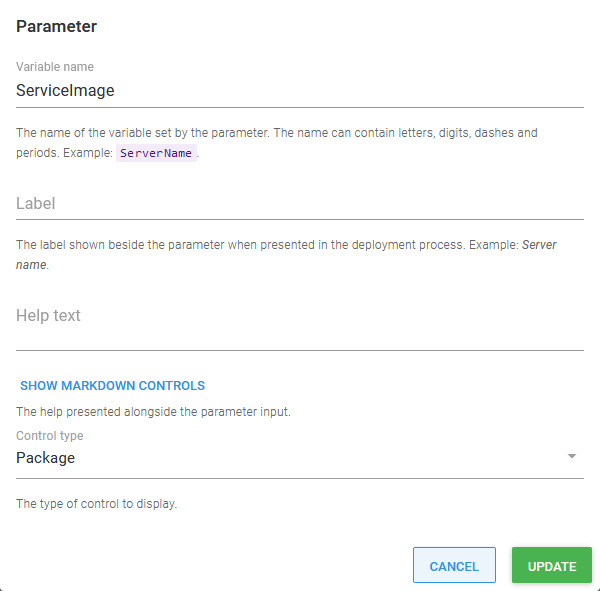

*The parameter defining the Docker image to use for the container.*

This parameter is referenced in the container definition with the **Let the project select the package** option for the Docker image field:

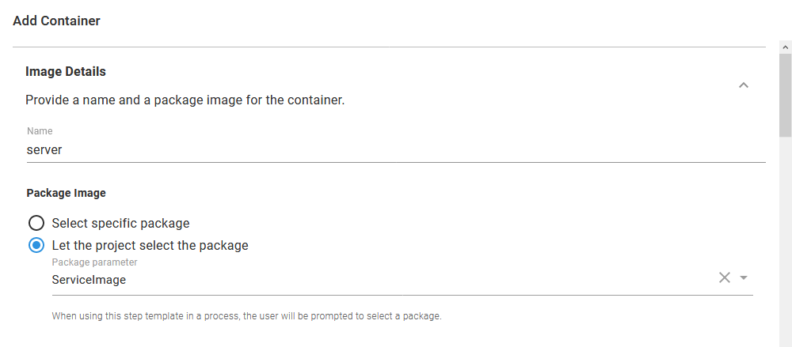
*The definition of the container, allowing the Docker image to be selected by the project.*

## Deploying the template

With the template deployed, we now create those microservices that originally shared a common deployment pattern. Since all the common boilerplate code has been abstracted away, all that is left is to populate the parameters defined by the step template:

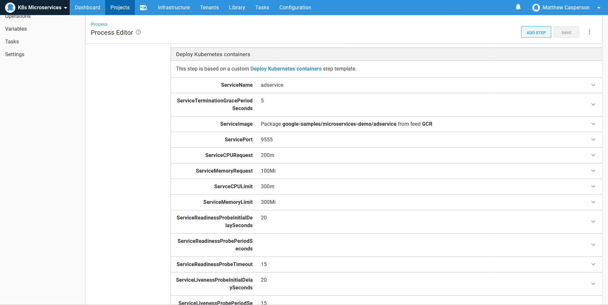

*A microservice using the step template to define the deployed resources.*

The environment variables are then defined using the group syntax noted above:

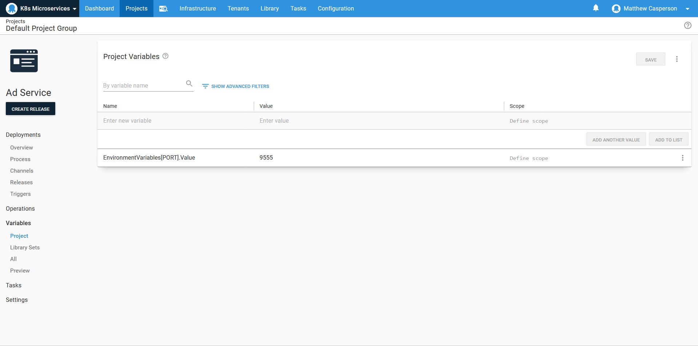

*The Octopus variables that will be used as environment variables.*

For those microservices that don’t follow the standard template (for example, the frontend app and the redis database), we can simply copy the deployment and service YAML into the appropriate **Edit YAML** section, which will populate the UI for us:

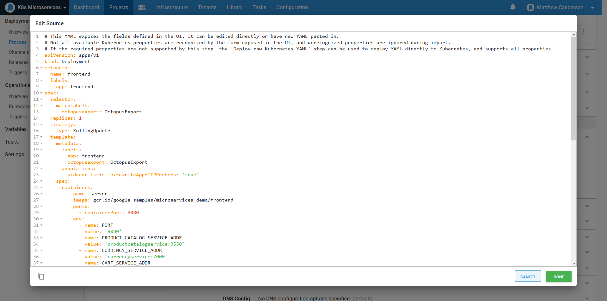

*Editing raw YAML allows unique resources to quickly populate an Octopus step.*

## Channel rules

For whatever reason, when Google published the Docker images that make up this sample microservice application, they included an image tagged with a hash like `31df60f`.

We want our deployments to ignore this hash and instead allow the selection of the more typical version tags like `v0.2.0`. To do this, we need to use a channel rule.

The rule defines a version range of `[0.0,1.0]`, which includes all the zero based point releases published by Google, and ignores the image tagged with a hash:

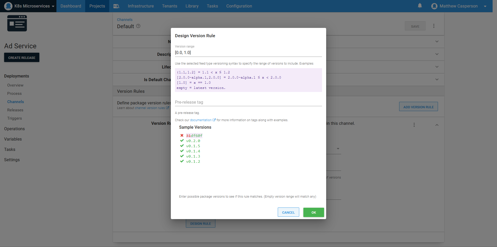

*Channel rules to select the desired tags.*

Docker images with plain text tags, like `redis:alpine`, can also take advantage of channel rules. The tag `alpine` is considered to be the version `0.0.0-alpine`, which can be matched with the version rule `(,0.0)` and a pre-release regular expression of `^alpine$`.

## Promoting an entire environment

The entire microservice stack is made up of nearly a dozen individual services. These could be promoted from one environment to another individually, and indeed if the microservices are genuinely separate entities managed by different teams and released on their own individual timelines, then individually promoting the services may be desirable.

But there are cases where the microservices are still tightly coupled and must be released in a particular order or situations where it’s critical that the state of an environment be well known at any time. For this, Octopus offers the **Deploy a release** step. 

The **Deploy a release** step treats an Octopus release as an artifact to be selected during the creation of a release of a kind of "meta-project". In our case, the meta-project contains a **Deploy a release** step for each microservice, allowing an entire microservice stack in one environment to be promoted to another environment in the correct sequence and with well known release versions. The ordering of the **Deploy a release** steps in the meta-project captures the dependencies of services on one another, and release managers could use the details of these meta-project releases to understand exactly which combination of applications was deployed at any given time.

Here is an example of our meta-project used to deploy all microservices to a given environment:

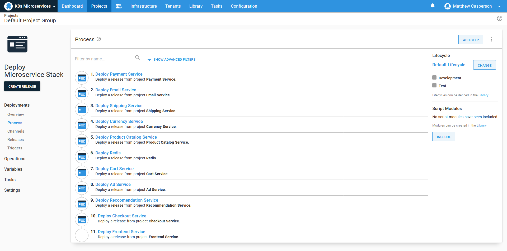

*A meta-project deploying a number of child projects in a specific order.*

## Conclusion

In this demo, we took advantage of a number of Octopus features to deploy a microservice application stack:

* We used step templates to abstract away the common boilerplate definitions for the microservices.
* The raw YAML editing allowed us to quickly define the deployments of those few unique microservices that did not conform to the patterns used by the majority of the stack.
* Channel rules allowed us to limit the available Docker image tags to a specific range.
* The **Deploy a release** step allowed us to create a meta-project which deploys all the microservices in the correct order in a new environment.

This meant that, once the initial templates were defined, we could define new microservice deployments quickly and reliably and populate whole environments with the deployment of a single meta-project.

Happy deployments!