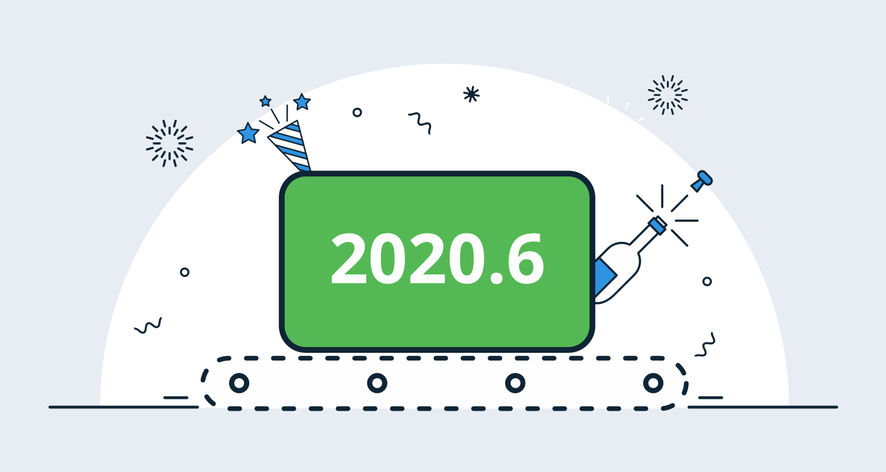
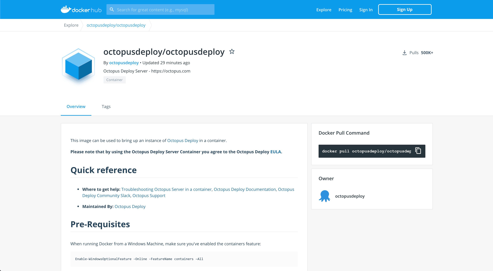

We're excited to announce that Octopus 2020.6 is generally available. This release includes some powerful updates and benefits.

* **[Octopus Linux Docker image RTW](blog/2021-03/octopus-release-2020-6/index.md#octopus-linux-docker-image)**. Our Linux containers feature is out of early access.
* **[Tentacle for ARM/ARM64](blog/2021-03/octopus-release-2020-6/index.md#tentacle-for-arm-arm64)**. Octopus Tentacle now supports ARM and ARM64 hardware.
* **[Global Search within a Space](blog/2021-03/octopus-release-2020-6/index.md#global-search)**. Navigate Octopus faster and find records and settings more easily.  
* **[API keys](blog/2021-03/octopus-release-2020-6/index.md#api-key-management)**. We've added improvements to API key management including key expiration and improved audit log tracking.

This is the final 2020 release and includes 6 months of long term support (critical patches). The following table shows our current releases with long term support. 

| Release               | Long term support           |
| --------------------- | --------------------------- |
| Octopus 2020.6        | Yes                         |
| Octopus 2020.5        | Yes                         |
| Octopus 2020.4        | Expired                     |

Keep reading to learn more about the updates.

## Octopus Linux Docker image RTW {#octopus-linux-docker-image}

Octopus Deploy Docker images allow you to self-host Octopus on a Linux operating system of your choice. We're proud to announce that this feature has reached release to web (RTW) status after shipping to [early access](https://octopus.com/blog/octopus-release-2020-3) in Octopus 2020.3. We've removed the early access feature toggle so it's available to all of our customers.

Check out our [DockerHub repository](https://hub.docker.com/r/octopusdeploy/octopusdeploy) to get started, and follow the **Learn More** link for more detailed instructions and a thorough example.

[Learn more](https://octopus.com/blog/introducing-linux-docker-image)

## Tentacle for ARM/ARM64 {#tentacle-for-arm-arm64}

The Octopus Tentacle agent now supports ARM and ARM64 hardware. This update makes it possible to deploy your apps and services to Raspberry Pi 3 and 4, AWS A1 EC2 instances, and any ARM hardware that can run [.NET Core 3.0 or later](https://devblogs.microsoft.com/dotnet/announcing-net-core-3-0/#platform-support).

[Learn more](https://octopus.com/blog/tentacle-on-arm)

## Global Search within a Space {#global-search}

We've introduced a Search field to the Octopus UI to help you:

* navigate Octopus faster,
* find and invoke actions with a few keystrokes, and
* quickly find server-side resources within a Space and go directly to them with ease. 

Global Search benefits all Octopus users. It helps first-time users to gain confidence with Octopus and find what they need without knowing where to look, and allows advanced users to navigate even faster than before.

Please let us know what you think of the new Global Search, and how we can improve it.

[Learn more](https://github.com/OctopusDeploy/Issues/issues/6703)

## Improvements to API key management {#api-key-management}

The Octopus API is one of our best features, but we recognised an opportunity to improve API key management. In this release we've: 

* introduced optional expiration dates for API keys,
* added API key subscription events, and
* made improvements to audit logging of API key events.

We hope it's now easier to track who created a given API key. Read on for a more detailed description of the changes.

### API key expiration ###

The API key expiration date is optional and the default value is `Never`. Expiration is set during key creation and checked every time the key is used.

When generating a new key you can select a time period such as 30, 60, 90 or 180 days, 1 or 2 years, or nominate a custom date with the date picker. The expiration date appears in the audit log as part of the API key creation event.

### Audit log filtering ###

We've improved the filter for the Api Key document type to ensure API key creation and deletion events are included. API keys created for a service account are included when the log is filtered by the service account and/or the Api Key document type.

### API key subscription events ###

Events are generated for service account API key expiration, much like certificate expirations. The events include:

* Key expired
* Key within 10 days of expiring
* Key within 20 days of expiring

### Display of API keys ###

From now on the first four characters of the API key are displayed in Octopus, including audit logs and the list of API keys for a given user. For example, `API-WXYZ••••••••`. This ensures API keys can be matched in the user interface.

Note that this change applies only to new keys. Existing keys are already hashed so the first four characters are not available.

[Learn more](TODO URL)

## Breaking changes

This release includes two breaking changes.

1. **[Channels now require the `ProjectView` permission](https://github.com/OctopusDeploy/Issues/issues/6690)**. Performing operations on Channels requires the `ProjectView` permission in addition to the existing permissions. 
2. **[Change to support for Windows Server 2008](https://octopus.com/docs/infrastructure/deployment-targets/windows-targets/requirements)**. Microsoft no longer supports Windows 2008. For this reason Octopus does not actively test against Windows 2008, and certain operating system specific issues may not be fixed.

## Upgrading

Octopus Cloud users are already running this release, and self-hosted Octopus customers can [download](https://octopus.com/downloads/2020.6.0) the latest version now.  

As usual, we encourage you to review the [steps for upgrading Octopus Deploy](https://octopus.com/docs/administration/upgrading). Please see the [release notes](https://octopus.com/downloads/compare?to=2020.6.0) for further information.

## What’s coming in Octopus 2021.1?

Check out our [public roadmap](https://octopus.com/roadmap) to see what’s coming next and register for updates.

## Conclusion

Octopus 2020.6 offers Linux Docker images, Tentacle support for ARM/ARM64, Global Search and improvements to API key management. We look forward to shipping more great features in the next release.

Feel free to leave a comment, and let us know what you think! Happy deployments!

## Related posts

* [Octopus Tentacle on ARM/ARM64](https://octopus.com/blog/tentacle-on-arm)
* [Introducing the Octopus Server Linux Docker image](https://octopus.com/blog/introducing-linux-docker-image)
* [Octopus 2020.3: Runbooks++, Jenkins Pipelines, and Octopus Linux Docker image](https://octopus.com/blog/octopus-release-2020-3)