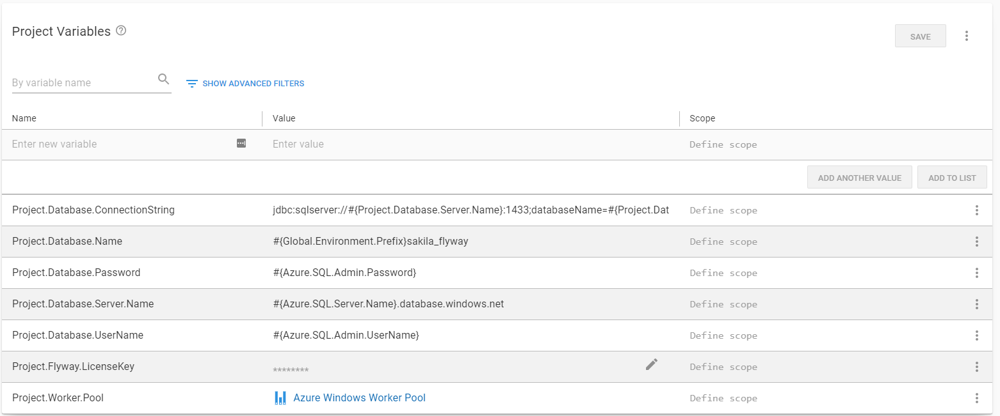
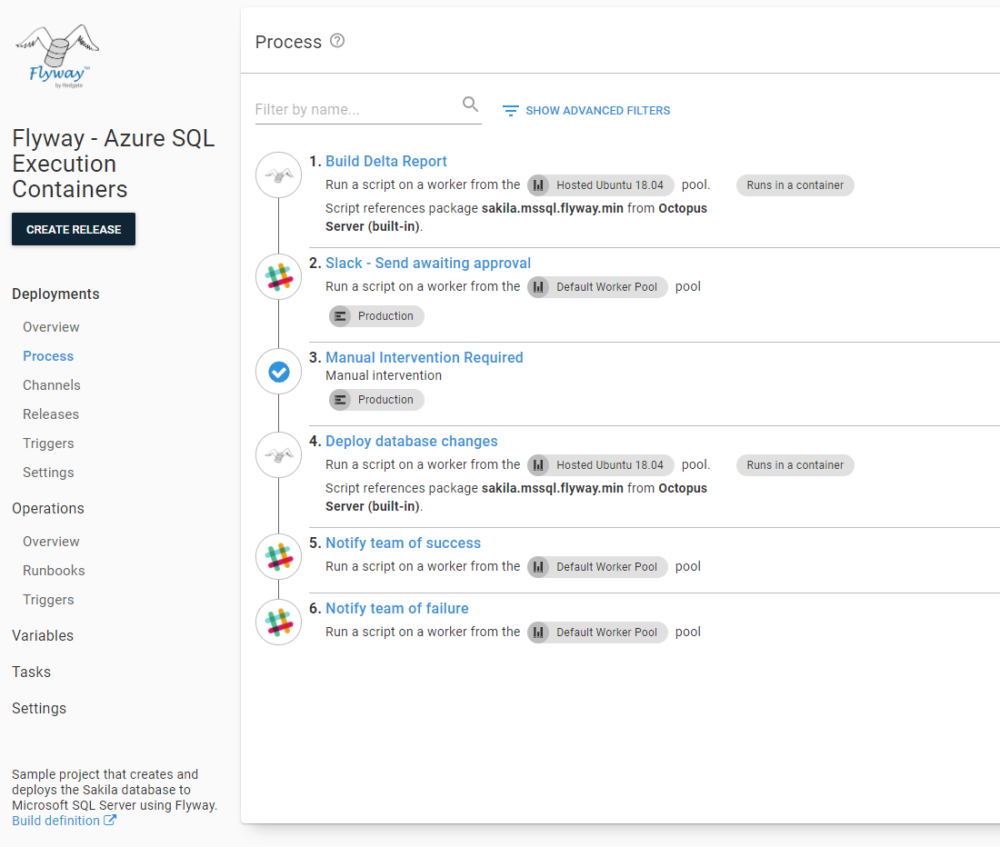
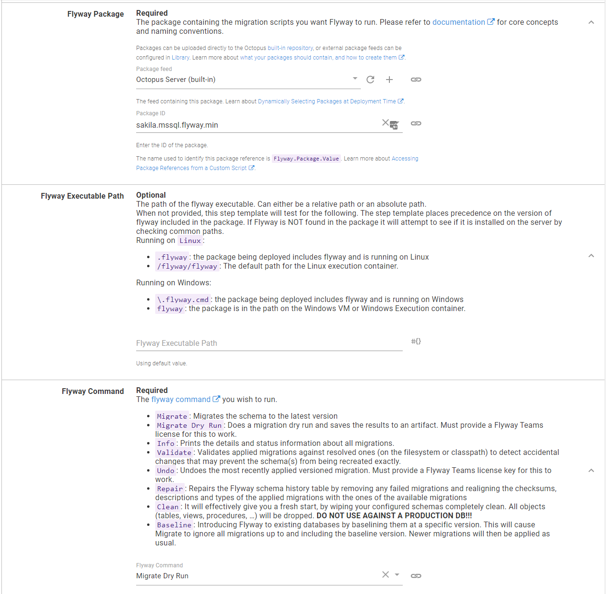
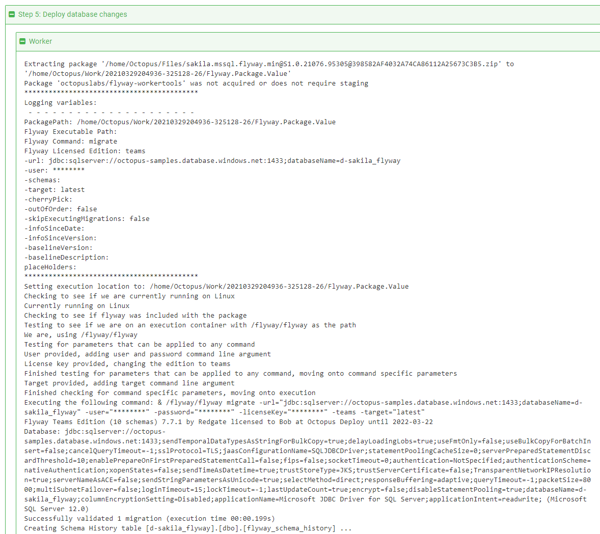
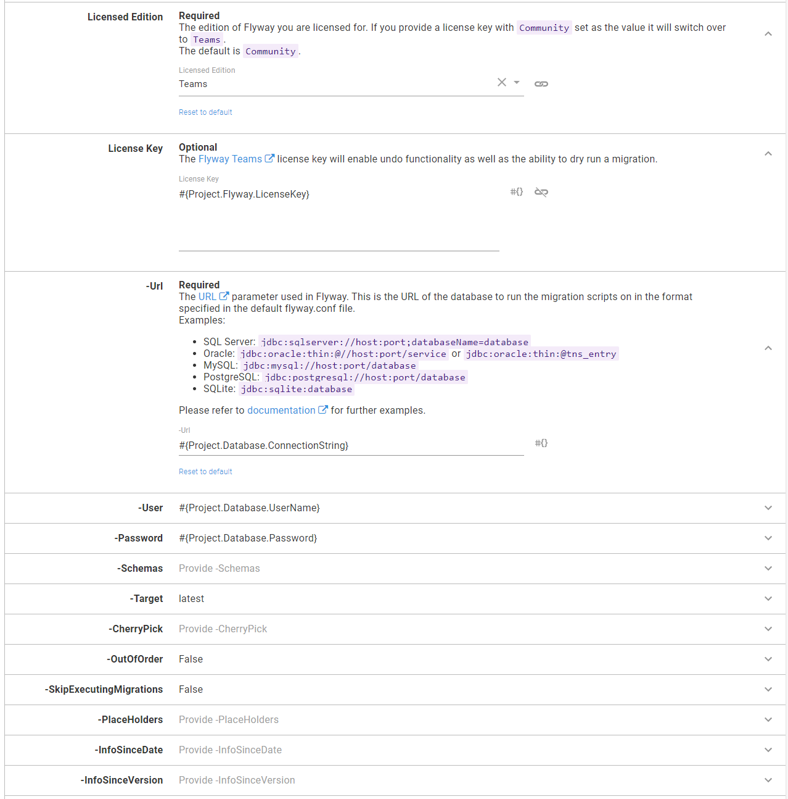
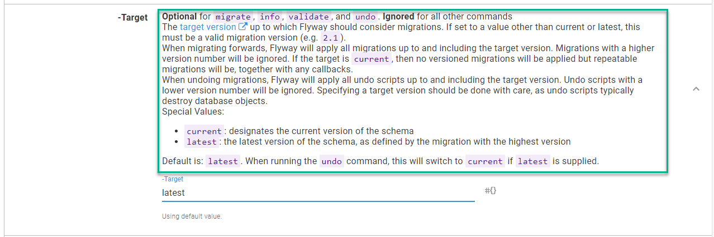
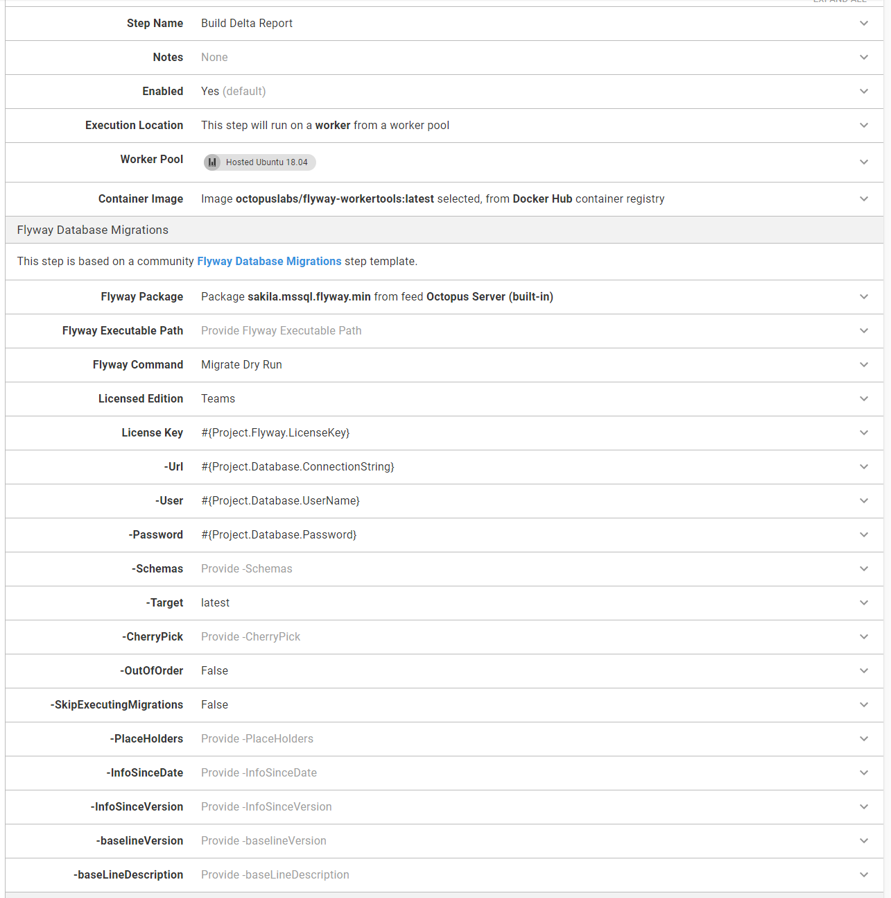
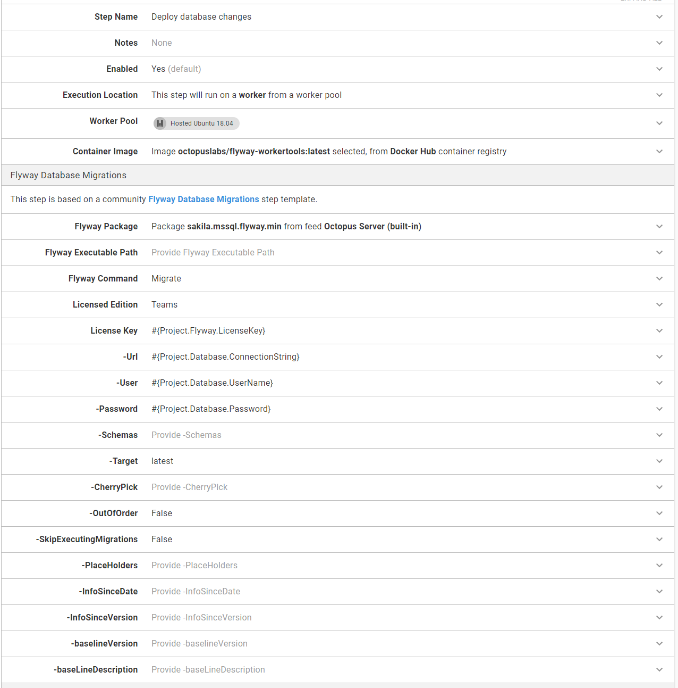

Recently I had the chance to try out [Flyway](https://flywaydb.org), and Octopus Deploy to deploy database changes.  I was very impressed with the Flyway; however, I didn't like the fact I had to either bundle the tool and the Java Runtime Engine (JRE) or pre-install them on a worker.  In the **2020.2** release of Octopus Deploy, we introduced the [Execution Containers](https://octopus.com/blog/execution-containers) feature.  Execution Containers use Docker Images to manage dependencies.  This article will walk through how to configure a database deployment in Octopus Deploy to use Execution Containers and Flyway.

## Execution Container Basics

I'm not a massive fan of including all the binaries needed to run Flyway in my package.  It leads to package bloat; in my examples, the difference was 10 KB vs. 90 MB.  As a developer, I'm also responsible for upgrading the binaries and including them in my Git repo.  I am also not a fan of pre-installing tools on the worker, which means everyone is on the same version.  An upgrade could break everyone.  

Execution containers solve both problems by using Docker images to manage dependencies.  The Docker image has all the necessary tooling (JRE, Flyway, PowerShell, etc.) installed.  You specify the Docker image and the tag to use in the deployment process.  When a deployment runs using Execution Containers, Calamari executes a Docker run command.  Also, Calamari automatically mounts a couple of folders to the container.  

A quick look through the task log, and you'll see a command similar to this:
```
docker run --rm  --env TentacleHome=/home/Octopus  -w /home/Octopus/Work/20210329204922-325128-24   -v /home/Octopus/Work/20210329204922-325128-24:/home/Octopus/Work/20210329204922-325128-24  -v /home/Octopus:/home/Octopus  index.docker.io/octopuslabs/flyway-workertools:latest 
```

If you have packages, those are automatically extracted into the `/home/Octopus/Work/[DATETIME]` folder.  What's cool is all of this happens behind the scenes; changing from running directly on the worker vs. running on an Execution Container only required clicking a radio button and providing the package name.  Everything else was the same!

## The Flyway Execution Container

Octopus Deploy provides [offical Docker images](https://octopus.com/docs/projects/steps/execution-containers-for-workers#worker-tools-images) you can use.  Unfortunately, those images cannot be used in this example for two reasons.

1. They include dozens of tools requiring GBs more data downloaded from Docker Hub.
2. None of the images include Flyway.  

That's the bad news.  The good news is I created a [Docker image](https://hub.docker.com/r/octopuslabs/flyway-workertools) you can use!  I also created a [GitHub Action](https://github.com/OctopusDeployLabs/flyway-workertools/blob/main/.github/workflows/docker-build-push.yml) that will run once a day and build a new image when a new version is detected.  

That Docker image's [base image](https://hub.docker.com/r/octopuslabs/workertools) includes the most popular scripting languages (PowerShell and Python) we support.  Naturally, the Ubuntu-based image supports Bash as well.  

## Scaffolding

There are two scaffolding steps you'll need to complete for this to work.  
1. Install the [Flyway Database Migrations Step Template](https://library.octopus.com/step-templates/ccebac39-79a8-4ab4-b55f-19ea570d9ebc/actiontemplate-flyway-database-migrations).
2. Add a Docker Container Registry external feed and point it to https://index.docker.io.


## Flyway Database Migrations Step Template

If you searched `Flyway` in our [community step template library](https://library.octopus.com) you'd notice many Flyway step templates.  The `Flyway Database Migrations` step template is designed to replace those older step templates.

The primary differences with this new step template are:
1. It allows you to choose from any of the commands (migrate, info, validate, etc.) Flyway support.
1. I worked with the Flyway team at Redgate to find the popular command-line switches.
1. It supports both the free and paid versions of Flyway, giving you access to dry run migrations and the undo command.
1. It can run on either Linux or Windows
1. It will attempt to find the Flyway executable, making it easy to either include Flyway in the package (if that is your preference) or run it in an execution container.
1. It supports both SQL and JAR migrations.

You'll notice I followed a similar pattern of more parameters the better some of my [other](https://library.octopus.com/step-templates/0dac2fe6-91d5-4c05-bdfb-1b97adf1e12e/actiontemplate-deploy-child-octopus-deploy-project) [recent](https://library.octopus.com/step-templates/0444b0b3-088e-4689-b755-112d1360ffe3/actiontemplate-run-octopus-deploy-runbook) [step templates](https://library.octopus.com/step-templates/c9d5c96f-f731-4e6c-b9b3-d93f84a9bb74/actiontemplate-re-prioritize-octopus-deploy-tasks).  But this was for a good reason, any parameter starting with a `-` is a [command line switch](https://flywaydb.org/documentation/configuration/parameters/) in the Flyway command-line tool.

## Packaging Up Migration Scripts

If you read through our docs, you'll notice it says you need "build" your packages.  If all you have is SQL files, there really isn't anything to "build."  All you need to do is package the folder on your build server and push it to Octopus.

Consider this example:


You'd need to run the Octo Pack command on the `db/src` folder on the build server.  The package would contain those folders and contents.


Once the package is built, you'll need to publish it to Octopus Deploy.  For the purposes of a POC, you don't need a build server.  You can use a tool like 7-Zip to zip up the folder to be `Flyway.Test.1.0.0.zip` and manually [upload the package](https://octopus.com/docs/packaging-applications/package-repositories/built-in-repository#pushing-packages-to-the-built-in-repository).  In fact, that is what I did for this article.

However, after the POC, if it makes sense to integrate a build server.  We have docs and blog posts to help you out.

Build Servers Examples:
- [Jenkins](https://octopus.com/docs/packaging-applications/build-servers/jenkins#Jenkins-Packageapplication)
- [TeamCity](https://octopus.com/docs/packaging-applications/build-servers/teamcity#TeamCity-CreateAndPushPackageToOctopusCreatingandpushingpackagesfromTeamCitytoOctopus)
- [Azure DevOps/TFS](https://octopus.com/docs/packaging-applications/build-servers/tfs-azure-devops/using-octopus-extension#PackageyourApplicationandPushtoOctopus)
- [Bamboo](https://octopus.com/docs/packaging-applications/build-servers/bamboo#create-the-package)
- [GitHub Actions](https://octopus.com/blog/publishing-a-package-to-octopus-with-github-actions)

## Configuring the Project

Now that we have the step template, Docker feed, and package uploaded, we can move on configuring the project.  

First, create a project.  In this example, I'll be using the name [Flyway - Azure SQL Execution Containers](https://samples.octopus.app/app#/Spaces-106/projects/flyway-azure-sql-execution-containers/deployments).  We already had a Flyway example on our samples instance; this was to show how to use execution containers with it.

### Variables

After the project is created, go to the variable screen and add the necessary variables.

:::hint
I recommend namespacing variables, for example `Project.[Component].[VariableName]` for project variables and `[VariableSetName].[Component].[VariableName]` for library variable set variables.  This will make it easier to find when inserting variables into the process.  As a bonus, in six months, you'll know where the variables came are located.
:::

- Project.Database.ConnectionString: The connection string to the database I want to deploy to.  **Please note:** this is the _only_ real difference between my example using SQL Server and you change it to Oracle, MySQL, PostgreSQL, Maria, Snowflake, etc.
- Project.Database.Name: the name of the database being deployed to.
- Project.Database.Password: the password of the database user doing the deployment.
- Project.Database.UserName: the username of the database user doing the deployment.
- Project.Database.Server.Name: the name of the server where the database is located.
- Project.Flyway.LicenseKey: the Flyway license key to required take advantage of features such as dry run deployments and undo.  **Please Note:** when a license key is not supplied Flyway will revert to the community edition.
- Project.Worker.Pool: The worker pool where the work will be done.



### Deployment Process

In [our docs](https://octopus.com/docs/deployments/databases/common-patterns/manual-approvals) we recommend starting out with this process for database deployments:

1. Generate Delta Script and attach it as an [artifact](https://octopus.com/docs/projects/deployment-process/artifacts)
2. Notify DBAs of pending approval (only in Production)
3. DBAs approve delta script [via manual intervention](https://octopus.com/docs/projects/built-in-step-templates/manual-intervention-and-approvals) (only in Production)
4. Deploy database changes
5. Notify teams of success or failure



The notification steps can be email, Slack, Microsoft Teams, or the tool of your choice.  The manual interventions are self-explanatory.  I'm not going to spend much more time with them, as we cover that information in our docs.

### Using the Flyway Database Migrations Step Template

Generating the delta report and deploying the database changes will be accomplished by the Flyway Database Migrations Step Template.  When you add that into your process, make the following changes:

- Update the name of the step
- Change it to run on a worker
- Select a worker pool
- Change the container image to be "runs inside a container, on a worker"
- Enter in `octopuslabs/flyway-workertools:latest` as the Docker image; Docker will automatically download the correct architecture (Ubuntu or Windows) based on what the host is running

:::hint
The worker has to have Docker installed to work.  Octopus Cloud provides hosted workers that are already running Docker.  If you want to self-host your workers, Linux workers have to run Linux containers, and Windows workers can only run Windows containers.  
:::


That configures where the step template will run.  Now we need to configure the parameters.  

- Select the package containing the scripts you want Flyway to run
- Optional: enter in the path where Flyway is located

:::hint
If you are running this on the `octopuslabs/flyway-workertools` execution container, you don't need to enter anything.  The step template will automatically find the executable to run. 
:::

- Select the command you want the step to run



The most common commands used in Octopus are:

- Info: this will generate a list of all the scripts found and their state in relation to the database being deployed.  The info command is ideal when using the community edition, and you need to list out all the scripts that will be run on the database.


- Migrate Dry Run: this will generate a file containing all the pending SQL scripts, and it will be saved as an artifact a DBA can download and review.  This is preferred over `info` but is only supported when you supply a Flyway license key.


- Migrate: this will take all the SQL scripts and JAR files found in the package and run them on the target database.  This is the command that does the actual "work"



After those initial parameters are the licensing parameters, followed by the connection parameters, and finally, the various command-line switches Flyway supports.

- Because I have a license key, I changed the edition to `Teams`.
- The next option is to pass in the license key.
- Then, provide the URL of the database using the connection string format.
- After that are the optional [parameters](https://flywaydb.org/documentation/configuration/parameters/) for Flyway to run.



The step template includes detailed help text for each parameter along with links to the appropriate documentation.



:::hint
Not all commands support all command line parameters.  The step template is smart enough to exclude parameters not supported by the command.
:::

### Generate Delta Script Step

The step to generate the delta script for the DBAs to approve has the following parameters set.  I have a license key, so I am using the `migrate dry run` command.  If I did not have a license key, I'd select `info` as the command.



### Deploy Database Changes step

The step to deploy the database changes from the package is virtually identical to the generate delta script step.  The only difference is the command run is `migrate` instead of `migrate dry run`.



## Conclusion

As you can see, updating your process to run inside an execution container isn't very involved, especially if you are using Octopus Cloud.  After that initial setup of adding a Docker Container Registry external feed, the only thing required is clicking a radio button for each step that should run on an execution container.  

It's a small change, but it makes the deployment process and pipeline much more robust.  Instead of worrying about what is installed on the worker or having to bundle everything in the package, I can leverage a tool that I know is running the exact version of Flyway I need without having all the maintenance overhead.

Until next time, happy deployments!