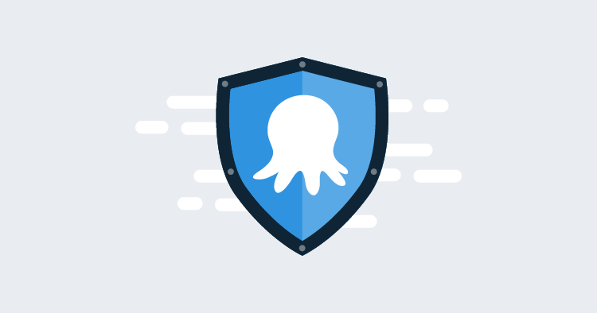

In February 2021 we announced our dedicated [security advisories](https://octopus.com/blog/security-advisories) page. Following that, we are now a CVE Numbering Authority (CNA). This authorises Octopus Deploy to assign CVE IDs to vulnerabilities within our scope.

## Why did we become a CNA?

As we mature our security practices, we want to simplify our CVE process.  This ensures that when we release information about vulnerabilities, we're certain the CVE ID and the accompanying security advisory are released at the same time. 

This is important to us, so our customers have all the information they need to confirm their Octopus installations are secure.

## What is CVE?

CVE is an international, community-based effort that relies on the community to discover vulnerabilities.

1. The vulnerabilities are discovered then assigned and published to the [CVE list](https://cve.mitre.org/about/terminology.html). 
1. The CVE Records published in the catalog enable program stakeholders to rapidly discover and correlate vulnerability information used to protect systems against attacks.

## Learn more

For more information about Octopus Deploy's security journey through 2021 you can see our [Trust and Security Roadmap](https://github.com/OctopusDeploy/Issues/issues/6523).

If you need to report a vulnerability please contact us at security@octopus.com.
