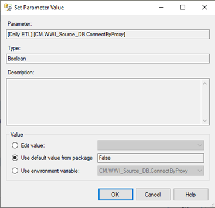

In a [previous post](https://octopus.com/blog/deploying-ssis), I walked through how to configure a build and deploy a SQL Server Integration Services (SSIS) package using Azure DevOps and Octopus Deploy.  In this post, I will discuss a rather frustrating problem I encountered after the package was deployed to the server.

## The error
After a successful deployment, the developer attempted to run the SSIS package only to receive,

```
Failed to configure a connection property that has the following path: \Package.Connections [WWI_Source_DB].Properties[ConnectByProxy]. Element "ConnectByProxy" does not exist in collection "Properties".
```

Perplexed, I looked at the Environment variable mapping


As you can see, the property clearly exists and is mapped to the appropriate Environment variable.

As an experiment, I had the developer publish the SSIS package directly from Visual Studio and the package worked correctly.  The biggest difference between the two methods was the Visual Studio publish didn't map Package Parameters to Environment Variables.  Instead, they were set to `Use default value from package`.  In this case, the default value was displayed as `False`.



:::hint
To get to this window, you need to do the following:
- Right-click on the package and choose Configure
- Change the Scope drop-down to `All packages and project`
- Click on the `Connection Managers` tab
:::

We redeployed the SSIS package using Octopus Deploy.  Once deployed, we edited the package and chose `Edit value` and selected False.  The package failed again with the same error, however, setting the value to `Use default value from package` succeeded.

## The problem
After several hours of research, I finally found what the issue was.  The developer was using the most recent version of Visual Studio to develop the SSIS package, but was deploying to an older version of SQL Server.  The newer version of Visual Studio was introducing additional properties to the Connection Manager that the older version of SQL Server didn't know about.  This is what the error was trying to tell us, albeit very poorly.  `Element "ConnectByProxy" does not exist in collection "Properties"` was saying that `ConnectByProxy` didn't exist in the Server collection of `Properties` for a package, not the package itself.  Furthermore, the selection of `Use default value from package` was also misleading.  From the UI, this selection displayed a value of `False`, however, the actual value was `null` (discovered by actually digging into the XML of the package).

## The solution
There are two ways to fix this:
- Manully updating Package Parameters to `Use value from package` setting
- Utilizing PowerShell to update the Package Parameters for you

### Manual method
The hint above describes how to navigate to the Package Parameters and manually upate them.  However, this a very tedious task and would need to be done after each deployment, very ineffecient.

### PowerShell
A better solution is to add a Run a Script task to our deployment process and have it perform the edits for us.  This is the method I ended us using at my previous position and worked quite well.  The following script should get you most of the way there

```PowerShell
# define functions
Function Import-Assemblies
{
    # display action
    Write-Host "Importing assemblies..."
    
    # get folder we're executing in
    $WorkingFolder = Split-Path $script:MyInvocation.MyCommand.Path
    Write-Host "Execution folder: $WorkingFolder"

    # Load the IntegrationServices Assembly
    [Reflection.Assembly]::LoadWithPartialName("Microsoft.SqlServer.Management.IntegrationServices") | Out-Null # Out-Null supresses a message that would normally be displayed saying it loaded out of GAC
}

Function Get-Catalog
{
    # define parameters
    Param ($CatalogName, $IntegrationServices)

    # define working varaibles
    $Catalog = $null

    # check to see if there are any catalogs
    if($integrationServices.Catalogs.Count -gt 0 -and $integrationServices.Catalogs[$CatalogName])
    {
        # get reference to catalog
        $Catalog = $integrationServices.Catalogs[$CatalogName]
    }
    else
    {
        Write-Error  "Catalog $CataLogName does not exist or the Tentacle account does not have access to it."

        # throw error
        throw 
    }

    # return the catalog
    return $Catalog
}

Function Get-Folder
{
    # parameters
    Param($FolderName, $Catalog)

    # try to get reference to folder
    $Folder = $Catalog.Folders[$FolderName]

    # check to see if $Folder has a value
    if(!$Folder)
    {
        Write-Error "Folder not found."
        throw
    }
    
    # return the folde reference
    return $Folder
}

Function Clear-Parameter
{
    # define parameters
    Param($ParameterName)

    # Create a connection to the server
    $sqlConnectionString = "Data Source=$SQLServer;Initial Catalog=master;Integrated Security=SSPI;"
    $sqlConnection = New-Object System.Data.SqlClient.SqlConnection $sqlConnectionString
    $ISNamespace = "Microsoft.SqlServer.Management.IntegrationServices"

    # create integration services object
    $integrationServices = New-Object "$ISNamespace.IntegrationServices" $sqlConnection

    try
    {
        # get catalog reference
        $Catalog = Get-Catalog -CatalogName $CataLogName -IntegrationServices $integrationServices
        $Folder = Get-Folder -FolderName $FolderName -Catalog $Catalog

        # get reference to project
        $Project = $Folder.Projects[$ProjectName]

        # find specific parameter
        $Parameter = $Project.Parameters | Where-Object {$_.Name -eq $ParameterName}

        # set parameter to design time default value
        Write-Host "Clearing parameter $ParameterName"
        $Parameter.Clear()

        # set value
        $Project.Alter()
    }
    finally
    {
        # close connection
        $sqlConnection.Close()
    }
}


# get reference to assemblies needed
Import-Assemblies

$SQLServer = "#{Project.Database.Server.Name}"
$CataLogName = "SSISDB"
$FolderName = "#{Project.SSISDB.Folder.Name}"
$ProjectName = "#{Project.SSISDB.Project.Name}"


# fix the problem
Clear-Parameter -ParameterName "CM.WWI_Source_DB.ConnectByProxy"
```

With this script, you can call Clear-Parameter for whatever parameters that need to be set to `Use default value from package` on.

## Conclusion
This was perhaps one of the most frustrating issues I ran while automating SSIS deployments.  I'm hoping this blog will save you from bashing your head against a brick wall.  Happy Deployments!