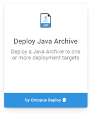
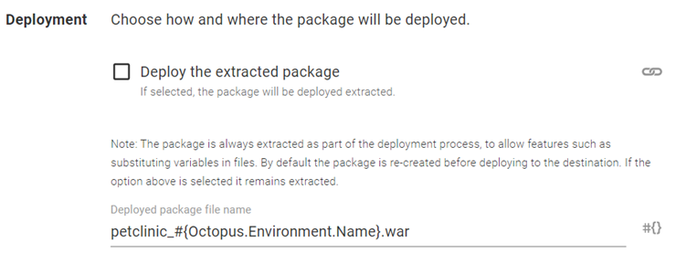
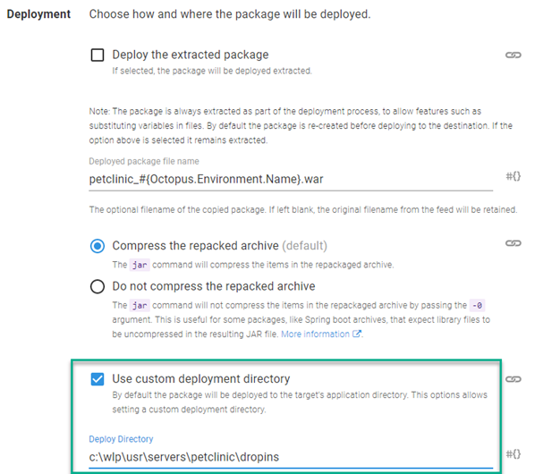
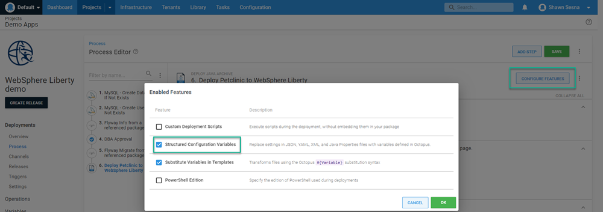
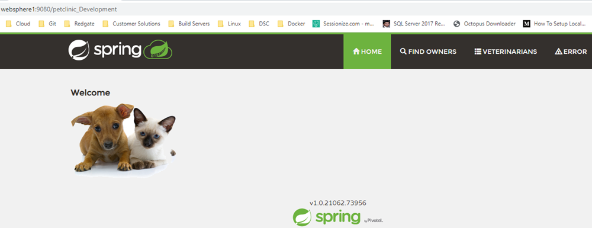

When evaluating software, it's easy to overlook an option because it doesn't list the specific stack you use.  However, just because it isn't listed, doesn't mean it isn't supported.  

For Java-based applications, Octopus Deploy includes specific steps to deploy to Tomcat and Wildfly (JBOSS).  Those are the two most popular options but there are more web server technologies available.  

Web servers such as Payara and IBM WebSphere Liberty will automatically deploy an application once it's placed in a specific folder. For those, writing a template for that specific server type isn't necessary.  

In this post, I'll demonstrate how to deploy the PetClinic application to an IBM WebSphere Liberty web server.

## IBM WebSphere Liberty
[IBM WebSphere Liberty](https://www.ibm.com/cloud/websphere-liberty) is a web server technology for Java-based applications developed by IBM.  This server has both [paid](https://www.ibm.com/cloud/websphere-liberty/pricing) and [open source](https://openliberty.io/) variants.  Both variants have the same automatic application deployment option available when the application is placed within a specific folder for the server.  In addition, Liberty is available for both Windows and Linux operating systems.  For this post, I'm using Windows.

### Set up
To install Liberty, simply download and extract. Other than installing Java, that's all that is required for set up.

### Create server
Once you have the server software extracted to a folder, open a terminal and navigate to the `bin` folder. In my case, it was `c:\wlp\bin`.  

Once there, run the following command (the command is the same whether you're in Windows or Linux):

```
server create <Name>
```
This will create a folder in the `usr\servers` folder with whatever name you gave it. I called mine petclinic (`c:\wlp\usr\servers\petclinic`).

Run the following command to start the server:

```
server start <Name>
```
Finish by installing the Octopus Tentacle on your Liberty server. 

This post assumes you have some familiarity with Octopus and will not cover Tentacle installation.

:::hint
Refer to IBM documentation on how to set Liberty to run as a service:

- [Windows](https://www.ibm.com/support/pages/running-liberty-profile-server-microsoft-windows-service)
- [Linux](https://www.ibm.com/support/pages/running-websphere-liberty-service-linux)
:::

## Octopus Deploy
For this demonstration, I'll be deploying the Java PetClinic application.  This application uses a MySQL database back-end, so my deployment process will include steps to create the database (if it doesn't exist), deploy database changes, and finally deploy the Java application to IBM WebSphere Liberty.

### Process
The deployment process consists of the following steps:

- MySQL - Create Database If Not Exists
- MySQL - Create User If Not Exists
- Flyway Info from a referenced package
- DBA Approval (manual intervention step)
- Flyway migrate from a referenced package
- Deploy PetClinic to WebSphere Liberty

This post focuses on deploying to IBM WebSphere Liberty and will cover just that step.

#### Deploy a Java Archive
Deploying to IBM WebSphere Liberty will utilize the `Deploy a Java Archive` built-in step of Octopus Deploy.  Edit your process and click **ADD STEP** and select **Deploy Java Archive**.



Select the role and package you wish to deploy and scroll to the **Deployment** section.  The selected package will contain the version number of the package.  

If you want the name to be more useful, fill in the `Deployed package file name`.  In my case, I wanted the environment name to be included so I used `petclinic_#{Octopus.Environment.Name}.war`



As previously mentioned, IBM WebSphere Liberty will automatically deploy an application if placed in a specific folder called `dropins`.  The `dropins` folder is located directly off the server folder that we created earlier; `c:\wlp\usr\servers\petclinic\dropins`.  

To place our file in this specific folder, we'll need to enable the **Use custom deployment directory** feature and specify where to place it.



The PetClinic application needs the `WEB-INF/classes/spring/datasource-config.xml` file updated with the database server, username, and password details.  To do this, we'll utilize the **Structured Configuration Variables** feature.  Scroll to the top of the step and click **CONFIGURE FEATURES**.  Enable the **Structured Configuration Variables** feature and click **OK**.



Scroll to the **Structured Configuration Variables** section that was just added to the form and enter `WEB-INF/classes/spring/datasource-config.xml` for the value.


With this feature configured, define the following Project variables

- `//*:property[@name='password']/@value` : Password for the user account
- `//*:property[@name='username']/@value` : Username for MySQL connection
- `//*:property[@name='url']/@value` : JDBC connection string to MySQL

### Deploy
With our process defined, we can now deploy our application to our server.  When the deployment is complete, you should see the following output for the deployment of the PetClinic web application:


The default port for WebSphere Liberty is 9080. Navigation to http://websphere1:9080/petclinic_Development shows that our application has been deployed.



## Conclusion
In this post I demonstrated how easy it is to deploy a Java-based application to an IBM WebSphere Liberty web server. I hope this is helpful.

Happy deployments!