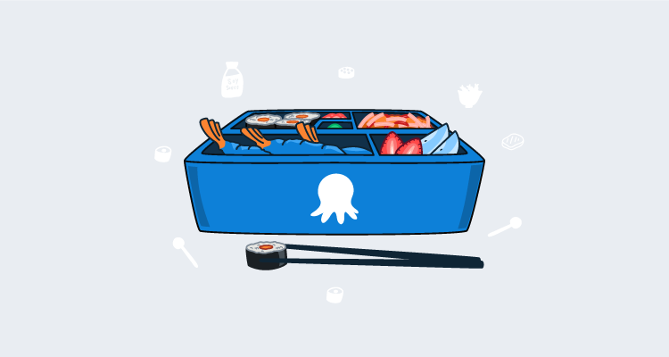
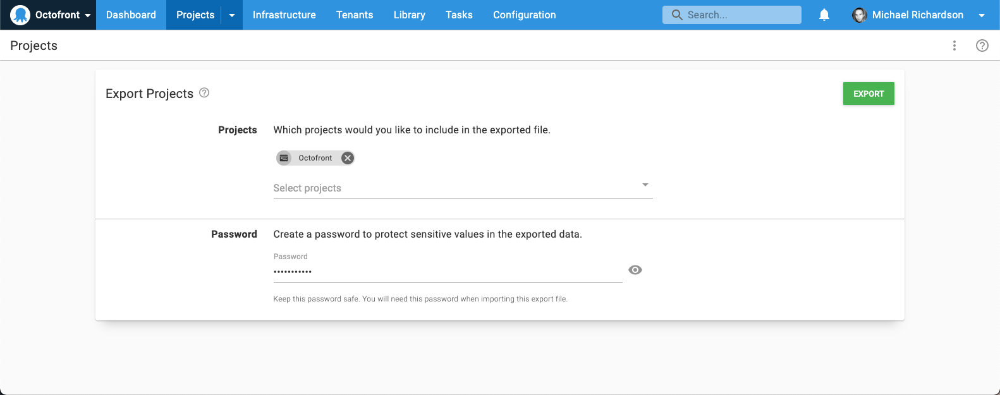
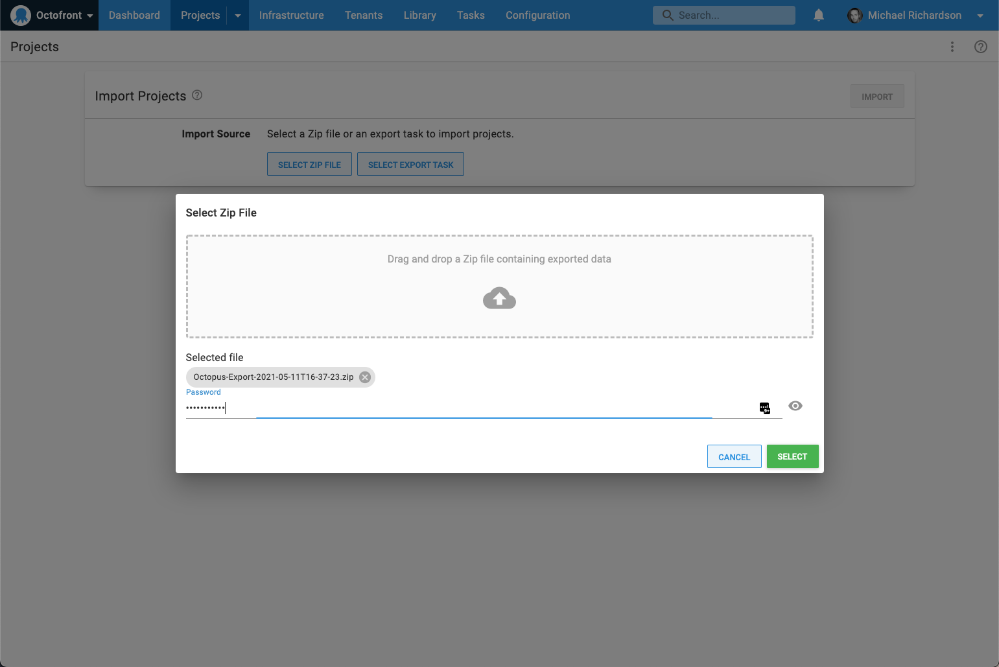

The 2021 Q2 Octopus Deploy release includes a new feature allowing projects to be exported and then imported into another Space, to help you organise your Octopus instance. It also allows you to easily move your on-premesis Octopus installation to Octopus Cloud.

## How Spaces evolved
Octopus 2019.1 introduced [Spaces](https://octopus.com/docs/administration/spaces), a way to partition your Octopus Server.  

We didn't include the ability to _move projects between spaces_ though,   because the functionality was complicated to design and build.  

The demand for this has been strong though. We were told Spaces was less valuable without a way to partition existing projects into new spaces. 

Our Customer Solutions team stepped up to fill the gap with the [Space Cloner](https://github.com/OctopusDeployLabs/SpaceCloner) project, a collection of PowerShell scripts to help with copying between spaces.  This was useful in many cases, but there were limitations because it operated via the HTTP API, as opposed to being "in the box". 

Fast-forward two years, and people also want to migrate projects from self-hosted Octopus instances to [Octopus Cloud](https://octopus.com/docs/octopus-cloud).  

The 2021 Q2 release introduces the ability to export and import projects as a fully-supported, in-the-box feature. 

## Exporting projects
One or more projects can be selected to be exported. A password is supplied to be used for encryption, as the export will include sensitive variables. 

The export runs as a task, and results in a zip file which can be downloaded.  

## Importing projects
The zip file can then be imported into another space on the same Octopus Server, a different server, or even an Octopus Cloud instance.  

Similar to the export, the import runs as a task (it can take some time for large exports).

The selected projects are included, along with everything they require: 

- Environments
- Tenants
- Variable sets
- Step templates
- Accounts
- Certificates  

It's also important to note what's _not_ included:
 
- [Deployment targets](https://octopus.com/docs/projects/export-import#deployment-targets). These will need to be reconfigured in the target space because of networking considerations, and because Tentacles need to be explicitly configured to trust another Octopus Server.  
- [Packages](https://octopus.com/docs/projects/export-import#packages). It's common for self-hosted projects to have hundreds of gigabytes of packages. Including these in the export zip would be impractical. In many cases, old packages aren't required, and the build server can simply be pointed at the new Octopus Server. For cases where packages are required, we've provided an [example script](https://github.com/OctopusDeploy/OctopusDeploy-Api/blob/master/REST/PowerShell/Feeds/SyncPackages.ps1) to demonstrate syncing packages via the Octopus API.  

## When to use the Project Export/Import feature
This first iteration of the Project Export/Import feature was designed primarily for one-time import/exports of a project.  This is useful in the following scenarios:

- Moving a project from a self-hosted instance to a cloud-hosted instance.
- Moving a project between two spaces on the same instance, for example when splitting a space into multiple spaces. 

This iteration _does not_ address repeatedly moving a project between spaces, for example to test upgrades or promote a project to a secure, segregated Octopus instance.  

These scenarios are different in subtle but significant ways, often requiring different variable values, lifecycles, tenants, etc., to be maintained between the instances.  We have laid the foundations with this feature to support these scenarios, and hope to do so in a future release. 

## Conclusion
The Project Export/Import feature is available in Octopus Cloud instances now, and will be in the 2021.1 release available from our [Downloads page](https://octopus.com/downloads). 

We hope this makes it easier migrating projects from self-hosted to Octopus Cloud.

Happy deployments!