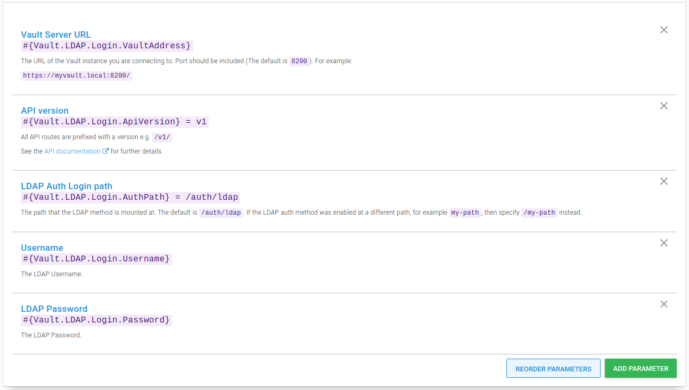
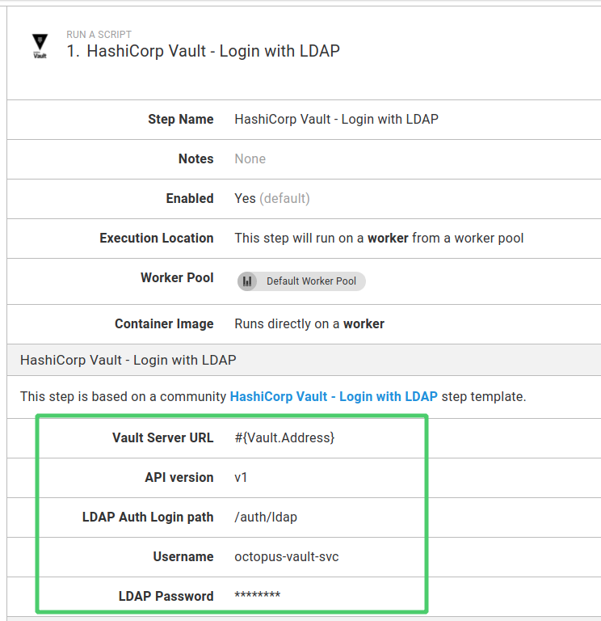

Octopus has supported the concept of [sensitive variables](https://octopus.com/docs/projects/variables/sensitive-variables) since [Octopus 2.0](https://octopus.com/blog/new-in-2.0/sensitive-variables). However, we're often asked by customers about support for Secret managers. You only have to do a [quick search](https://www.google.com/search?q=secret+managers) to see that all of the major cloud providers have secret managers. In addition, there are a number of third-party products in the marketplace such as [HashiCorp Vault](https://www.vaultproject.io/).

Storing sensitive values in Octopus Deploy solves many problems; the trade-off is, if your organisation has standardised on a secrets manager, that might mean storing sensitive values twice, making secrets management more complicated.

In this post, I walk through a number of new [HashiCorp Vault step templates](https://library.octopus.com/listing/hashicorp%20vault) that are designed to enable you to retrieve secrets from Vault for use in your deployments or runbooks.

<h2>In this post</h2>

!toc

## Introduction

This post assumes some familiarity with [Custom step templates](https://octopus.com/docs/projects/custom-step-templates) and the Octopus [Community Library](https://octopus.com/docs/projects/community-step-templates). If you want to learn more about these, my colleague Ryan Rousseau wrote up an excellent [two-part series](https://octopus.com/blog/creating-an-octopus-deploy-step-template) on how to create your own step template and publish it to the Library.

In addition, this post doesn't cover how to configure a Vault server, or its main concepts in great detail.

The step templates cover both [Vault authentication](https://www.vaultproject.io/docs/concepts/auth) and Secret retrieval for both versions `1` and `2` of the [Key-Value (kv)](https://www.vaultproject.io/docs/secrets/kv) Secrets Engine. 

All of the step templates make use of the Vault [HTTP API](https://www.vaultproject.io/api-docs) so no additional dependencies are required to use them, except being able to connect to your Vault server of course!

They have all been tested using Vault version `1.7.1` and can run on both Windows and Linux (with `Powershell Core` installed).

## Authentication

Authentication with Vault can be achieved with a number of different methods. As Octopus executes both runbooks and deployments on deployment targets (machines), authentication methods that are suited to this non-interactive mode are preferable. The following methods are included:

- [LDAP login](#ldap-login)
- [AppRole login](#approle-login)

Once you have authenticated with Vault, a [token](https://www.vaultproject.io/docs/concepts/tokens) is generated that can be used in further interactions with Vault. The primary use in our case is to retrieve secrets from a Secrets Engine.

### LDAP login #{ldap-login}

The [HashiCorp Vault - Login with LDAP](https://library.octopus.com/step-templates/de807003-3b05-4649-9af3-11a2c7722b3f/actiontemplate-hashicorp-vault-ldap-login) step template authenticates with a Vault Server using the [LDAP](https://www.vaultproject.io/docs/auth/ldap) authentication method. This is useful as it allows Vault integration without having to duplicate username or password configuration.

You might choose to authenticate using LDAP if you already have an LDAP server available and make use of service accounts to control access to sensitive information.

:::hint
Microsoft's Active Directory supports LDAP using [Active Directory Lightweight Directory Services](https://docs.microsoft.com/en-us/previous-versions/windows/desktop/adam/what-is-active-directory-lightweight-directory-services).
:::

Once authenticated, the `client_token` from the Vault response will be made available as a [sensitive output variable](https://octopus.com/docs/projects/variables/output-variables#sensitive-output-variables) named `LDAPAuthToken` for use in other step templates.

#### LDAP login parameters

The step template has the following parameters:

- `Vault Server URL`: The URL of the Vault instance you are connecting to, including the port (The default is `8200`).
- `API version`: All Vault [API routes](https://www.vaultproject.io/api-docs) are prefixed with a version e.g. `/v1/`.
- `LDAP Auth Login path`: The path that the [LDAP method is mounted at](https://www.vaultproject.io/api-docs/auth/ldap). The default is `/auth/ldap`.
- `Username`: The LDAP username.
- `Password`: The LDAP password.

#### Using the LDAP login step

The LDAP login step is added to deployment and runbook processes in the [same way as other steps](https://octopus.com/docs/projects/steps#adding-steps-to-your-deployment-processes).

Once you have added the step to your process, fill out the parameters in the step:

Once you've added the step, you can execute the step in a runbook or deployment process, and on successful authentication, the sensitive output variable name containing the token is displayed in the Task log:

### AppRole login #{approle-login}

The [HashiCorp Vault - Login with AppRole](https://library.octopus.com/step-templates/e04a9cec-f04a-4da2-849b-1aed0fd408f0/actiontemplate-hashicorp-vault-approle-login) step template authenticates with a Vault Server using the [AppRole](https://www.vaultproject.io/docs/auth/approle) authentication method. 

This is perfect for use with Octopus. HashiCorp themselves recommend it for machines or apps:

> This auth method is oriented to automated workflows (machines and services), and is less useful for human operators.

With an AppRole, a machine can login with:

- A `RoleID` - think of this as the username in the authentication pair.
- A `SecretID` - think of this as the password in the authentication pair.

:::warning
**Don't store the Secret ID:**

Storing the the RoleID in Octopus as a sensitive variable is a good way to ensure it remains encrypted until required. 

However, the same is **not recommended** for the SecretID.

The reasons for this are simple. A SecretID, just like a password is _designed to expire_. In addition storing the SecretID would provide the capabililty to potentially retrieve all secrets as both the RoleID and SecretID would be available.

For this reason, it's recommended that you consider the use of the more secure [Get wrapped Secret ID](get-wrapped-secretid) and [Unwrap Secret ID and Login](#{unwrap-secretid-login}) step templates.

If you do choose to use this step template, we recommend you provide the SecretID at execution time using a sensitive [prompted variable](https://octopus.com/docs/projects/variables/prompted-variables).
:::

### Response wrapping #{response-wrapping}

The AppRole is considered a _trusted-broker_ method. Simply put, this means that the onus of trust rests in the system that acts as the authentication intermediary (the _broker_) between the client (typically an Octopus deployment target) and Vault.

:::warning
**Secure the broker:**
Since the trust rests on the broker, we strongly recommend using the Octopus Server's [built-in worker](https://octopus.com/docs/infrastructure/workers#built-in-worker), or a highly-secured [external worker](https://octopus.com/docs/infrastructure/workers#external-workers) to act as the broker. It would be responsible for retrieving  
:::

:::hint
Link to Vault AppRole best practices: https://learn.hashicorp.com/tutorials/vault/approle
:::

### Get wrapped Secret ID #{get-wrapped-secretid}

### Unwrap Secret ID #{unwrap-secretid}

### Unwrap Secret ID and Login #{unwrap-secretid-login}

## Retrieving secrets #{retrieving-secrets}

### Retrieve KV (version 1) secrets #{retrieve-kv-v1-secrets}

### Retrieve KV (version 1) secrets #{retrieve-kv-v2-secrets}

## Conclusion

