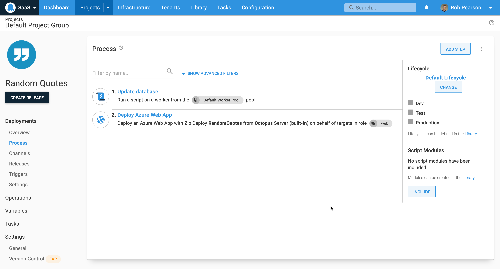
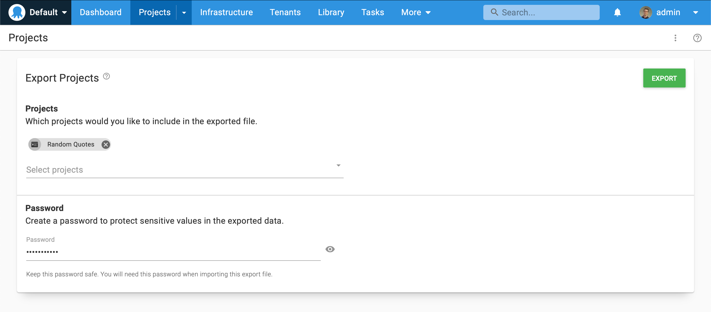
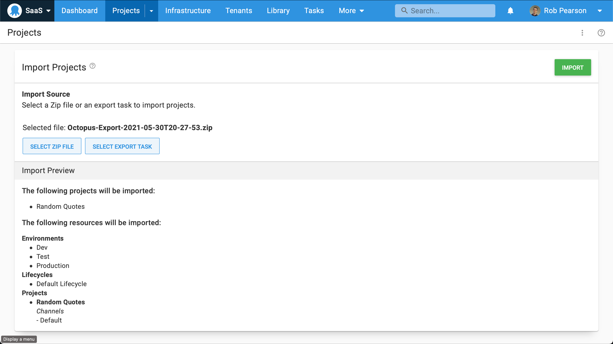
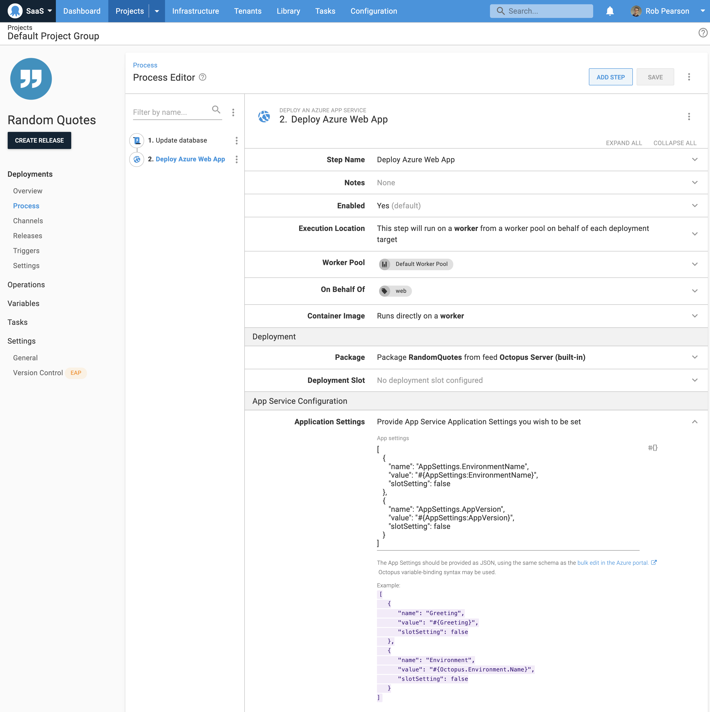
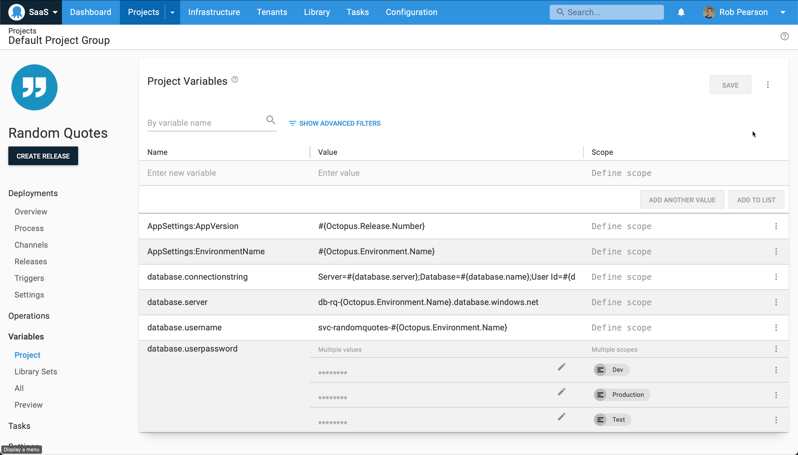

Team are migrating their applications and infrastructure to the cloud. The natural migration path for ASP.NET web app running on Microsoft's IIS web server on-prem is to App Services on Microsoft's Azure cloud platform. It's relatively straightforward to change the way your application is hosted but it's also important to ensure your CI/CD process is still repeatable and reliable. 

In this blog post, I'll walk through how to update the deployment process of an existing web application with Octopus Deploy shifting it from on-prem to the cloud. 

## Example application

We're using the [Random Quotes](https://github.com/octopussamples/randomquotes) web application as the example in this migration guide. This is a web application which retrieves and displays famous quotes randomly. It has an ASP.NET front end with a SQL Server backend. It is a simple application however it helps illustrate the changes required without becoming overhwelming. 

NOTE: This is a web application build on ASP.NET however it could be a Spring Boot Java web app or Ruby on Rails application. We're focusing on the changes to the deployment process so the tech stack is less important.

## Deployment process: before and after

We need to update our deployment process and it's a quite straightforward.


Our existing **on-prem based deployment process** has two steps. It has a script step that executes a command line tool to update our database and a second step to deploy our web application package to IIS and configure the bindings. 



Our new **cloud-based deployment process** is similar however it's updated to deploy to a cloud provider. Our first step is still running a script step to update our database. The second step has changed and it's now a Deploy an Azure App Service step. It captures everything required to deploy our web appliation to an Azure App Service including updating our configuration file.

## Migrating to Octopus Cloud (optional)

With teams shifting from shifting away from on-prem virtual machines, one common patter is they also move their CI/CD platform from on-prem tooling to the cloud. For example: companies might change from using [TeamCity](https://www.jetbrains.com/teamcity/) and Octopus on-prem to [TeamCity Cloud](https://www.jetbrains.com/teamcity/cloud/) and [Octopus Cloud](https://octopus.com/cloud). 

I'll briefly outline how to accomplish this with Octopus Deploy. We recently launched [Project export and import support](https://octopus.com/blog/exporting-projects) to make it easy to move projects from one Octopus instance to another. This is self-service meaning that individual developers can do this themselves without the need for system administrators to help. That said, it's often good to involve the operations team to keep them in the loop.

NOTE: This requires that both of your Octopus instance need to be running Octopus 2021.1 or newer. 

### On-premises Octopus instance:



1. Navigate to the Projects dashboard. Select the more button (three virticle elipses) and then the **Export Projects** button. 
2. Select the project(s) that you'd like to export.
3. Set a password to protect the exported files.
4. Click the **Export** button and then download the artifacts.

### Octopus Cloud instance:



1. Navigate to the Projects dashboard. Select the more button (three virticle elipses) and then the **Import Projects** button. 
2. Select your exported ZIP file from your on-prem server and enter your password.
3. Review the Import Preview and click the **Import** button.

Once this is done, you should see your new projects imported into your Octopus Cloud instance. The final step is to import your application packages (i.e. NuGet, JAR, WAR and ZIP files) into Octopus Cloud. This can be done [manually](https://octopus.com/docs/packaging-applications/package-repositories/built-in-repository#pushing-packages-to-the-built-in-repository) if you only only want to move the latest packages or [automated](https://octopus.com/docs/projects/export-import#packages) if you want to preserve the history. 

NOTE: I recommend reading our [documentation](https://octopus.com/docs/projects/export-import) to understand the limitations of the project export and import feature.

## Configure Octopus to move to the cloud-based deployments

### Updated your infrastructure


In order to move to an Azure cloud-based deployment, we need to configure an Azure Account in Octopus and add one or more Azure Web App deployment targets. 

The Azure account captures everything required to authenticate with an Azure subscription which you can then use to configure your Azure web app targets. Navigate to {{Infrastructure, Accounts}} to add one or more Azure accounts. Configuring an Azure account requires four specific IDs which are relatively difficult to find. I won't go into the detail here and I highly recommend reviewing our [Azure account documentation](https://octopus.com/docs/infrastructure/deployment-targets/azure) to configure this integration.

[Azure web app deployment targets](azure-web-app-deployment-targets.png "width=500")

Next, we need to add one or more Azure Web App deployment targets. These are the App Services that we will deploy our web application to and they are the replacement for our on-prem virtual machines running IIS. 

Add an Azure web app deployment target:

1. Navigate to {{Infrastructure, Deployment Targets}}
2. Click the **Add target** button and select Azure and then Azure Web App. 
3. Configure the name, role and select the Azure account and Azure Web App.
4. Click the **Save** button.

Repeat for your different subscriptions appropriate for your development, test and production environments.

### Update your deployment process

We need to update our deployment process to support our move to the cloud. I could use [Octopus channels](https://octopus.com/docs/releases/channels) to support the old and new deployment processes but we're moving away from our on-prem infrastructure so I'll delete the old IIS based deployment step.

My database update step uses a script that uses the database connection string to connect to a database. I don't need to change anything for this step however I do need to ensure that my Azure SQL Server database has granted access to my Octopus Server to connect to. Octopus Cloud uses [Static IP addresses](https://octopus.com/docs/octopus-cloud/static-ip) so you can easily add the appropriate range.

The key update that we need to perform to move from our on-prem deployment process is to configure our new Azure App Service deployment step. We've already configured out infrastructure so this isn't difficult. 



This screenshot shows our step configuration. We're using a worker to deploy to the "web" role, and we specify the package, app service and connection string configuration updates. Octopus recently introduced an updated Azure App Service deployment step and this allows us to wire-up our configuration updates directly in the step. For example, Random Quotes displays two configuration values to show the application version and the environment it was deployed to. To configure this, we use the following JSON string and something similar for the database connection string. 

```json
[
   {
      "name": "AppSettings.EnvironmentName",
      "value": "#{AppSettings:EnvironmentName}",
      "slotSetting": false
   },
   {
      "name": "AppSettings.AppVersion",
      "value": "#{AppSettings:AppVersion}",
      "slotSetting": false
   }
]
```

NOTE: This syntax uses the same schema as the Azure portal [bulk edit](https://docs.microsoft.com/en-us/azure/app-service/configure-common#edit-in-bulk) feature. This was new to me but it was easy to learn.

### Update your configuration variables



We also need to update our Project variables to support the cloud. The primary thing we need to change is our database connection string. In this case, I've composed my database connection string with individual variables which makes it easy to update. 

I can remove unused variables for ports and bindings etc. I could add host name or DNS details if needed but this doesn't apply in this case. 

## Explore runbooks

Now that we have moved to the cloud, it's worth mentioning some of the areas that runbooks can assist. Common usage scenarios include: 

* Provisioning and tearing down development and test infrastructure on a schedule to save money.
* Running regular database maintenance jobs like indexing and clean-up.
* Toggling a blue/green deployment to push a new release live after testing.

I won't go into detail in this post but it's a natural next step to leverage runbook automation with cloud infrastructure.

## Conclusion

Teams are retiring old virtual machines and moving to cloud-based CI/CD infrastructure and application hosting. In this blog post, we saw how we can move an existing web application from on-prem to the cloud as well as shift from from Octopus Server on-prem to Octopus Cloud. 