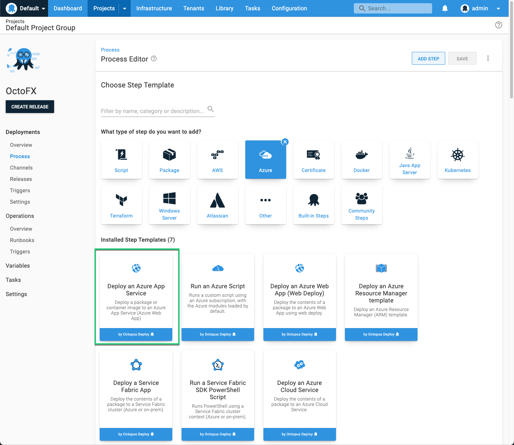
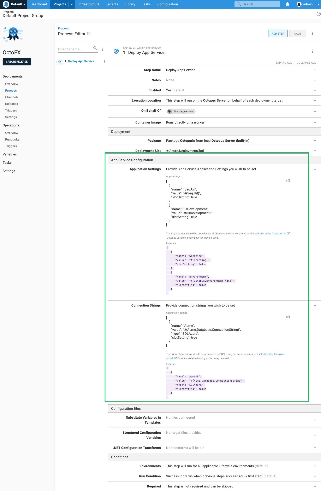
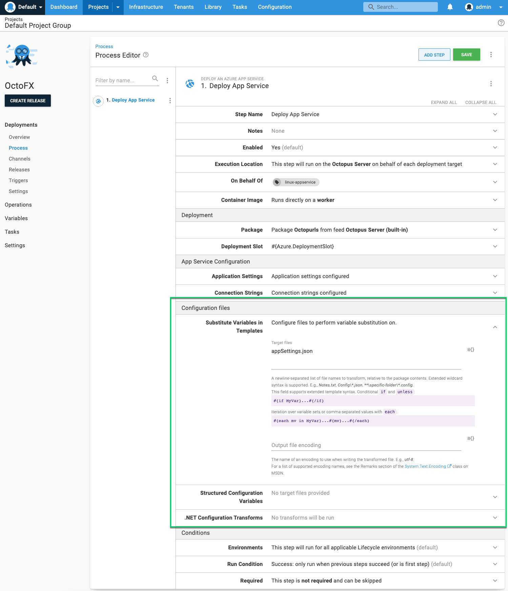

Octopus 2021.1 includes a new _Deploy an Azure App Service_ step. This delivers major improvements for deploying Azure web applications including:

- Deploying to Linux app service plans (without obscure configuration hacks). 
- Deploying container images. 
- Executing deployments on Linux Octopus workers.
- Configuring application settings and connection strings.

## What's changed?

The _Deploy an Azure App Service_ step is designed to supercede the existing _Deploy an Azure Web App_ step, however the original step is still available. 

The _Deploy an Azure Web App_ step relied on [Microsoft Web Deploy](https://www.iis.net/downloads/microsoft/web-deploy) as the deployment mechanism. This restricted the step to executing on Windows workers, required special configuration to work with Linux app service plans, and didn't support container images.  

The new step:

- Relies on the [zip deploy API](https://docs.microsoft.com/en-us/azure/app-service/deploy-zip#rest) for file-based packages (zip, nupkg, war).
- Supports container images. 
- Brings the ability to configure the Azure application settings and connection strings. 

This is done by supplying the settings and/or connection strings as JSON. 

## The JSON format

The benefits of using the JSON format are: 

- It is the same JSON format as the [bulk-edit feature in the Azure portal](https://docs.microsoft.com/en-us/azure/app-service/configure-common#edit-in-bulk), making it easy to move existing app settings into Octopus.  
- These fields accept [Octopus variable expressions](https://octopus.com/docs/projects/variables/variable-substitutions), allowing advanced scenarios such as conditionally including values, and iterating over collections of Octopus variables to build the app settings or connection strings.  

In the future we hope to add a friendlier UI over these fields, maintaining the JSON configuring as an 'advanced' mode. 

## Transforming configuration files

When deploying applications packaged as zip, nupkg, or war files, multiple options are available for transforming configuration files within the package.  Octopus will extract the package and perform these transforms before pushing to Azure.

The following options for transforming configuration files are provided: 

- Performing [variable substitution](https://octopus.com/docs/projects/steps/configuration-features/substitute-variables-in-templates#:~:text=The%20Substitute%20Variables%20in%20Files,Octopus%20Variables%20into%20any%20file.) on templated files, containing Octopus variable expressions (e.g. `#{MyVariable}`). 
- Using [structured configuration variables](https://octopus.com/docs/projects/steps/configuration-features/structured-configuration-variables-feature) to transform YAML, JSON, XML, and other structured configuration files.  
- Performing [.NET XML configuration transforms](https://octopus.com/docs/projects/steps/configuration-features/configuration-transforms).

## Conclusion

The new _Deploy an Azure App Service_ step is available now in both Octopus Cloud instances and in Octopus 2021.1 on the self-hosted [downloads page](https://octopus.com/downloads). We hope this makes it easier to deploy Azure web applications.

Happy deployments!