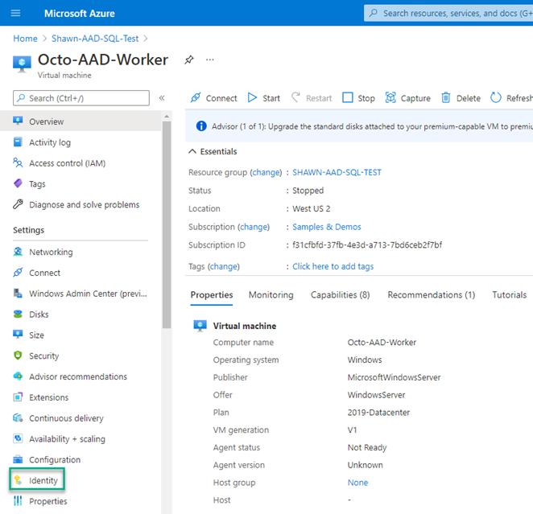
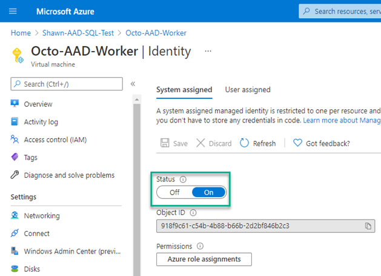
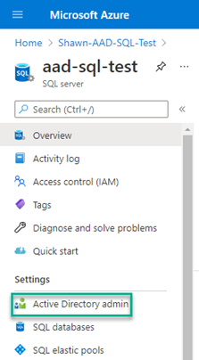
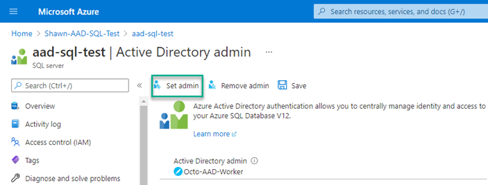
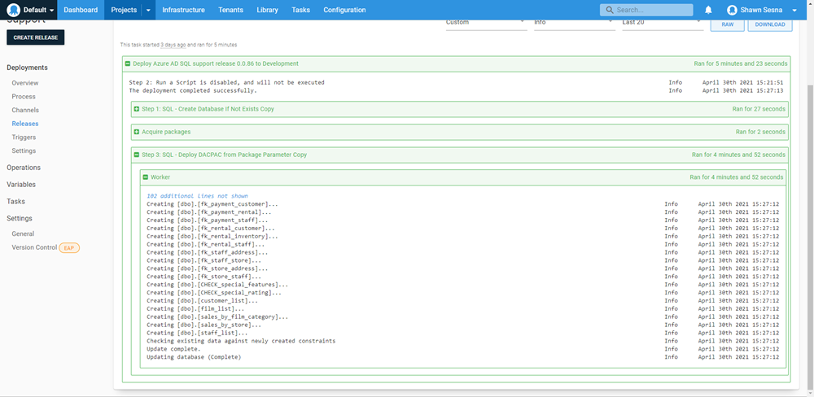

At Octopus Deploy, we have dedicated time to learn, which we call sharpening.  During my last sharpening period, I wanted to see if it would be possible to modify the [DACPAC](https://library.octopus.com/step-templates/e4a60d6f-036f-425d-a3f7-793034fc0f49/actiontemplate-sql-deploy-dacpac-from-package-parameter) step template to use [Azure Active Directory Managed Identity](https://docs.microsoft.com/en-us/azure/active-directory/managed-identities-azure-resources/overview) for authentication.  

In this post, I show you how I accomplished this with PowerShell and a custom class.

## Preparation
First, you need to provision an Azure SQL Server and an Azure VM.  This post assumes you're familiar with provisioning those types of resources and won't cover those topics.

### Configuring the VM for a Managed Identity
Once the Azure VM has been created, you need to configure it to use the Managed Identity feature.  

Navigate to the VM resource and click **Identity** in the left hand pane.



On the Identity pane, switch the **Status** to **On**.



The VM can now authenticate to Azure resources such as Azure SQL Server.

### Configure Azure SQL Server for managed identity authentication
There are two methods to grant authentication of the managed identity to SQL server:

1. Configure the VM managed identity as the **Active Directory admin** for the Azure SQL Server.
1. Add the managed identity as an external login to a database.

#### Configure Active Directory admin
Navigate to the Azure SQL Server resource and click **Active Directory admin**.

:::warning
As you can only have one account configured as an **Active Directory admin**, I would not recommend this approach for Production use.
:::



Once on the **Active Directory admin** screen, click **Set admin**.  Select the VM you want and click **Select**.  The account will now show as the selected Administrator account. Click **Save** to retain your changes.



#### Add managed identity as an external login to the database
Using something like SQL Server Management Studio (SSMS), you can execute a script that will grant permissions to the VM.  

Select the database to add permissions to, noting that the `USER` is the name of the VM, and run the following:

``` sql
CREATE USER [Octo-AAD-Worker] FROM EXTERNAL PROVIDER
ALTER ROLE db_owner ADD MEMBER [Octo-AAD-Worker]
```

:::warning
Ensure you're executing the script against the desired database.
:::


Your VM now has the `db_owner` role for the selected database.

### Testing connectivity
To verify that the managed identity is working: 

- Log on to the Azure VM and bring up PowerShell or PowerShell ISE.  
- Run the following script to verify that it's connecting:

``` PowerShell
$response = Invoke-WebRequest -Uri 'http://169.254.169.254/metadata/identity/oauth2/token?api-version=2018-02-01&resource=https%3A%2F%2Fdatabase.windows.net%2F' -Method GET -Headers @{Metadata="true"}
$content = $response.Content | ConvertFrom-Json
$AccessToken = $content.access_token

$connectionString = "Data Source=aad-sql-test.database.windows.net; Initial Catalog=TestDB2;"

$sqlConnection = New-Object System.Data.SqlClient.SqlConnection
$sqlConnection.ConnectionString = $connectionString
$sqlConnection.AccessToken = $AccessToken

$command = $sqlConnection.CreateCommand()
$command.CommandType = [System.Data.CommandType]'Text'
$command.CommandText = "SELECT @@VERSION"

$sqlConnection.Open()

$command.ExecuteNonQuery();

$sqlConnection.Close()
```
This script should succeed without error messages and will return a `-1` as a result, which in this case means success.

This script calls the internal to Azure identity service to return an Access Token used to authenticate to the database server.

## DACPAC step template

The DACPAC step template uses .NET objects to interact with SQL Server instead of calling the sqlpackage.exe command line program.  To establish a connection with the database server, the code creates a [DacServices](https://docs.microsoft.com/en-us/dotnet/api/microsoft.sqlserver.dac.dacservices?view=sql-dacfx-150) object passing a connection string to the constructor.  

Like the above script, authenticating with a managed identity requires an access token which cannot be added to the connection string itself.  The above script shows that the [SqlConnection](https://docs.microsoft.com/en-us/dotnet/api/system.data.sqlclient.sqlconnection?view=dotnet-plat-ext-5.0) object contains the property `AccessToken` which is assigned for authentication purposes.  

`DacServices`, however, contains no such property.  To use a managed identity authentication method, you must instantiate a `DacServices` object using an [overloaded constructor](https://docs.microsoft.com/en-us/dotnet/api/microsoft.sqlserver.dac.dacservices.-ctor?view=sql-dacfx-150#Microsoft_SqlServer_Dac_DacServices__ctor_System_String_Microsoft_SqlServer_Dac_IUniversalAuthProvider_) that takes an object that implements the `Microsoft.SqlServer.Dac.IUniversalAuthProvider` interface.

### Creating classes in PowerShell
As of PowerShell version 5, you can create custom classes in PowerShell itself.

```PowerShell
class AzureADAuth : Microsoft.SqlServer.Dac.IUniversalAuthProvider
{
	[string] GetValidAccessToken()
    {
      # Call Azure API to retrieve the token
      $response = Invoke-WebRequest -Uri 'http://169.254.169.254/metadata/identity/oauth2/token?api-version=2018-02-01&resource=https%3A%2F%2Fdatabase.windows.net%2F' -Method GET -Headers @{Metadata="true"} -UseBasicParsing
      $content = $response.Content | ConvertFrom-Json
      $azureAccessToken = $content.access_token
      # Return access token
      return $azureAccessToken
    }
}
```

An issue can arise with `class` definitions that are evaluated before code execution.  Despite loading the appropriate assemblies prior to the class definition, PowerShell fails if it can't find the type.  If the DLL is in the Global Assembly Cache (GAC), it might work, however, you can't assume that for a step template.

```
+ class AzureADAuth : Microsoft.SqlServer.Dac.IUniversalAuthProvider
+                     ~~~~~~~~~~~~~~~~~~~~~~~~~~~~~~~~~~~~~~~~~~~~~~
Unable to find type [Microsoft.SqlServer.Dac.IUniversalAuthProvider].
    + CategoryInfo          : ParserError: (:) [], ParentContainsErrorRecordException
    + FullyQualifiedErrorId : TypeNotFound
```

#### Alternate class creation method
I discovered I could create classes by defining them first in a string variable using C# syntax! I could also pass in dependent assembly references when adding the type:

``` Powershell
# Define C# class
$authClass = @"
public class AzureADAuth : Microsoft.SqlServer.Dac.IUniversalAuthProvider
{
	public string GetValidAccessToken()
    {
    	System.Net.HttpWebRequest request = (System.Net.HttpWebRequest)System.Net.WebRequest.Create("http://169.254.169.254/metadata/identity/oauth2/token?api-version=2018-02-01&resource=https://database.windows.net/");
		request.Headers["Metadata"] = "true";
		request.Method = "GET";
		string accessToken = null;
        
        System.Net.HttpWebResponse response = (System.Net.HttpWebResponse)request.GetResponse();
        
        System.IO.StreamReader streamResponse = new System.IO.StreamReader(response.GetResponseStream());
        string stringResponse = streamResponse.ReadToEnd();
        System.Web.Script.Serialization.JavaScriptSerializer j = new System.Web.Script.Serialization.JavaScriptSerializer();
        System.Collections.Generic.Dictionary<string, string> list = (System.Collections.Generic.Dictionary<string, string>) j.Deserialize(stringResponse, typeof(System.Collections.Generic.Dictionary<string, string>));
        accessToken = list["access_token"];

		return accessToken;
    }
}
"@

# Create new object
Add-Type -TypeDefinition $authClass -ReferencedAssemblies @("$($DacDLL.FullName)", "System.Net", "System.Web.Extensions", "System.Collections")

$dacServices = New-Object Microsoft.SqlServer.Dac.DacServices $connectionString, $azureAuth
```

:::hint
As the DACPAC step template is quite long, only the relevant portions of code for class creation are included in this post.  The searching for the location of the value for $DacDLL is not included here.
:::

### Deployment
Testing our code shows a successful deployment using the managed identity method.



## Conclusion
In this post I demonstrated creating custom classes in PowerShell, including implementation of an interface.  I this helps your work with PowerShell in the future.

Happy deployments!

:::hint
The modifications for the step template are incomplete at this point, I'm still hoping to add other authentication methods such as Azure Active Directory Integrated and Azure Active Directory Username/Password.
:::

