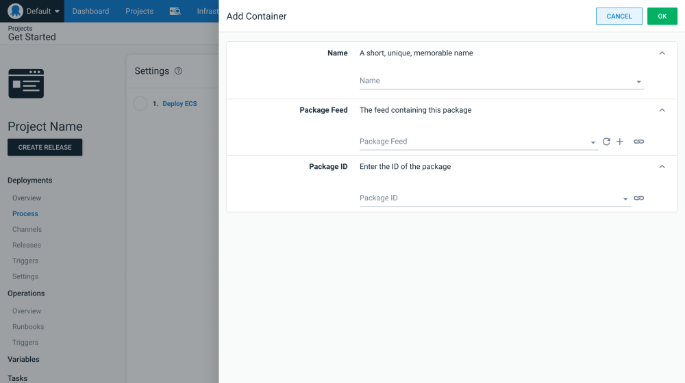
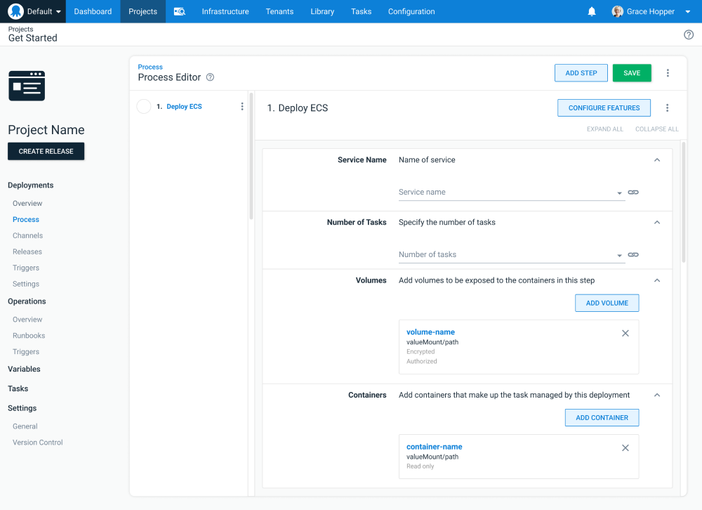
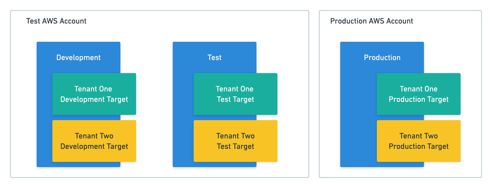
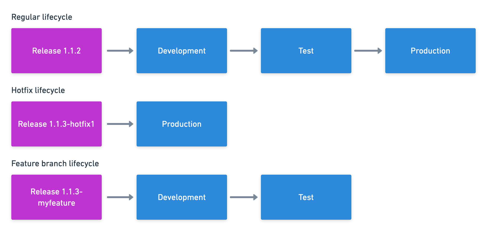
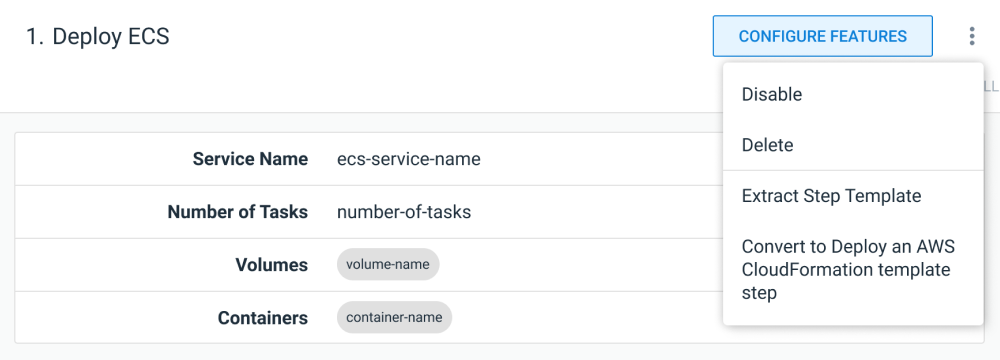

Octopus is a tool that enables world-class deployments. We have had industry leading functionality for deploying to your on-premises infrastructure from the beginning, and we've powered Azure application deployments for years. More recently we expanded into other major cloud service providers, allowing you to use tools like Kubernetes and Terraform to deploy to Azure and AWS. But we can do more - there are still a number of cloud native services that Octopus does not yet provide first class integrations for.

We want Octopus to be your first choice regardless of whether you deploy on-premises, to the cloud, or to a hybrid of both. This means providing first class support for more cloud native service offerings to make your complex deployments easy.

To reach this goal, Octopus has established a new internal team dedicated to integrating Octopus with the most popular cloud native services. After spending some months focused on developing a new framework to enable the rapid delivery of these integrations, we are now in a position to share our goals and plans with our customers, partners, and other internal Octopus departments. This blog is what we hope will be the first of many Request For Comment (RFC) posts where we discuss proposed new functionality and provide an opportunity for those interested to offer feedback.

One cloud service that we have been repeatedly asked to support is AWS ECS, and this post will outline some new steps and targets that we are currently discussing.

## How we propose to deliver first class ECS support

[Amazon describes Elastic Container Service (ECS) as](https://docs.aws.amazon.com/AmazonECS/latest/developerguide/Welcome.html):

> a highly scalable, fast container management service that makes it easy to run, stop, and manage containers on a cluster. Your containers are defined in a task definition that you use to run individual tasks or tasks within a service.

Octopus already has many features in place to coordinate container deployments, including the ability to consume Docker images via feeds (including ECR feeds) and securely storing AWS credentials via an account. By scripting against the AWS CLI it has been *possible*, if not convenient, to deploy to ECS today. But we can do better.

### A new ECS target

The proposed ECS support starts with a new target that represents an ECS cluster. This target references the AWS credentials used to access an ECS cluster, the AWS region, and the name of the cluster:

*An ECS target mockup.*

### A new service deployment step

At a high level, there are three components required to deploy an application to an ECS cluster.

First you need a Docker image. We envision your Continuous Integration (CI) server will continue to build, tag, and deploy these images to a Docker registry.

A [task definition](https://docs.aws.amazon.com/AmazonECS/latest/developerguide/task_definitions.html) then references a specific image tag and defines many of the settings for the resulting container such as memory and CPU requirements, environment variables, exposed ports and more. Task definitions are immutable, and each new image tag must be captured by a new version of a task definition.

A [service](https://docs.aws.amazon.com/AmazonECS/latest/developerguide/service_definition_parameters.html) then references a task definition, along with additional runtime details such as how many instances to run, how the instances are distributed through the cluster, which VPC to run in, load balancers and scaling requirements.

Our proposed new step provides an opinionated deployment workflow that combines a [Fargate](https://aws.amazon.com/fargate/) task definition and service into a single step. 

You'll start by defining the values contributed to a task definition. It is important to note here that unlike the AWS console, the Docker images(s) defined in this step do not include the tag, as the selection of an image tag is deferred until a release is created:

*Step mockup showing Docker image selection and task definition inputs.*

The same step defines the values contributed to the properties of a service:

*Step mockup showing service properties.*

An ECS deployment will then execute the following process:
1. Select the Docker image tags to be defined in the task definition when creating a release.
2. Create a new task definition with the details specific to the deployment to a given environment.
3. Configure the service with the task definition from step 2.

## What are the benefits of the proposed approach?

The target and step described above have been designed to help those orchestrating ECS deployments fall into the pit of success, which we have summarized as [The ten pillars of pragmatic deployments](https://octopus.com/blog/ten-pillars-of-pragmatic-deployments).

With this first milestone we have specifically focused on the fundamentals including enabling [repeatable deployments across environments](https://octopus.com/blog/ten-pillars-of-pragmatic-deployments#repeatable-deployments), [recoverable deployments by redeploying previous releases](https://octopus.com/blog/ten-pillars-of-pragmatic-deployments#recoverable-deployments), and [auditable deployments by ensuring all resources are defined and tracked via CloudFormation stacks](https://octopus.com/blog/ten-pillars-of-pragmatic-deployments#auditable-deployments).

Central to all of these features is the idea that deployments will progress through a series of [environments](https://octopus.com/docs/infrastructure/environments), with the canonical environment set including the development, test, and production environments. ECS has no concept of environments though, and so to enable [repeatable deployments](https://octopus.com/blog/ten-pillars-of-pragmatic-deployments#repeatable-deployments) we must model the new step and target to facilitate environmental progression, taking into account factors like [environment scoped variables](https://octopus.com/docs/projects/variables#scoping-variables) and the [ability to update a release snapshot](https://octopus.com/docs/octopus-rest-api/examples/releases/update-release-variable-snapshot).

### Why use targets?

By capturing the details of an ECS cluster as a [target](https://octopus.com/docs/infrastructure/deployment-targets), which is scoped to an environment and exposed by a [role](https://octopus.com/docs/infrastructure/deployment-targets#target-roles), the specific details of where a deployment will take place is lifted out of the steps. A step simply defines the target role it deploys to, and Octopus will ensure that the deployment takes place on the correctly scoped target for the current environment.

We envisage this will be incredibly beneficial if you are looking to adopt some of the [best practices recommended by AWS with respect to using multiple accounts](https://aws.amazon.com/blogs/mt/best-practices-for-organizational-units-with-aws-organizations/):

> An AWS account provides natural security, access, and billing boundaries for your AWS resources, and enables you to achieve resource independence and isolation. 

With ECS targets it makes little difference whether you deploy many logical environments to one shared ECS cluster, have a dedicated cluster per environment, or even separate environments into multiple AWS accounts. Simply point each ECS target to the appropriate cluster and your deployments will scale across any environment partitions you may use:

### Abstracting away task definition versions

If you have ever had to deploy a new Docker image by first creating a new task definition version and then updating the service to reference it, you will appreciate how tedious manual ECS deployments can be.

Our goal is for a new ECS deployment to involve nothing more than creating an Octopus release and selecting the new Docker image tags to include in it. By creating a new task definition with each deployment we remove the need for those deploying to ECS to even think about task definitions.

It doesn't matter if your task definitions include environment specific values, or if each environment is represented by a cluster in a new AWS account, as Octopus will create the necessary task definitions on your behalf. This streamlines your workflow to: creating new Docker images, creating an Octopus release with those Docker images, and promoting your release across your environments. It also ensures you can [recover from failed deployments](https://octopus.com/blog/ten-pillars-of-pragmatic-deployments#recoverable-deployments) by redeploying an old release.

### Advanced deployments with tenants and channels

The proposed step and target also integrate with advanced Octopus features like [tenants](https://octopus.com/docs/deployments/patterns/multi-tenant-deployments), [channels](https://octopus.com/docs/releases/channels), and [lifecycles](https://octopus.com/docs/releases/lifecycles). 

The new ECS targets can be scoped to tenants, once again abstracting away the details of where a deployment takes place from the steps and encapsulating it in a target:

Meanwhile channel rules can be applied to Docker image tags, facilitating deployment patterns like hotfixes via a lifecycle allowing deployments straight to production:

### Fall back to CloudFormation

Behind the scenes the new step will generate CloudFormation templates, which will then be executed for you. This ensures all resources can be [audited](https://octopus.com/blog/ten-pillars-of-pragmatic-deployments#auditable-deployments) and [tracked](https://docs.aws.amazon.com/AWSCloudFormation/latest/UserGuide/using-cfn-stack-drift.html) with existing CloudFormation tooling.

However, any opinionated step will eventually meet a use case that it simply does not support. For those with specialized requirements, or who find they outgrow the proposed step, we'll offer the ability to convert the opinionated step into a raw CloudFormation template. 

Simply select the convert option in the overflow menu, and the step will be converted into a CloudFormation deployment step, giving you complete control over your ECS deployments, without having to recreate them from scratch:

To allow the deployment of CloudFormation templates with Docker image references (which is an increasingly common scenario with [EKS](https://aws.amazon.com/eks/), [ECS](https://aws.amazon.com/ecs/), [Lightsail](https://aws.amazon.com/lightsail/), [Lambdas](https://aws.amazon.com/lambda/), and [AppRunner](https://aws.amazon.com/apprunner/)), the **Deploy an AWS CloudFormation template** step will be updated to support [additional package references](https://octopus.com/blog/script-step-packages). This allows Docker images to be defined and referenced in a CloudFormation template, while deferring the image tag selection to release creation time.

## What is the scope of the first ECS milestone?

Our goal is to release the ECS integration incrementally, both to get the feature out to our customers sooner, and to collect feedback from early adopters. The proposed step above is a high level look at where we see this new feature going, but the first milestone will likely have the following limitations:

* Limiting the step to deploying to Fargate only.
* Only support rolling deployments, and not support integrated CodeDeploy blue/green deployments.
* Not provide the ability to build a new load balancer.
* Exclude auto-scaling settings.
* Exclude App Mesh and FireLens settings.
* Exclude service auto-discovery settings.
* Only create a service, and not support tasks or scheduled tasks.

These features are likely to be included in subsequent milestones, so watch for new RFC posts covering these.

## When will this be released?

We're still in the early planning stages, and ECS support is not a confirmed feature at this point, so we can not provide a release date. Keep an eye on the [blog](https://octopus.com/blog/) for further announcements.

## We want your feedback!

ECS support is still in the planning phases, so now is a great time to shape the future of this new feature with your feedback. [We have created a GitHub issue to capture the discussion](https://github.com/OctopusDeploy/StepsFeedback/issues/1).

Specifically we want to know if the proposed step and target will work for your ECS deployments, as well as learning what your ECS architecture looks like. Do you have multiple clusters? Do you have multiple AWS accounts? What kinds of applications are you deploying? What ECS deployment challenges do you wish Octopus could solve for you? This is all great feedback that will help us deliver the best solution we can.

## Conclusion

In summary, the first milestone of our proposed ECS support includes:

* A new target to model environments and tenanted deployments.
* A new step combining the creation/updating of a task definition and creation/updating of a service.
* The ability to convert the opinionated step into a raw CloudFormation template.
* A simplified deployment workflow across environments supporting environment specific variables, channels, and lifecycles.

Thank you for reading this post. We hope you are as excited about the proposed new ECS functionality as we are, and any feedback you may have is greatly appreciated.

Happy deployments!